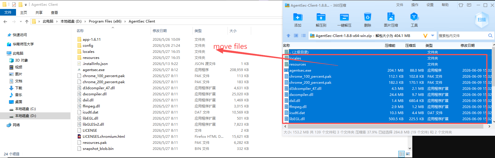
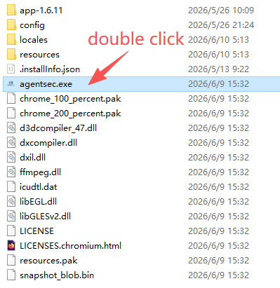
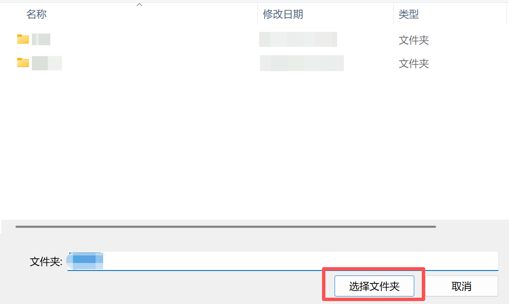
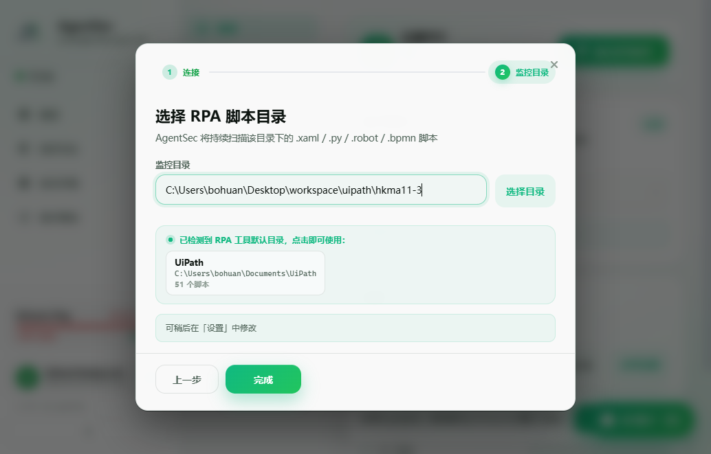
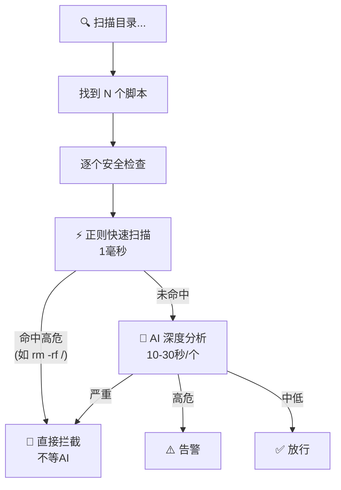
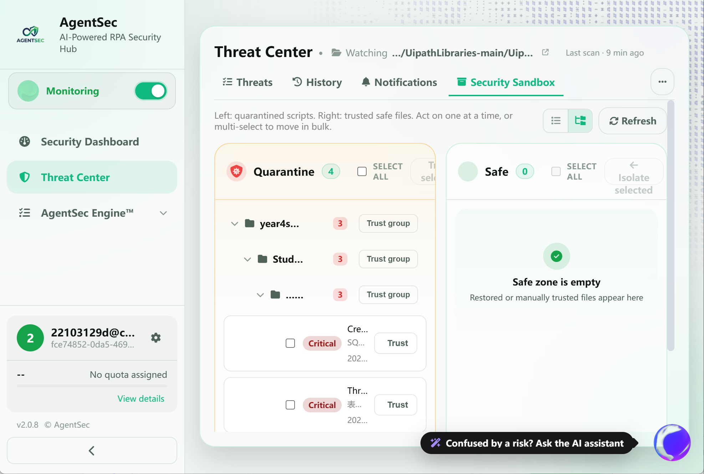
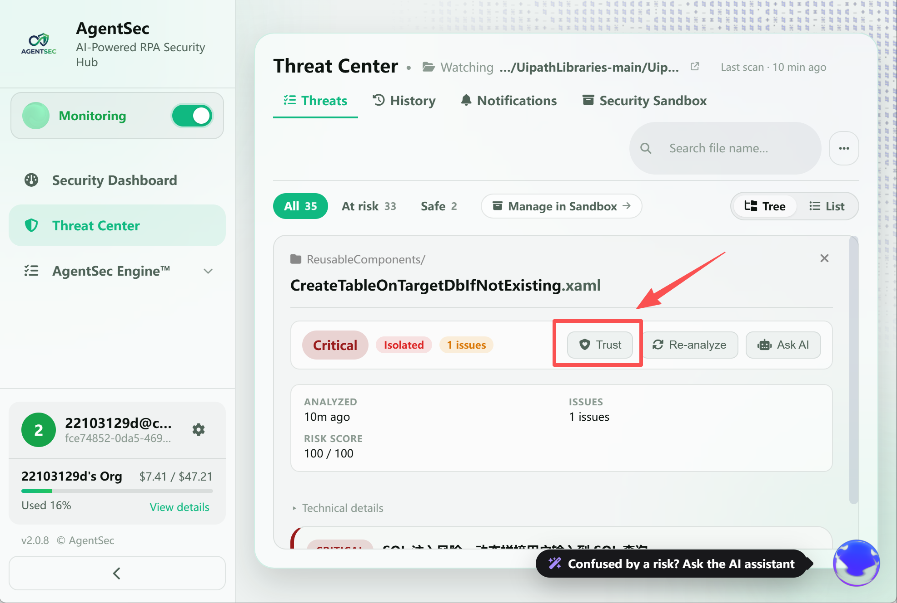
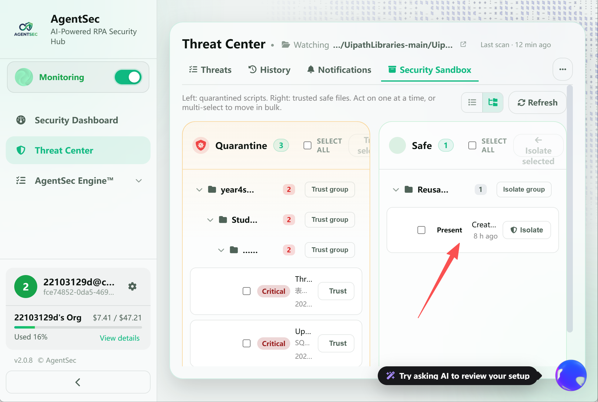

# 01 — 快速入门（跟我做）

> 预计用时：10 分钟 | 您将完成：安装 → 登录 → 配置 → 第一次监控 → 看懂第一个分析结果

本教程会**带着您一步一步操作**。请打开 AgentSec，跟着做。

---

## 1. 安装并打开

### Windows 用户

1. 下载 `AgentSec-Client-x64-win.zip`
2. 解压到任意目录（如 `D:\Program Files (x86)\AgentSec Client`）(你需要新建文件夹)
3. 双击 `agentsec.exe`

> 

> 

> ⚠️ 如果弹出 Windows SmartScreen 警告，点击「更多信息」→「仍要运行」。

### macOS 用户

1. 下载 `.dmg` 文件，双击挂载
2. 拖入 `Applications` 文件夹
3. 首次打开若被阻止：**系统设置 → 隐私与安全性 → 仍要打开**

> 📸 **[截图位置]** `screenshots/install-macos-drag.png` — DMG 拖入 Applications

---

## 2. 首次配置（引导向导）

打开应用后，会自动弹出引导向导。

> **如果没弹出引导**，说明这台电脑之前有人配置过。两种方式重新打开：

**方式一：在软件里操作（推荐）**

点击左侧 ⚙「设置」→ 左侧选「常规」→ 点击顶部的 **「运行引导向导」** 按钮。

> 

**方式二：删除配置文件（恢复出厂状态）**

删掉配置文件后重新打开应用，等同于首次启动。

| 系统 | 删除这个文件 |
|------|-------------|
| Windows | `%APPDATA%\AgentSec\config.json` |
| macOS | `~/Library/Application Support/AgentSec/config.json` |

> ⚠️ 方式二会清空所有设置，不仅是监控目录。推荐用方式一。

### 2.1 选择使用方式

您会看到两个选项：

> 

| 选项 | 适合谁 | 需要准备 |
|------|--------|---------|
| **从 AgentSec 登录**（推荐👍） | 有账号、能上网 | 一个邮箱（注册账号用） |
| **本地模式** | 完全离线、有自己的 AI 接口 | AI 模型 API Key 或安装 Ollama |

> 💡 **不确定？选「从 AgentSec 登录」**，这是最简单的方式，不需要额外配置 AI。

### 2.2 登录（选择「登录」的用户）

1. 点击「下一步」
2. 浏览器自动打开 AgentSec 登录页
3. 输入邮箱和密码（没有账号？点击注册）
4. 登录成功后，浏览器会**自动回到应用**

> 📸 **[截图位置]** `screenshots/onboarding-login-browser.png` — 浏览器登录页面

**成功标志**：侧边栏底部出现您的邮箱和头像。

> 📸 **[截图位置]** `screenshots/onboarding-login-success.png` — 登录成功后的界面

### 2.3 本地模式配置（选择「本地」的用户）

选择本地模式后，需要配置 AI 模型：

| 字段 | 怎么填 |
|------|--------|
| 模型供应商 | 如果用了 Ollama 选 Ollama（免费）；有 OpenAI Key 选 OpenAI |
| 模型名称 | Ollama 用户填 `qwen3:latest`；OpenAI 用户填 `gpt-4o-mini` |
| API Key | OpenAI/Anthropic 用户填 Key；Ollama 留空 |

> 💡 没有 AI Key？用 [Ollama](https://ollama.com)（完全免费）。安装后执行 `ollama pull qwen3` 下载模型即可。

### 2.4 选择监控目录

点击「选择目录」，找到您存放 RPA 脚本的文件夹。

> 

> 💡 如果电脑安装了 UiPath，AgentSec 会自动检测并显示建议目录，直接点击即可。

---

## 3. 启动第一次监控

引导完成后，您会看到**仪表盘**。

> 

现在，点击蓝色 **「启动监控」** 按钮。

**您会立刻看到的变化：**

| 变化    | 说明                   |
| ----- | -------------------- |
| 按钮变色  | 绿 → 红，文字变为「停止监控」     |
| 状态变化  | 「等待连接」→「监控中」+ 绿色闪烁圆点 |
| 脚本数出现 | 显示监控目录中找到的脚本数量       |

**AgentSec 正在做什么？**

---

## 4. 看懂分析结果

等待几秒到几十秒，分析结果会陆续出现。

### 4.1 仪表盘概览

| 看这里 | 说明 |
|--------|------|
| **脚本数** | 目录中找到的脚本总数 |
| **已分析** | 已完成 AI 分析的脚本数 |
| **拦截数** | 被判定为「需要拦截」的脚本数（红色醒目） |
| **风险概览** | 所有脚本中最高的风险等级（红/橙/黄/灰） |

### 4.2 进入威胁中心

点击左侧 **「威胁中心」**，查看每个脚本的详情。

**点击任意一个脚本**，右侧展开详情面板：
**三个关键信息**：
1. **💡 建议**：告诉您怎么修复
2. **📝 代码片段**：指出具体哪行有问题
3. **风险等级颜色**：红 > 橙 > 黄 > 灰（越红越紧急）

---

## 5. 如果脚本被拦截了

如果看到「已隔离」标签（红色），说明 AgentSec 认为该脚本非常危险，已自动将其移走。

### 您确认它是恶意脚本？

✅ 什么都不用做。原文件在 `.agentsec_quarantine` 目录中安全隔离，原路径被替换为无害的安全桩。

### 您确认它是误拦（脚本是安全的）？

1. 点击该脚本 → 打开详情面板
2. 点击 **「还原」** 按钮
3. 确认操作 → 文件自动移回，并加入「信任列表」

> 💡 还原后该文件内容不变，以后扫描会自动跳过。如果之后修改了文件，AgentSec 会重新分析。

---

## 6. 试用 AI 助手

按 **`Ctrl+K`**（Windows）或 **`Cmd+K`**（macOS），右侧弹出 AI 助手面板。

试试问它：

> 「总结一下当前的脚本安全状况」

> 「哪个脚本风险最高？为什么？」

AI 会基于实际的监控数据和分析结果回答，不是套话。

---

## 7. 快速检查：您上手了吗？

- [ ] 监控成功启动，「脚本数」> 0
- [ ] 威胁中心中有已完成的分析记录
- [ ] 点击某个脚本，看到了详细的问题列表（或「未发现安全问题」）

如果三项都完成，恭喜！🎉 您已经掌握 AgentSec 的基本使用。

---

## 接下来

| 我想... | 看这个 |
|---------|--------|
| 了解仪表盘每个数字的含义 | [02 — 仪表盘详解](02-dashboard.md) |
| 看一个完整的「发现→分析→处理」案例 | [03 — 第一次安全分析](03-first-analysis.md) |
| 了解监控的细节和优化 | [04 — 监控配置详解](04-monitoring.md) |
| 学习如何解读分析结果 | [05 — 威胁中心（防护日志）](05-security-log.md) |
| 管理被拦截和已信任的文件 | [06 — 安全沙箱](06-sandbox.md) |
| 调整安全检测的严格程度 | [07 — 安全策略](07-security-policy.md) |
| 学习 AI 助手的全部能力 | [08 — AI 安全助手](08-ai-assistant.md) |
| 配置账户、模型、更新等 | [09 — 设置详解](09-settings.md) |
| 理解本文档中的术语 | [10 — 关键概念](10-concepts.md) |
| 遇到问题怎么办 | [11 — 常见问题](11-faq.md) |
