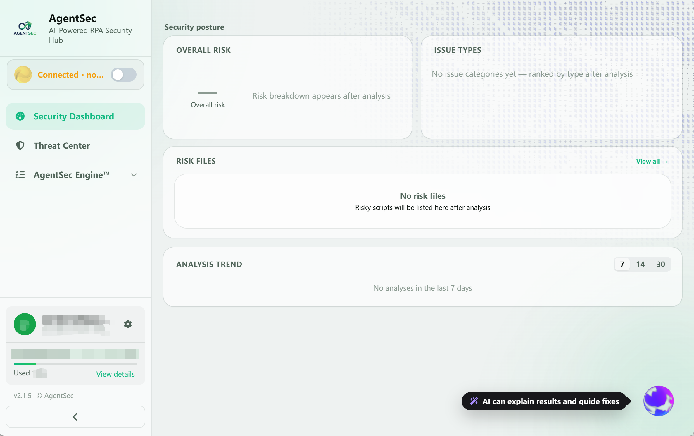
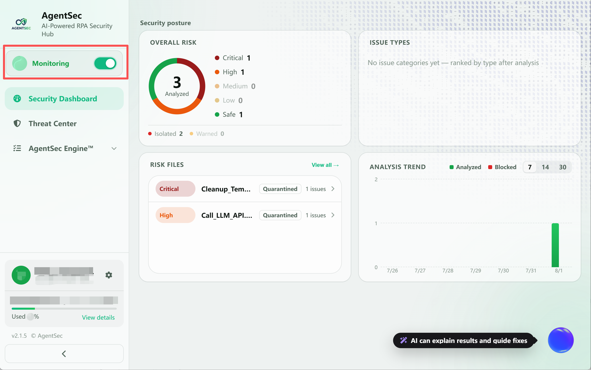
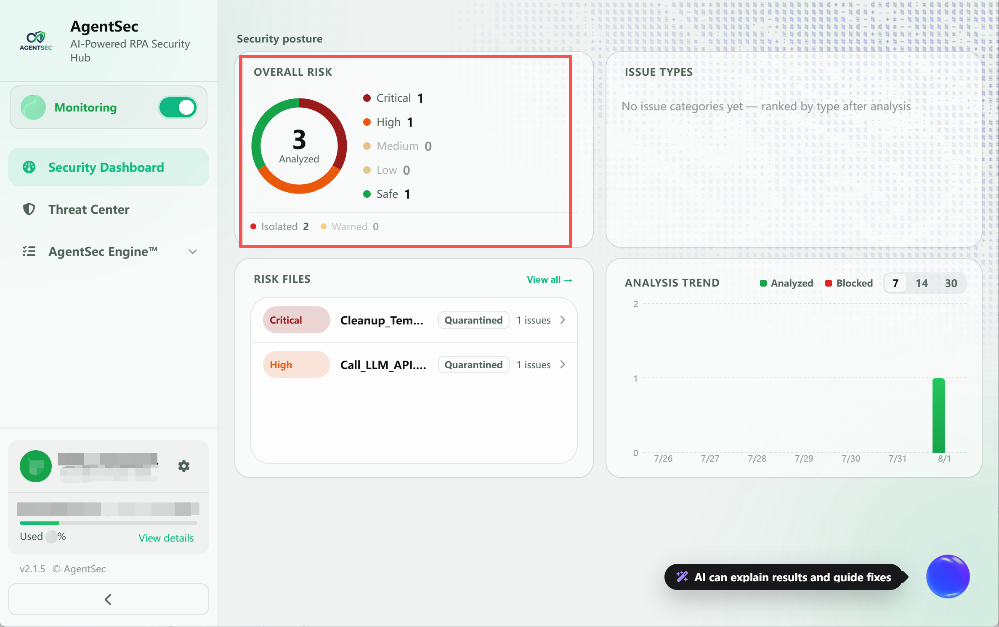
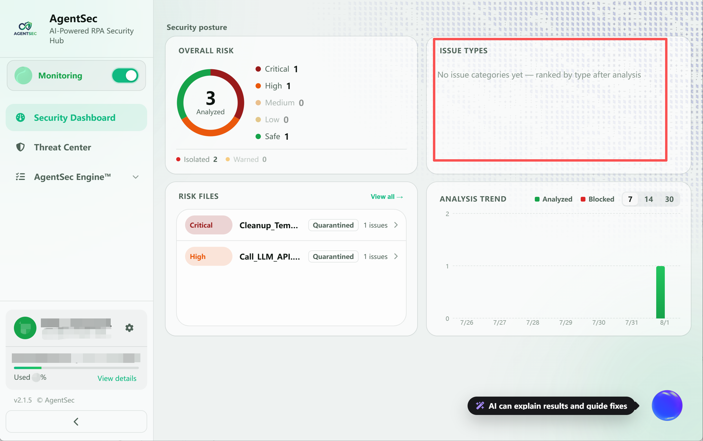
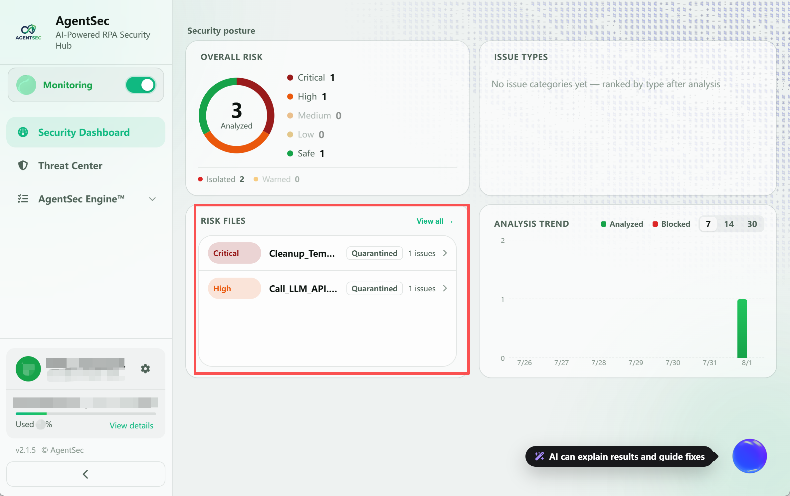
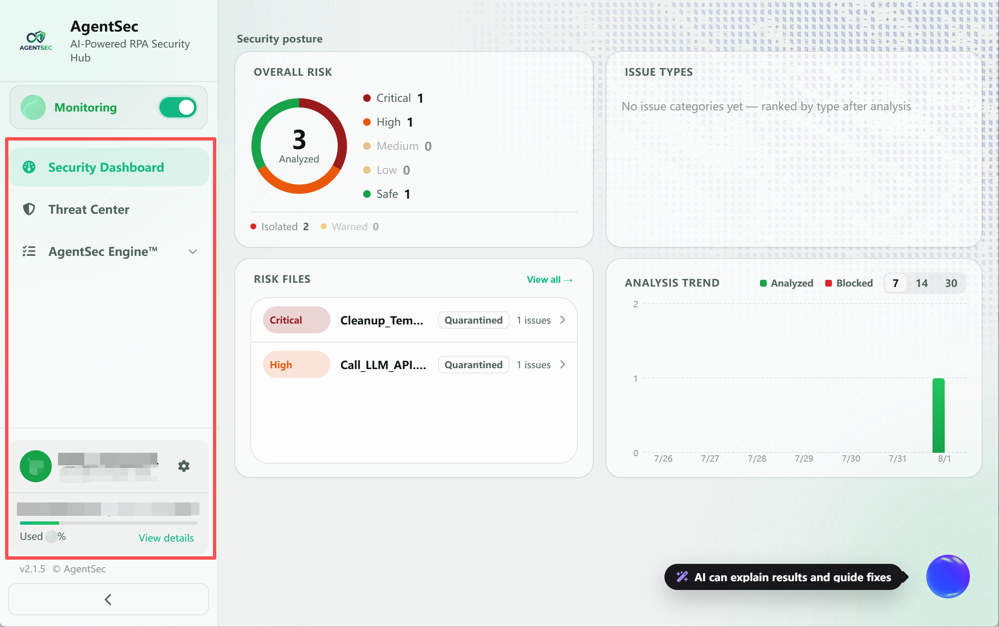
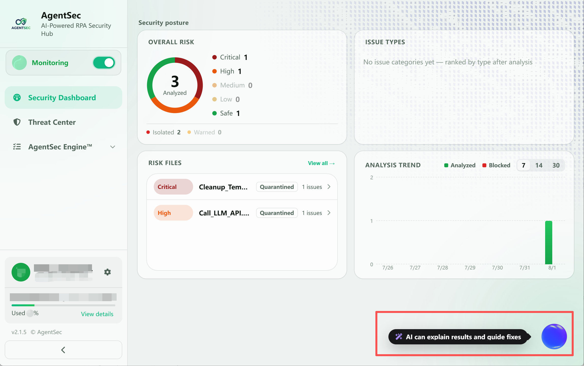

# 安全仪表盘使用指南

> 安全仪表盘集中展示 AgentSec 的监控状态、风险分布、风险文件和分析趋势，帮助您快速了解当前的整体安全态势。

---

## 仪表盘概览

> 

新版仪表盘主要分为以下区域：

| 区域 | 作用 |
| --- | --- |
| **监控状态** | 查看 AgentSec 的连接和监控状态，并开启或停止监控 |
| **总体风险** | 查看已分析脚本的整体风险构成 |
| **问题类型排行** | 查看各类安全问题的数量及排名 |
| **风险文件** | 快速定位存在风险的脚本文件 |
| **分析趋势** | 查看近 7、14 或 30 天的分析数据变化 |
| **AI 助手** | 解读分析结果并提供修复建议 |

> 初次进入或尚未完成分析时，部分卡片会显示“暂无数据”。启动监控并完成脚本分析后，仪表盘会自动更新。

---

## 一、查看和切换监控状态

左侧边栏顶部的状态卡片同时显示当前的**连接状态**和**监控状态**。点击卡片右侧的开关，可以启动或停止监控。
> 

| 显示状态          | 含义                       | 图片                                                                              |
| ------------- | ------------------------ | ------------------------------------------------------------------------------- |
| **已连接 · 未监控** | 已连接到 AgentSec 服务，但尚未开始监控 |  |
| **监控中**       | 正在监控已配置目录中的脚本变化          |                    |
| **未连接**       | 未登录或服务端不可达               |                 |

开启监控前，请先完成监控目录配置。有关目录配置和监控操作，请参阅 [监控管理](04-monitoring.md)。

---

## 二、总体风险

“总体风险”卡片展示已完成分析的脚本在不同风险等级下的分布，帮助您快速判断当前环境的整体风险情况。
> 

常见风险等级包括：

| 风险等级   | 说明               |
| ------ | ---------------- |
| **严重** | 可能造成重大安全影响，应优先处理 |
| **高危** | 存在明显安全风险，建议尽快修复  |
| **中危** | 存在潜在风险，建议检查并处理   |
| **低危** | 风险较低，可结合实际业务判断   |

尚无分析结果时，该区域会显示“分析完成后显示风险构成”。

---

## 三、问题类型排行

“问题类型排行”按照发现数量从多到少展示安全问题类型，便于识别当前最常见的风险。
> 

您可以通过该区域了解：

- 哪类安全问题出现得最多；
- 每类问题的发现数量；
- 当前应优先关注的风险类型。

尚无分析结果时，该区域会显示“暂无问题分类，分析后按类型从多到少排行”。

---

## 四、风险文件

“风险文件”区域列出检测到安全问题的脚本及其问题数量。您可以通过列表快速找到需要检查的文件。
> 
- 点击风险文件，可进入对应的分析详情；
- 点击右上角的 **“查看全部”**，可前往威胁中心查看完整列表；
- 尚未发现风险文件时，该区域会显示空状态提示。

有关分析结果和问题详情，请参阅 [威胁中心](05-security-log.md)。

---

## 五、分析趋势

“分析趋势”以时间维度展示脚本分析数据的变化。点击右上角的时间范围，可以切换不同的统计周期：
> 
- **7**：最近 7 天；
- **14**：最近 14 天；
- **30**：最近 30 天。

如果所选周期内没有分析记录，页面会显示“近 N 天暂无分析数据”。

---

## 六、侧边栏信息

除监控开关外，左侧边栏还提供以下入口和信息：
> 

| 项目                   | 说明                      |
| -------------------- | ----------------------- |
| **安全仪表盘**            | 返回当前安全态势概览页             |
| **威胁中心**             | 查看脚本、风险问题和详细分析结果        |
| **AgentSec Engine™** | 展开 AgentSec Engine 相关功能 |
| **用户信息**             | 显示当前登录账号和用户标识           |
| **组织用量**             | 显示当前组织的额度、已用比例和剩余额度     |
| **设置**               | 点击用户信息右侧的齿轮进入设置         |

---

## 七、AI 助手

点击右下角的 AI 助手悬浮按钮，可以打开 AI 安全助手。
> 

AI 助手能够结合当前分析结果：

- 解读风险及其影响；
- 说明问题出现的原因；
- 提供修复建议；
- 协助执行相关安全操作。

详见 [AI 安全助手使用指南](08-ai-assistant.md)。

---

## 下一步

- [配置监控目录并启动监控](04-monitoring.md)
- [查看脚本分析结果](05-security-log.md)
- [配置安全策略](07-security-policy.md)
- [使用 AI 安全助手](08-ai-assistant.md)
