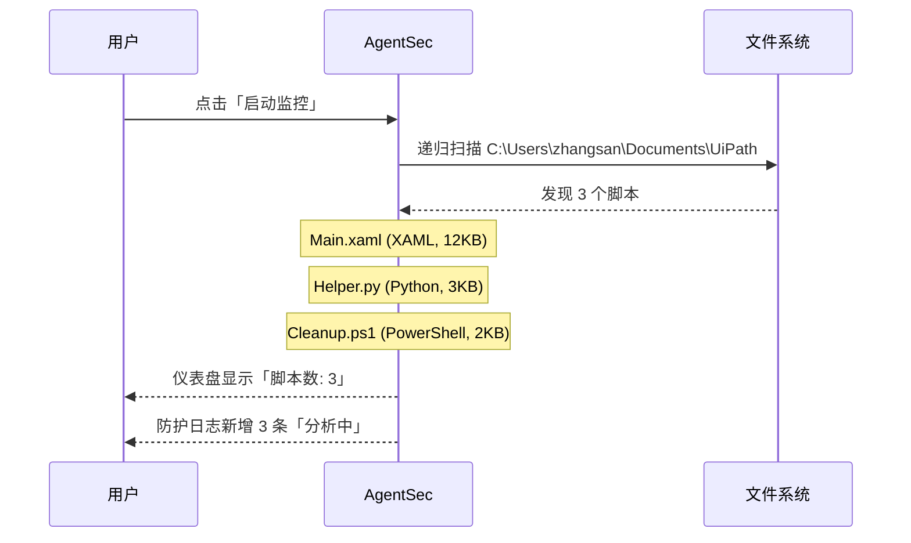
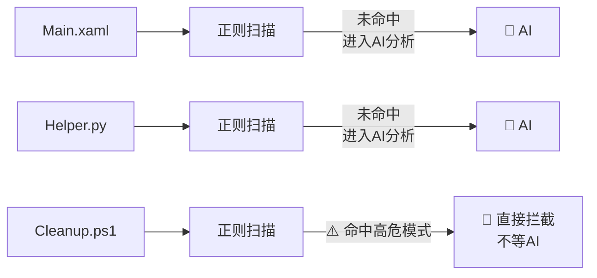
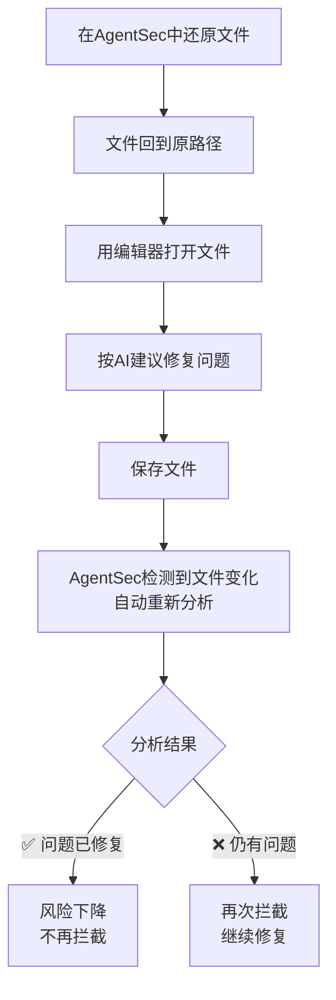

# 03 — 第一次安全分析（完整案例）

> 本页用一个真实场景，带您完整走一遍「发现脚本 → AI 分析 → 查看结果 → 处理问题」的全过程。

---

## 场景设定

假设您的监控目录 `C:\Users\zhangsan\Documents\UiPath` 中有三个脚本：

| 文件名 | 内容简介 |
|--------|---------|
| `Main.xaml` | 一个 UiPath 主流程，读取 Excel 并发送邮件 |
| `Helper.py` | 一个 Python 辅助脚本，里面有硬编码的数据库密码 |
| `Cleanup.ps1` | 一个 PowerShell 清理脚本，删临时文件 |

您刚刚配置好 AgentSec，点击「启动监控」。

---

## 阶段一：扫描与发现



**您看到的画面：**

> 📸 **[截图位置]** `screenshots/first-analysis-scan-complete.png` — 扫描完成，3 个脚本等待分析

- 仪表盘：脚本数 = 3，分析中 = 3，已分析 = 0
- 防护日志：3 个条目都显示绿色旋转图标「分析中」

---

## 阶段二：安全检查

每个脚本依次经过：

### 第1关：正则快速扫描



三份脚本的正则扫描结果：

| 脚本 | 正则结果 | 处理 |
|------|---------|------|
| `Main.xaml` | 未命中 | → 进入 AI 分析 |
| `Helper.py` | 未命中 | → 进入 AI 分析 |
| `Cleanup.ps1` | ⚠️ 命中 `fs-remove-item-system`（PowerShell 强制递归删除） | → **直接拦截** |

**Cleanup.ps1 的正则命中意味着**：脚本中包含 `Remove-Item -Recurse -Force C:\...` 这样的高危命令，AgentSec 不需要等 AI 分析，直接执行拦截。

> 📸 **[截图位置]** `screenshots/first-analysis-prefilter-hit.png` — Cleanup.ps1 被正则预拦截

Cleanup.ps1 被隔离后：
- 原始文件 → `.agentsec_quarantine\Cleanup_20260609T093000Z.ps1`
- 原路径 → 安全桩文件（只读，无法执行）
- 防护日志中显示：`CRITICAL · 已隔离 · ⚡正则预拦截`

### 第2关：AI 深度分析

Main.xaml 和 Helper.py 进入 AI 分析。AgentSec 调用 AI 模型，分析脚本安全性。

**Main.xaml 的分析过程**（登录模式）：

```
上传脚本内容 → AgentSec 云端 → AI 分析
  ↓
检查项目（基于您启用的安全策略规则）:
  · 是否向外部发送数据？（网络请求检查）
  · 是否包含硬编码密码？（凭证检查）
  · 是否使用明文 HTTP？（传输安全检查）
  · 是否有异常处理？（代码质量检查）
  · 是否有 SQL 注入风险？（注入检查）
  ...（共检查 15-21 条规则，取决于您的策略设置）
  ↓
返回分析结果
```

> 📸 **[截图位置]** `screenshots/first-analysis-ai-progress.png` — AI 分析中的进度界面

---

## 阶段三：查看结果

分析完成后，三个脚本的结果：

| 脚本 | 风险等级 | 动作 | 问题数 |
|------|---------|------|--------|
| `Main.xaml` | MEDIUM | 放行（可写） | 2 |
| `Helper.py` | CRITICAL | 拦截（已隔离） | 1 |
| `Cleanup.ps1` | CRITICAL | 拦截（已隔离）⚡正则 | 1 |

> 📸 **[截图位置]** `screenshots/first-analysis-results-overview.png` — 三个脚本的分析结果总览

---

## 阶段四：逐个解读

### 脚本 1：Main.xaml — MEDIUM · 可写

> 📸 **[截图位置]** `screenshots/first-analysis-main-xaml.png` — Main.xaml 的详情面板

点击 Main.xaml，右侧展开：

**问题 1：MEDIUM — 缺少全局异常处理**

```
📍 位置：整个工作流
📋 描述：脚本没有 TryCatch/Finally 包裹主要逻辑，
       如果运行时出错，异常信息可能泄露内部路径或数据。
💡 建议：在 Sequence 外层添加 TryCatch 活动，
       并在 Catch 块中记录通用错误信息而非详细堆栈。
```

**问题 2：LOW — 日志不够充分**

```
📍 位置：邮件发送步骤之后
📋 描述：发送邮件操作没有记录日志，如果发送失败无法追溯。
💡 建议：在关键操作前后添加 Log Message 活动。
```

**处理决定**：两个问题都只是建议，风险不高，AgentSec 没有拦截该文件。在开发时有空修复即可。

---

### 脚本 2：Helper.py — CRITICAL · 已隔离

> 📸 **[截图位置]** `screenshots/first-analysis-helper-py.png` — Helper.py 的详情面板

点击 Helper.py，右侧展开：

**问题：CRITICAL — 硬编码凭证 / API Key**

```
📍 位置：第 15 行
📝 代码片段：
    14  | # Database connection
    15  | conn = pyodbc.connect('DRIVER={ODBC};SERVER=prod-db;
         |                      UID=admin;PWD=MyPassword123')
    16  | cursor = conn.cursor()

📋 描述：Python 脚本中硬编码了生产数据库的用户名(admin)
       和密码(MyPassword123)。任何人拿到这个脚本都能直接
       访问数据库。

💡 建议：
   1. 立即修改数据库密码（因为已经暴露在代码中）
   2. 改用环境变量存储连接信息：
      conn = pyodbc.connect(os.environ['DB_CONN_STRING'])
   3. 或使用密钥管理服务（如 Azure Key Vault）
```

**AgentSec 已执行的操作**：
- ✅ 检查是否有 Python 进程在运行该脚本 → 已终止
- ✅ 原文件移入 `.agentsec_quarantine\Helper_20260609T093015Z.py`
- ✅ 原路径替换为安全桩文件
- ✅ 生成 `.meta.json` 记录隔离详情

**您的下一步**：修复代码中的硬编码密码，然后从隔离区还原文件。

---

### 脚本 3：Cleanup.ps1 — CRITICAL · 已隔离 ⚡正则预拦截

> 📸 **[截图位置]** `screenshots/first-analysis-cleanup-ps1.png` — Cleanup.ps1 的详情面板

Cleanup.ps1 没有经过 AI 分析（被正则预扫直接拦截），它的详情面板标注了「正则预拦截」：

**问题：HIGH — PowerShell 强制递归删除系统盘**

```
📍 代码片段：
    Remove-Item -Path C:\Windows\Temp\* -Recurse -Force

📋 描述：脚本使用 Remove-Item -Recurse -Force 指向 C: 盘。
       虽然本例目标是 Temp 目录，但 -Recurse -Force 组合
       在系统盘上具有极高破坏性，被 AgentSec 预过滤器拦截。

💡 建议：
   1. 使用精确的绝对路径，避免通配符加 -Recurse -Force
   2. 添加 -WhatIf 参数做预演（仅 PowerShell 5.1+）
   3. 清理临时文件可考虑使用系统自带的磁盘清理工具
```

---

## 阶段五：处理与修复

### Helper.py（需要修复后还原）

1. 打开 `.agentsec_quarantine\Helper_20260609T093015Z.py` 查看原文件
2. 修改第 15 行，将硬编码密码改为环境变量
3. 回到 AgentSec，在防护日志中找到 Helper.py
4. 点击 **「还原」**，将修改后的文件放回原处
5. 因为文件内容变了（哈希不同），还原后如果再次被 chokidar 检测到修改，会重新分析

> ⚠️ 实际上还原的是隔离区中的**原文件**。如果您想先修改再还原，需要手动操作：从隔离区复制文件 → 修改 → 放回原路径 → 在沙箱中清理隔离记录。

**推荐的标准流程**：



### Cleanup.ps1（正则拦截，需要审查）

正则预拦截的文件需要人工判断：这个脚本是否真的危险？

- 如果 `Cleanup.ps1` 确实是清理 C:\Windows\Temp（合理操作）：还原 + 加入白名单
- 如果这个脚本来源不明且确实危险：保持在隔离区

---

## 总结：第一次分析的收获

| 学到的 | 说明 |
|--------|------|
| AgentSec 扫描是**自动的** | 启动监控后全程自动，不需要手动触发 |
| 有两层安全网 | 正则预扫（毫秒级）+ AI 分析（深度检查） |
| 拦截不是删除 | 文件被「隔离」而非删除，随时可以还原 |
| 详情要看三个地方 | 风险等级、代码片段、修复建议 |
| 被拦不一定危险 | Cleanup.ps1 的正则拦截可能是误报，需要人工判断 |

---

## 下一步

| 我想... | 看这个 |
|---------|--------|
| 了解监控的更多配置选项 | [04 — 监控配置详解](04-monitoring.md) |
| 学习防护日志的所有功能 | [05 — 安全防护日志](05-security-log.md) |
| 了解如何管理隔离/信任文件 | [06 — 安全沙箱](06-sandbox.md) |
| 知道怎么调整拦截的严格程度 | [07 — 安全策略](07-security-policy.md) |
