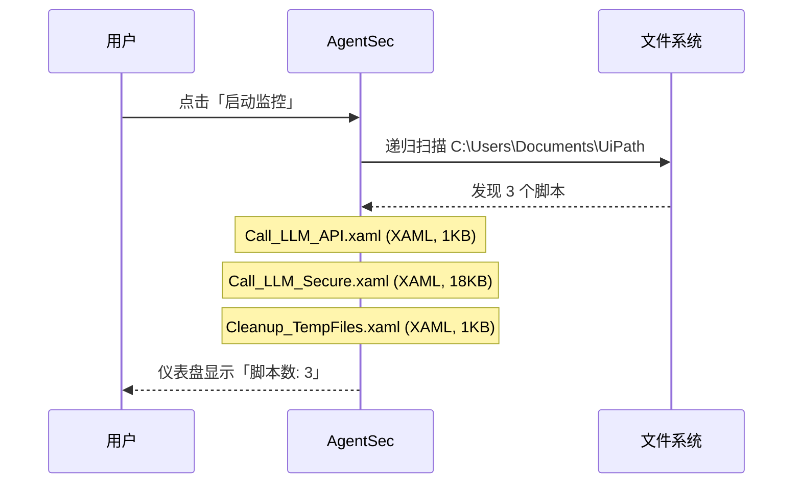
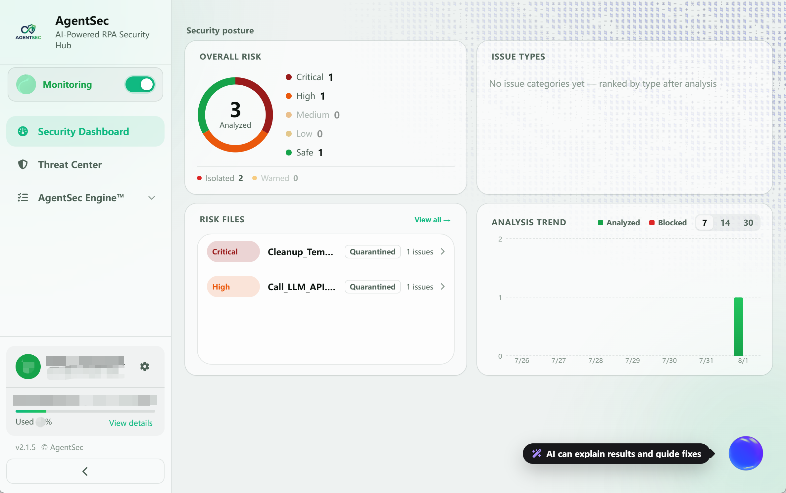
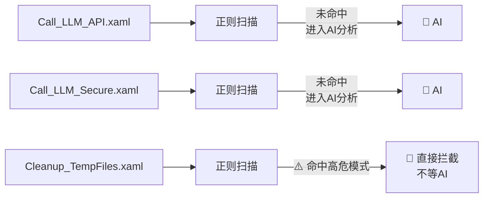
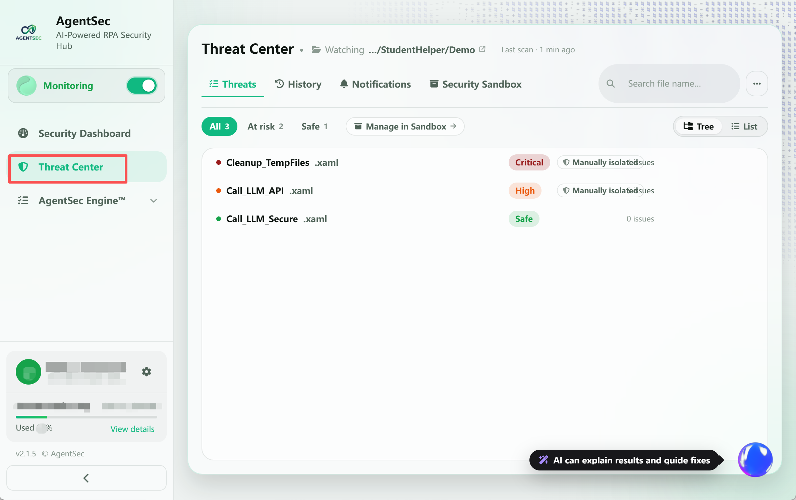
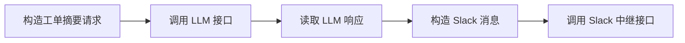
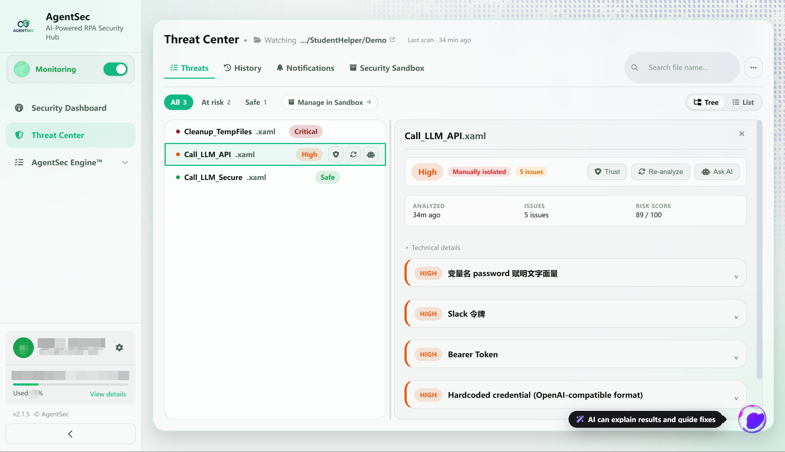
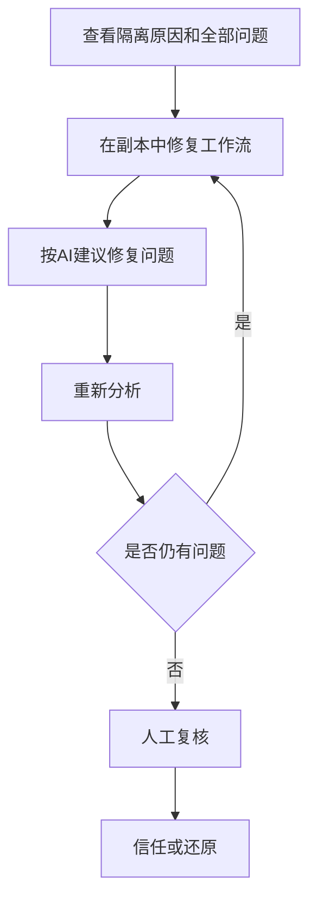

# 第一次安全分析：三个 UiPath 工作流案例

> 本页以三个 UiPath XAML 工作流为例，演示从启动监控、查看分析结果到处理风险文件的完整流程。

---

## 场景准备

假设您的监控目录 `C:\Users\Documents\UiPath` 中有三个脚本：

| 文件                       | 用途                          | 主要安全特征                                  |
| ------------------------ | --------------------------- | --------------------------------------- |
| `Call_LLM_API.xaml`      | 调用大模型生成工单摘要，再将结果回帖到 Slack   | 在工作流中直接写入 API Key 和 Slack Token         |
| `Call_LLM_Secure.xaml`   | `Call_LLM_API.xaml` 的安全改写版本 | 从 Orchestrator Assets 读取凭据，并包含异常处理和安全日志 |
| `Cleanup_TempFiles.xaml` | 调用 PowerShell 清理文件          | 执行针对系统盘根目录的强制递归删除命令                     |

> 示例中的密钥、Token、接口地址和频道编号均为演示值，不是真实凭据。

如果您想跟着本章复现，可以先下载配套的 [UiPath 示例包](https://github.com/PolyUxAISecurity/AgentSec-UserDoc/raw/main/Demo/agentsec-uipath-demo.zip)。解压后，将 `Demo` 文件夹放到一个测试目录，并在 AgentSec 中把该目录设为监控目录。

示例包中包含三个工作流：`Call_LLM_API.xaml`、`Call_LLM_Secure.xaml` 和 `Cleanup_TempFiles.xaml`，后续各阶段会逐个说明它们的分析结果和处理方式。

您刚刚配置好 AgentSec，在左侧监控状态卡片中开启监控。

---

## 阶段一：扫描与发现

启动监控后，AgentSec 会扫描 `C:\Users\Documents\UiPath`，发现三个 `.xaml` 文件并依次创建分析任务。



**您看到的画面：**
> 

---

## 阶段二：安全检查

每个脚本依次经过：
### 第1关：正则快速扫描



三份脚本的正则扫描结果：

| 脚本                       | 正则结果                                             | 处理         |
| ------------------------ | ------------------------------------------------ | ---------- |
| `Call_LLM_API.xaml`      | 未命中                                              | → 进入 AI 分析 |
| `Call_LLM_Secure.xaml`   | 未命中                                              | → 进入 AI 分析 |
| `Cleanup_TempFiles.xaml` | ⚠️ 命中 `fs-remove-item-system`（PowerShell 强制递归删除） | → **直接拦截** |
**Cleanup_TempFiles.xaml 的正则命中意味着**：脚本中包含 `Remove-Item -Recurse -Force C:\...` 这样的高危命令，AgentSec 不需要等 AI 分析，直接执行拦截。

`Cleanup_TempFiles.xaml` 被隔离后：
- 原始文件 → `.agentsec_quarantine\Cleanup_TempFiles_20260609T093000Z.xaml`
- 原路径 → 安全桩文件（只读，无法执行）

### 第2关：AI 深度分析

`Call_LLM_API.xaml` 和 `Call_LLM_Secure.xaml` 进入 AI 分析。AgentSec 调用 AI 模型，分析脚本安全性。

**Call_LLM_API.xaml 的分析过程**（登录模式）：

```
上传脚本内容 → AgentSec 云端 → AI 分析
  ↓
检查项目（基于您启用的安全策略规则）:
  · 是否向外部发送数据？（网络请求检查）
  · 是否包含硬编码密码？（凭证检查）
  · 是否使用明文 HTTP？（传输安全检查）
  · 是否有异常处理？（代码质量检查）
  · 是否有 SQL 注入风险？（注入检查）
  ...（共检查 15-21 条规则，取决于您的策略设置）
  ↓
返回分析结果
```

---

## 阶段三：查看结果

分析完成后，在左侧导航栏点击 **「威胁中心」**，再从脚本列表中选择文件查看详情。
> 

| 文件                       | 分析结果         | 问题数 | 文件状态 |
| ------------------------ | ------------ | --: | ---- |
| `Call_LLM_API.xaml`      | **High**     |   5 | 已隔离  |
| `Call_LLM_Secure.xaml`   | **Safe**     |   0 | 未隔离  |
| `Cleanup_TempFiles.xaml` | **Critical** |   1 | 已隔离  |

这里可以看到三个典型结果：

- **Safe**：未发现安全问题，文件可继续使用；
- **High**：存在高危问题，文件已被隔离，需要修复或人工确认；
- **Critical**：存在可能造成严重破坏的操作，文件已被隔离，应优先处理。

> 分析详情页还提供 **「信任」**、**「重新分析」** 和 **「询问 AI」** 等操作。只有在确认文件安全后，才应使用「信任」。

---

## 阶段四：逐个解读

### 脚本一：`Call_LLM_API.xaml`——High · 已隔离

#### 工作流做了什么

该工作流先构造工单摘要请求，通过 HTTP 接口调用大模型；随后构造 Slack 消息，并通过另一个 HTTP 请求发送回帖。



#### AgentSec 的判定
AgentSec 检出 **5 个问题**，主要与 XAML 中的明文 API Key、Slack Token 和疑似密码字段有关，因此将文件判定为 **High** 并隔离。

**处理建议：** 删除明文凭据，轮换已经暴露的密钥，并改用 UiPath Orchestrator Asset 或其他密钥管理服务。

> 

---

### 脚本二：`Call_LLM_Secure.xaml`——Safe · 未隔离

#### 与高风险版本有什么不同

安全版本仍然完成“调用 LLM 生成摘要并回帖到 Slack”的业务流程，但采用了更安全的实现：

| 改进 | XAML 中的实现 |
| --- | --- |
| 不保存明文凭据 | 使用 `GetRobotAsset` 读取 `LLM_Gateway_ApiKey` 和 `Slack_Bot_Token` |
| 运行时传入令牌 | HTTP 请求使用 `OAuthToken` 变量，不在请求头中写死 Token |
| 限制请求行为 | 启用 TLS、设置超时，并配置有限次数的重试 |
| 检查响应状态 | 对非 2xx HTTP 状态主动抛出异常 |
| 处理运行异常 | 使用 `TryCatch` 包裹 LLM 与 Slack 调用 |
| 减少日志泄露 | 只记录成功状态、HTTP 状态、耗时和响应长度等元数据 |

#### AgentSec 的判定
该工作流实现了相同的 LLM 与 Slack 调用，但凭据从 Orchestrator Assets 读取，并加入了异常处理、HTTP 状态检查和安全日志。未发现安全问题，结果为 **Safe**，文件保持可用。

> 

---

### 脚本三：`Cleanup_TempFiles.xaml`——Critical · 已隔离

该工作流名义上用于清理临时文件，但其 PowerShell 活动实际执行：

```powershell
Remove-Item -Recurse -Force -Path C:\
```

该命令会尝试从系统盘根目录开始强制递归删除。AgentSec 将其判定为 **Critical** 并立即隔离。

**处理建议：** 不要直接信任或还原；应将删除目标改为明确、受控的临时目录，并在执行前校验路径和使用 `-WhatIf` 预演。

> 

---

## 阶段五：处理与修复

| 文件 | 主要处理 |
| --- | --- |
| `Call_LLM_API.xaml` | 轮换已暴露的凭据，删除明文密钥，并参考安全版本改用 Orchestrator Assets |
| `Call_LLM_Secure.xaml` | 无需隔离处理；按正常流程测试接口权限和业务逻辑 |
| `Cleanup_TempFiles.xaml` | 删除系统盘递归删除命令，改用经过校验的明确目标目录 |

修改风险文件后，点击 **「重新分析」**。只有分析结果和人工复核均通过，才应信任或还原文件。



> 请通过 AgentSec 的威胁中心和安全沙箱管理隔离文件，不要手动修改 `.agentsec_quarantine` 中的原始文件或元数据。

---
## 总结：第一次分析的收获

| 学到的                 | 说明                            |
| ------------------- | ----------------------------- |
| AgentSec 扫描是**自动的** | 启动监控后全程自动，不需要手动触发             |
| 有两层安全网              | 正则预扫（毫秒级）+ AI 分析（深度检查）        |
| 拦截不是删除              | 文件被「隔离」而非删除，随时可以还原            |
| 详情要看三个地方            | 风险等级、代码片段、修复建议                |
| 被拦不一定危险             | Cleanup.ps1 的正则拦截可能是误报，需要人工判断 |

---

## 下一步

- [配置和管理监控目录](04-monitoring.md)
- [查看威胁中心的完整分析详情](05-security-log.md)
- [管理隔离区与安全区](06-sandbox.md)
- [配置安全策略](07-security-policy.md)
- [使用 AI 助手解释和修复问题](08-ai-assistant.md)
