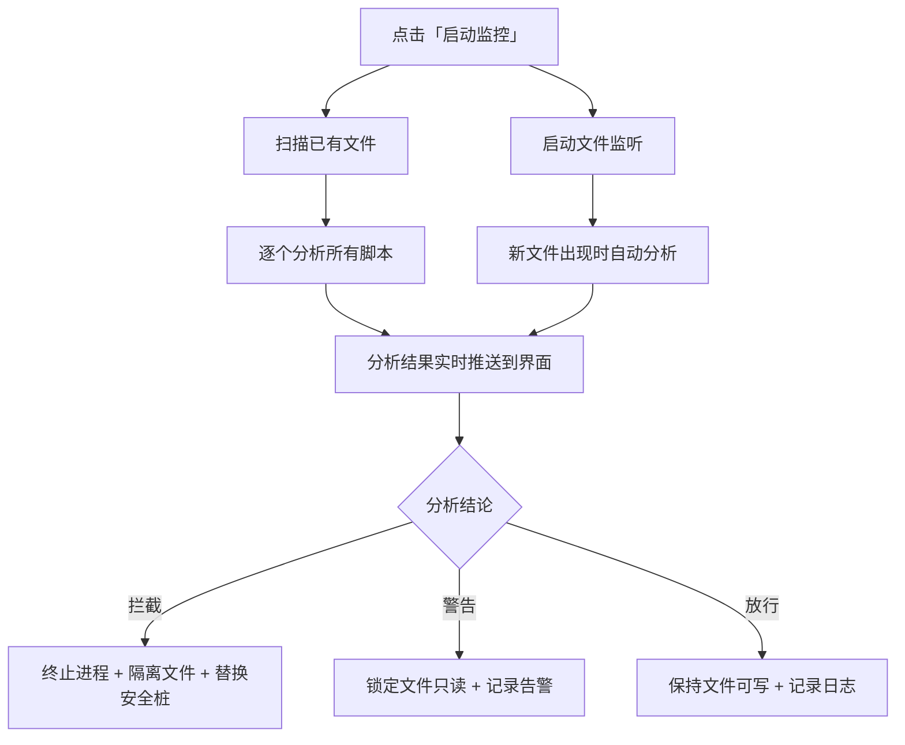
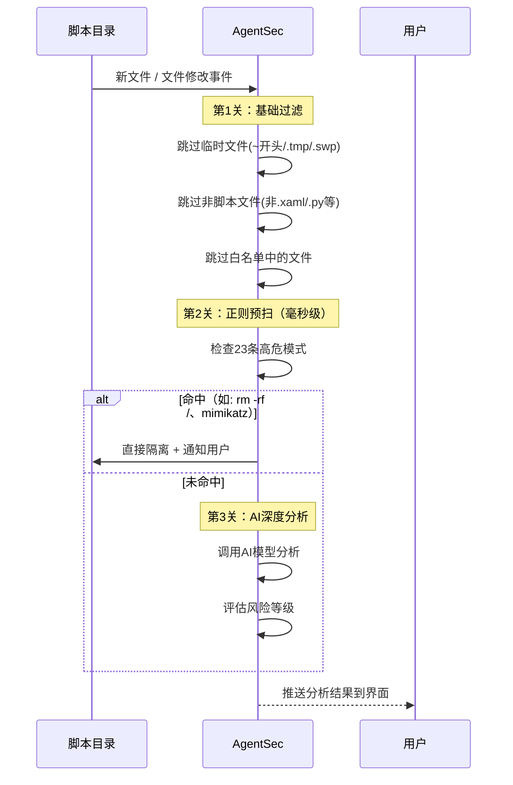

# 监控配置与使用指南

> 监控是 AgentSec 的核心功能。启动后，AgentSec 会持续监视您指定的目录，自动检测新增或修改的脚本并触发安全分析。

---

## 什么是「监控」？

AgentSec 的监控功能包含以下自动操作：

1. **发现脚本**：扫描指定目录中的所有 RPA 脚本
2. **实时监听**：目录中有新文件或文件被修改时，自动触发分析
3. **安全检查**：每个脚本依次经过「正则快速扫描」→「AI 深度分析」
4. **自动响应**：根据分析结果自动拦截、警告或放行

> 📸 **[截图位置]** `screenshots/monitoring-overview.png` — 监控工作流程示意图

---

## 如何选择监控目录？

### 在仪表盘中设置

1. 点击仪表盘顶部的监控目录卡片
2. 自动跳转到「设置 → 常规」页面
3. 点击「选择目录」按钮
4. 支持**多目录同时监控**：可添加多个文件夹路径

> 📸 **[截图位置]** `screenshots/settings-watchdir-select.png` — 设置页面中的监控目录选择

### 使用自动检测

AgentSec 会自动检测您电脑上已安装的 RPA 工具，将其默认项目目录列在建议区：

> 📸 **[截图位置]** `screenshots/settings-rpa-suggestions.png` — RPA 目录建议列表

| 可能检测到的工具 | 默认目录 |
|----------------|---------|
| UiPath | `Documents\UiPath` |
| Power Automate Desktop | `Documents\Power Automate Desktop` |
| Automation Anywhere | `Documents\Automation Anywhere Files` |

> 💡 直接点击建议目录即可自动填入，无需手动翻找。

### 选择目录的原则

| ✅ 推荐 | ❌ 不推荐 |
|--------|----------|
| RPA 项目专用目录 | C 盘根目录 |
| 脚本集中存放的文件夹 | 系统目录（Windows / Program Files） |
| 某个项目的子目录 | 包含大量非脚本文件的目录 |

---

## 启动 / 停止监控

### 启动

1. 确认「监控目录」已正确设置
2. 点击蓝色 **「启动监控」** 按钮

> 📸 **[截图位置]** `screenshots/dashboard-start-btn.png` — 启动监控按钮

启动后发生的变化：



### 停止

- 点击红色 **「停止监控」** 按钮
- 停止后：
  - 不再监听新文件
  - 正在进行的分析会继续完成
  - 已分析的结果保留在界面上

> 📸 **[截图位置]** `screenshots/dashboard-stop-btn.png` — 停止监控按钮（红色）

---

## 监控过程中会发生什么？



### 第1关：基础过滤

进入分析前，AgentSec 会先排除以下文件：
- 临时文件（名称以 `~$` 或 `.` 开头、后缀 `.tmp` / `.swp`）
- 不支持的脚本类型
- 已被加入白名单（信任列表）且内容未变的文件

### 第2关：正则预扫（毫秒级）

用 23 条高置信度规则快速扫描，典型的会被拦截的模式包括：

| 类别 | 示例 |
|------|------|
| 系统破坏 | `rm -rf /`、格式化 C 盘 |
| 勒索软件 | 删除卷影副本、禁用系统恢复 |
| 恶意代码执行 | 从网络下载并直接执行、PowerShell 加密绕过 |
| 凭据窃取 | Mimikatz、转储 lsass 进程 |
| 硬编码密钥 | AWS 密钥、GitHub Token、SSH 私钥 |

> ⚡ 正则预扫通常在 **1 毫秒内完成**。命中后直接拦截，不需要等待 AI 分析，大大提高了响应速度。

### 第3关：AI 深度分析

正则未命中的脚本进入 AI 分析阶段：
- **登录模式**：上传到 AgentSec 云端，由云端 AI 分析（通常 10-30 秒）
- **本地模式**：调用您配置的本地 AI 模型分析（速度取决于模型和硬件）

---

## 监控范围

AgentSec 会递归监控您选择的目录（最多 10 层子目录），但会自动跳过以下目录：

- `node_modules`、`__pycache__`、`.venv` — 依赖缓存目录
- `.git`、`.svn` — 版本控制目录
- `.idea`、`.vscode` — IDE 配置目录
- `$RECYCLE.BIN`、`System Volume Information` — 系统目录
- `.agentsec_quarantine` — AgentSec 自己的隔离目录

---

## 大目录的处理方式

如果您的监控目录中有 **超过 30 个**脚本文件，AgentSec 采用智能两段式处理：

```
阶段1（快速预扫）：32个并发，仅做正则扫描 → 命中高危的直接拦截
阶段2（AI分析）：   8个并发， 对剩余文件做AI深度分析
```

这样即使目录中有上百个脚本，高危脚本也能被即时拦截，不需要排队等 AI。

---

## 文件状态说明

分析完成后，脚本文件会根据分析结果处于不同状态：

| 状态 | 标记 | 含义 | 文件权限 |
|------|------|------|---------|
| 已隔离 | `已隔离`（红色标签） | 被判定为需要拦截，已移入隔离区 | 原路径被安全桩替换 |
| 已锁定 | `只读`（红色标签） | 被判定为警告级别，文件被锁定 | 只读（不可执行） |
| 未拦截 | `可写`（灰色标签） | 风险较低，未被拦截 | 保持原权限 |

> ⚠️ 「可写」不代表「绝对安全」，只代表 AI 认为当前风险等级不需要执行拦截。仍然建议定期审查。

---

## 监控目录变更

如果您需要更换监控目录：

1. 如果监控正在运行，**先停止监控**
2. 在设置中修改监控目录（或直接在仪表盘的目录卡片点击跳转）
3. 重新点击「启动监控」
4. AgentSec 会对新目录重新全量扫描

---

## 常见问题

**Q: 为什么有些脚本分析很快，有些很慢？**
A: 被正则预扫命中的脚本会被毫秒级直接拦截。AI 分析的脚本需要等待模型返回结果，大型脚本（超过 15000 字符）可能会更慢一些。

**Q: 监控对系统性能有影响吗？**
A: 正常使用几乎无影响。文件监听使用操作系统原生事件通知机制（不会轮询磁盘），AI 分析最多 8 个并发不会耗尽资源。

**Q: 关闭应用后监控还继续吗？**
A: 不会。AgentSec 必须保持运行才能监控。建议将 AgentSec 设为开机自启。
