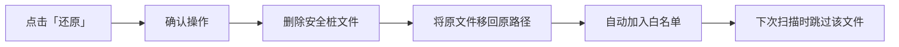

# 安全防护日志

> 防护日志是查看每个脚本分析结果的详细页面。从这里您可以看到 AI 发现了什么问题、风险有多高、应该怎么修复。

---

## 打开防护日志

在左侧导航栏点击 **「防护日志」**。

> 📸 **[截图位置]** `screenshots/security-log-overview.png` — 防护日志全貌

---

## 界面布局

防护日志采用 **左右双栏** 布局：

```
┌──────────────────────┬──────────────────────────┐
│  左侧：脚本列表       │  右侧：详情面板           │
│                      │                          │
│  📁 当前目录 (5)     │  ┌────────────────────┐  │
│  ├─ Main.xaml       │  │ 文件名              │  │
│  │  HIGH · 已隔离   │  │ HIGH · 已隔离       │  │
│  ├─ Process.py      │  ├────────────────────┤  │
│  │  LOW · 可写      │  │ 分析时间 · AI分析   │  │
│  └─ ...             │  │ 风险分数 72/100     │  │
│                      │  ├────────────────────┤  │
│  📁 子目录A (3)     │  │ 问题列表：          │  │
│  ├─ ...             │  │  CRITICAL 硬编码凭证 │  │
│                      │  │  HIGH    HTTP明文    │  │
│                      │  │  MEDIUM  缺少异常处理│  │
│                      │  └────────────────────┘  │
└──────────────────────┴──────────────────────────┘
```

- **左侧**：所有已分析脚本的列表，按子目录分组
- **右侧**：点击某个脚本后，显示其详细分析结果

> 📸 **[截图位置]** `screenshots/security-log-dual-pane.png` — 左右双栏布局截图

---

## 左侧：脚本列表

### 分组显示

如果您的监控目录包含子目录，脚本会按文件夹分组：

- 📁 当前目录 — 监控根目录下的脚本
- 📁 子目录名 — 子文件夹中的脚本

每个文件夹可点击折叠/展开，右侧显示该文件夹内的脚本数量。

> 📸 **[截图位置]** `screenshots/security-log-folders.png` — 文件夹分组视图截图

### 脚本条目信息

每个脚本条目显示：

| 信息 | 示例 | 含义 |
|------|------|------|
| 文件名 | `Main.xaml` | 脚本名称 |
| 风险等级 | `CRITICAL`（红）/ `HIGH`（橙） | 最高风险级别 |
| 文件状态 | `已隔离`（红）/ `只读`（红）/ `可写`（灰） | 文件处置结果 |
| 问题数 | `3 个问题` | 发现的安全问题数量 |
| 分析器 | `⚡正则预拦截` / `AI 智能体分析` | 分析来源 |
| 子目录 | `SubFolder/` | 脚本所在子目录 |

> 📸 **[截图位置]** `screenshots/security-log-script-card.png` — 单个脚本条目卡片的截图

### 状态标签

| 标签 | 颜色 | 说明 |
|------|------|------|
| `分析中` | 绿色旋转图标 | AI 正在分析，显示已等待时间 |
| `分析失败` | 红色 | 分析过程出错，可能是模型超时 |
| `已隔离` | 红色 | 文件已被移入隔离区 |
| `只读` | 红色 | 文件已被锁定为只读 |
| `可写` | 灰色 | 未触发拦截规则 |
| `⚡正则预拦截` | 绿色闪电 | 被正则快速扫描命中，无需AI分析 |

---

## 右侧：详情面板

> 📸 **[截图位置]** `screenshots/security-log-detail-panel.png` — 详情面板截图

点击左侧任意脚本，右侧会展开详细分析结果。

### 顶部概览

| 信息 | 说明 |
|------|------|
| 文件名 | 脚本名称 |
| 风险等级 pill | `CRITICAL` / `HIGH` / `MEDIUM` / `LOW` 标签 |
| 文件状态标签 | 已隔离 / 只读 / 可写 |
| 问题计数 | 共发现 N 个问题 |

### 元数据网格

| 字段 | 说明 |
|------|------|
| 分析时间 | 什么时候完成的分析（如"3分钟前"） |
| 分析器 | AI 智能体分析 / 正则预拦截 |
| 检出问题 | 问题总数 |
| 风险分数 | 0-100，分数越高风险越大 |

### 未发现安全问题

如果脚本分析后未发现任何安全问题，会显示绿色提示：

> ✅ **未发现安全问题**
> 已检查：网络访问 · 凭据/密钥 · 文件操作 · 提权 · 数据外发 · 反取证

### 问题卡片

每个安全问题以可折叠卡片展示：

```
┌─────────────────────────────────────────┐
│ CRITICAL  硬编码凭证 / API Key       ⌄  │
├─────────────────────────────────────────┤
│ 📍 位置：第 15 行                       │
│                                         │
│ 📝 代码片段：                           │
│ ┌───────────────────────────────────┐   │
│ │ password = "admin123"             │   │
│ │ api_key = "sk-abc123..."          │   │
│ └───────────────────────────────────┘   │
│                                         │
│ 📋 描述：脚本中明文写入了密码和API密钥， │
│   这会导致凭证泄漏风险。                 │
│                                         │
│ 💡 修复建议：改用凭证管理器（如 UiPath  │
│   Credential Manager）或环境变量来存储   │
│   敏感信息。                            │
└─────────────────────────────────────────┘
```

> 📸 **[截图位置]** `screenshots/security-log-issue-card.png` — 单个问题详情卡片（展开状态）

点击卡片标题可展开/折叠详情。

### 风险等级含义

| 等级 | 颜色 | 判定标准 | 默认动作 |
|------|------|---------|---------|
| **CRITICAL** | 红色 | 数据外传、硬编码密码、恶意命令、凭据窃取 | 🚫 拦截 |
| **HIGH** | 橙色 | SQL 身份认证、日志含敏感信息、HTTP 明文、禁用证书 | ⚠️ 警告 |
| **MEDIUM** | 黄色 | 缺少异常处理、输入未校验、路径指向个人目录 | ℹ️ 提醒 |
| **LOW** | 灰色 | 日志不足、命名不规范 | — 放行 |

---

## 已隔离脚本的还原

如果某个脚本被错误拦截（您确认它是安全的），可以在详情面板中直接还原：

1. 点击被隔离的脚本，打开详情面板
2. 在详情面板顶部会看到红色隔离信息条
3. 点击 **「还原」** 按钮

> 📸 **[截图位置]** `screenshots/security-log-restore-btn.png` — 详情面板中的还原按钮



还原后的文件会自动加入**白名单**（信任列表），后续扫描时若文件内容不变则跳过分析。

---

## 导出日志

您可以将分析结果导出为 ZIP 文件，用于提交工单或存档：

1. 在防护日志页面右上角，点击 **「导出日志」**
2. 选择保存位置
3. 点击「保存」

> 📸 **[截图位置]** `screenshots/security-log-export.png` — 导出日志按钮和对话框

导出内容包括：
- 安全分析记录（不含脚本源码）
- 应用运行日志
- AI 对话记录

---

## 历史数据

即使关闭 AgentSec 再重新打开，之前的分析记录仍然会保留。防护日志会自动从本地数据库加载最近 200 条历史记录。

---

## 下一步

- [如何管理被隔离的文件？](sandbox.md)
- [如何调整检测规则的严格程度？](security-policy.md)
