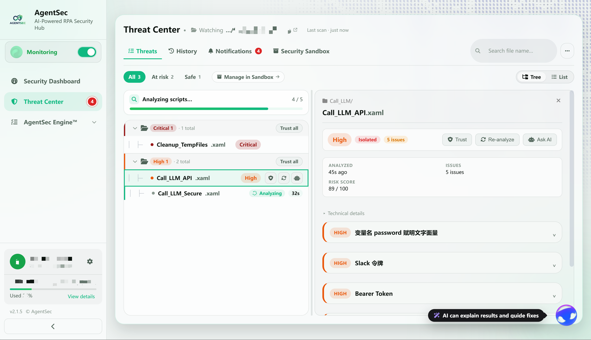
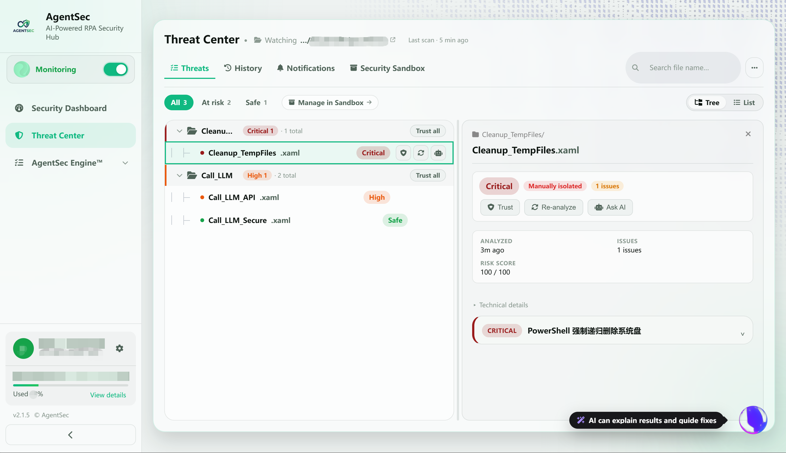
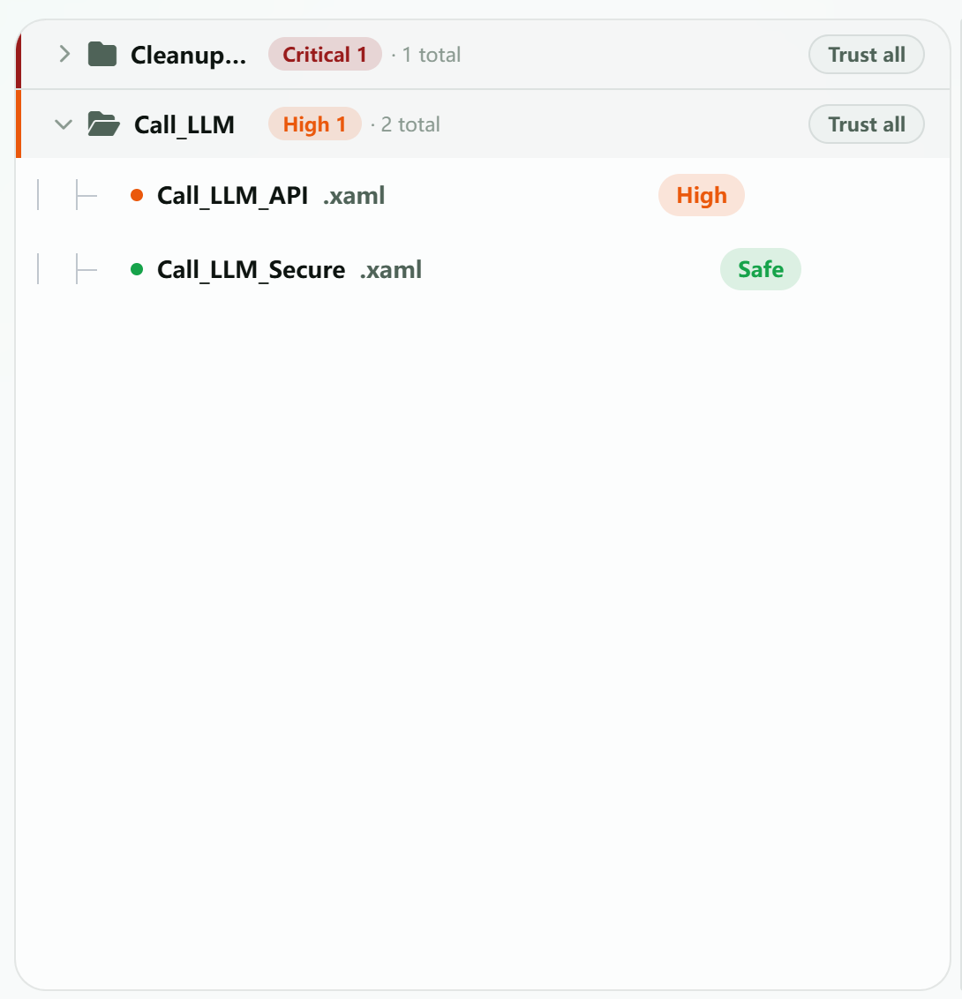
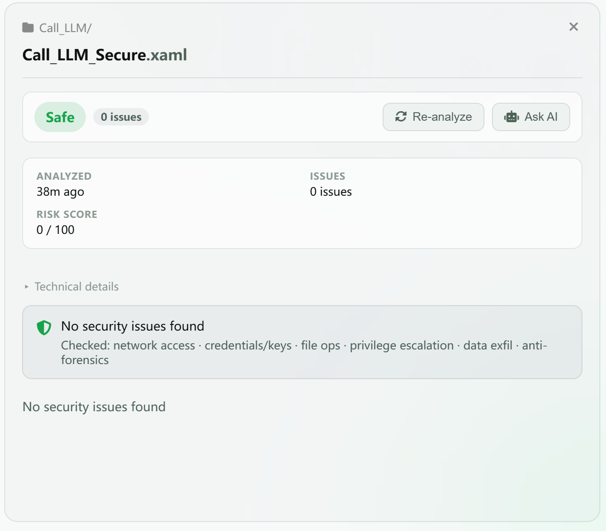
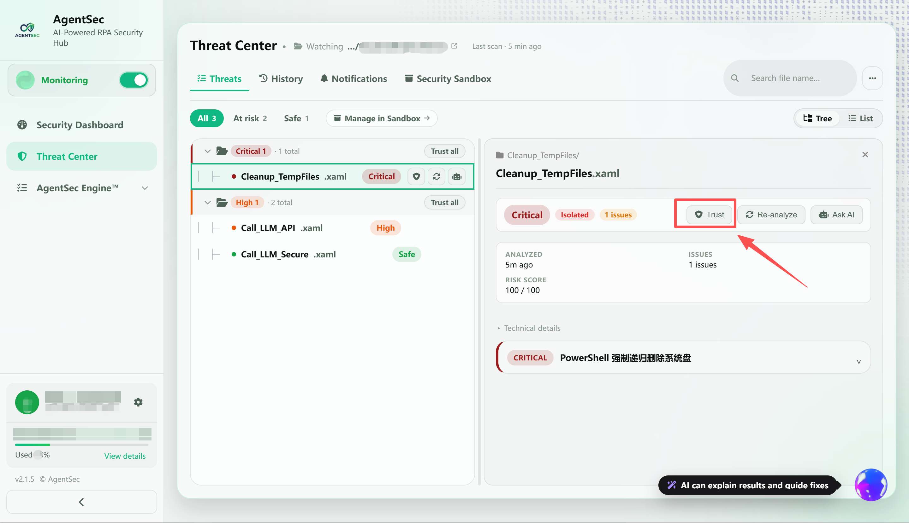
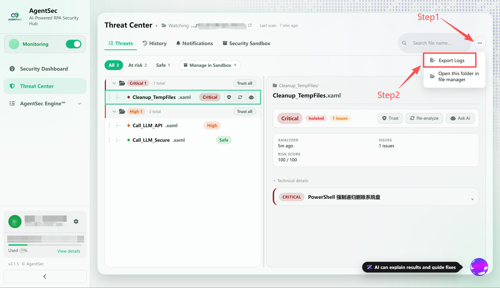

# 威胁中心（防护日志）

> 「威胁列表」、「历史记录」、「通知」、「安全沙箱」四个功能集中在统一的**威胁中心**页面中，可通过顶部标签切换。
> 威胁中心是查看每个脚本分析结果的核心页面。从这里您可以看到 AI 发现了什么问题、风险有多高、应该怎么修复。

---

## 打开威胁中心

在左侧导航栏点击 **「威胁中心」**。

> 

---

## 界面布局

「威胁列表」采用 **左右双栏** 布局。未选择文件时以威胁列表为主；选择文件后，右侧显示该文件的分析详情。

- **左侧**：显示所有已分析脚本，可按风险分组并以目录树或列表方式浏览
- **右侧**：点击某个脚本后，显示该文件的分析结果、风险分数和问题列表

### 顶部工具栏

| 控件                  | 作用                     |
| ------------------- | ---------------------- |
| `全部` / `有风险` / `安全` | 按分析结果筛选文件；标签后的数字表示文件数量 |
| `沙箱管理`              | 进入安全沙箱管理被隔离的文件         |
| 搜索框                 | 按文件名搜索                 |
| `目录树` / `列表`        | 切换威胁列表的显示方式            |

> 

---

## 左侧：威胁列表

### 分组显示

在「目录树」视图中，脚本按风险等级和目录结构分组。如果您的监控目录包含子目录，脚本会按文件夹分组：每个分组标题会显示该组的最高风险等级、文件数量以及 **「信任整组」** 按钮。

- **严重**：红色标识
- **高危**：橙色标识
- **安全**：绿色标识

每个文件夹可点击折叠/展开，右侧显示该文件夹内的脚本数量。

> 

### 脚本条目信息

每个脚本条目显示：

| 信息   | 示例                  | 含义                   |
| ---- | ------------------- | -------------------- |
| 文件名  | `Call_LLM_API.xaml` | 脚本名称                 |
| 风险等级 | `高危`（橙色）            | 文件的最高风险级别            |
| 文件状态 | `已隔离`               | 文件处置结果；在详情面板中显示      |
| 问题数  | `5 条问题`             | 发现的安全问题数量；具体在详情面板中显示 |
| 快捷操作 | 信任 / 重新分析 / 问 AI    | 对当前文件执行相应操作          |
| 子目录  | `Call_LLM/`         | 脚本所在子目录              |

### 状态标签

| 标签 | 颜色 | 说明 |
|------|------|------|
| `分析中` | 绿色旋转图标 | AI 正在分析，并显示已等待时间 |
| `分析失败` | 红色 | 分析过程出错，可能是模型超时 |
| `已隔离` | 红色 | 文件已被移入隔离区 |
| `严重` | 红色 | 文件包含严重风险 |
| `高危` | 橙色 | 文件包含高危风险 |
| `安全` | 绿色 | 未检出安全问题 |

---

## 右侧：详情面板

> 

点击左侧任意脚本，右侧会展开详细分析结果。

### 顶部概览

| 信息 | 说明 |
|------|------|
| 文件名 | 脚本名称 |
| 风险等级标签 | `严重` / `高危` / `中危` / `低危`；问题卡片中可显示 `HIGH` 等英文等级 |
| 文件状态标签 | 例如 `已隔离` |
| 问题计数 | 共发现 N 条问题 |
| 操作按钮 | 信任 / 重新分析 / 问 AI |

### 元数据网格

| 字段 | 说明 |
|------|------|
| 分析时间 | 什么时候完成的分析（如"3分钟前"） |
| 检出问题 | 问题总数 |
| 风险分数 | 0-100，分数越高风险越大 |

元数据下方的 **「技术详情」** 可展开查看更完整的分析信息。问题列表中的每张卡片也可单独展开或折叠。

### 未发现安全问题

如果脚本分析后未发现任何安全问题，会显示绿色提示：

> ✅ **未发现安全问题**
> 已检查：网络访问 · 凭据/密钥 · 文件操作 · 提权 · 数据外发 · 反取证
> 

### 问题卡片

每个安全问题以可折叠卡片展示，包含风险等级、触发位置、代码片段、问题描述和修复建议。

> 

点击卡片标题可展开/折叠详情。

### 风险等级含义

| 等级 | 颜色 | 判定标准 | 默认动作 |
|------|------|---------|---------|
| **CRITICAL** | 红色 | 数据外传、硬编码密码、恶意命令、凭据窃取 | 🚫 拦截 |
| **HIGH** | 橙色 | SQL 身份认证、日志含敏感信息、HTTP 明文、禁用证书 | ⚠️ 警告 |
| **MEDIUM** | 黄色 | 缺少异常处理、输入未校验、路径指向个人目录 | ℹ️ 提醒 |
| **LOW** | 灰色 | 日志不足、命名不规范 | — 放行 |

---

## 已隔离脚本的还原

如果某个脚本被错误拦截（您确认它是安全的），可以在详情面板中直接还原：

1. 点击被隔离的脚本，打开详情面板
2. 在详情面板会看到红色隔离信息条
3. 点击 **「信任」** 按钮；如需处理整个风险分组，也可在左侧点击 **「信任整组」**

> 

确认信任后，AgentSec 会移除安全桩，将原文件恢复到原路径，并把该文件加入**白名单**（信任列表）。后续扫描时，如果文件内容不变，AgentSec 会跳过该文件。

---
## 导出日志

您可以将分析结果导出为 ZIP 文件，用于提交工单或存档：

1. 在防护日志页面右上角，点击 **「导出日志」**

2. 选择保存位置

3. 点击「保存」

> 

导出内容包括：

- 安全分析记录（不含脚本源码）

- 应用运行日志

- AI 对话记录
---

## 历史数据

点击顶部 **「历史记录」** 可查看之前的分析记录。即使关闭 AgentSec 后重新打开，已有记录仍会保留。防护日志会自动从本地数据库加载最近 200 条历史记录。

---

## 下一步

- [如何管理被隔离的文件？](sandbox.md)
- [如何调整检测规则的严格程度？](security-policy.md)
