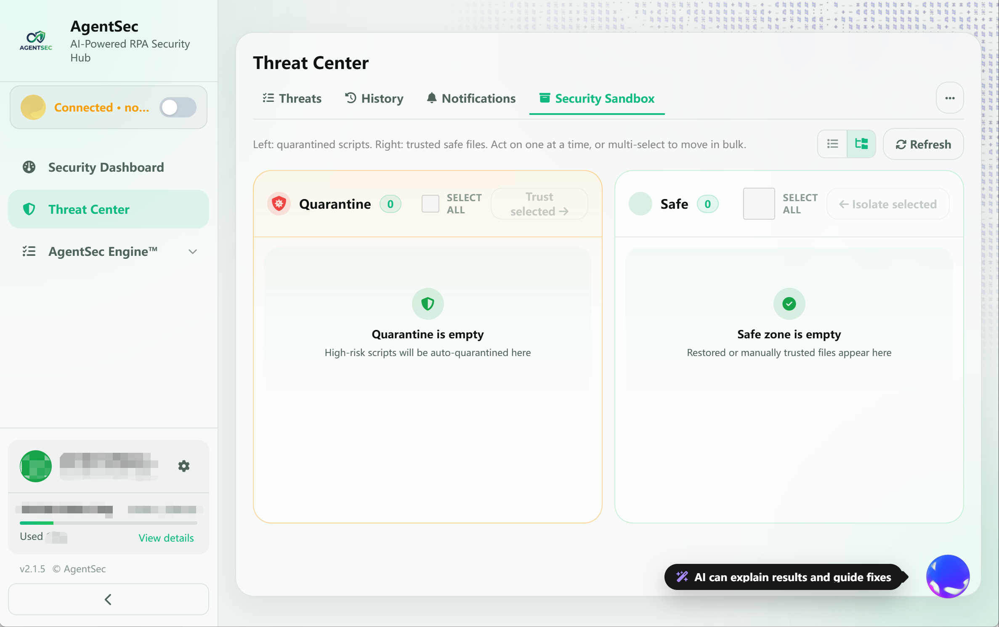
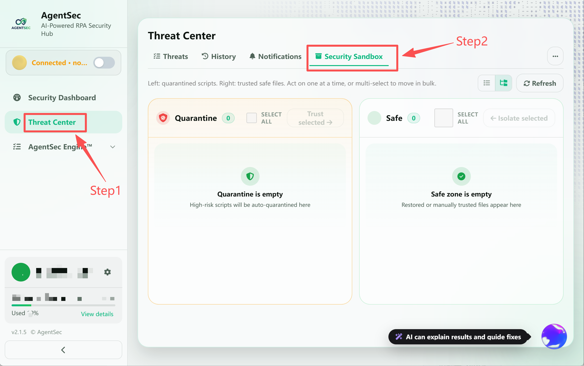
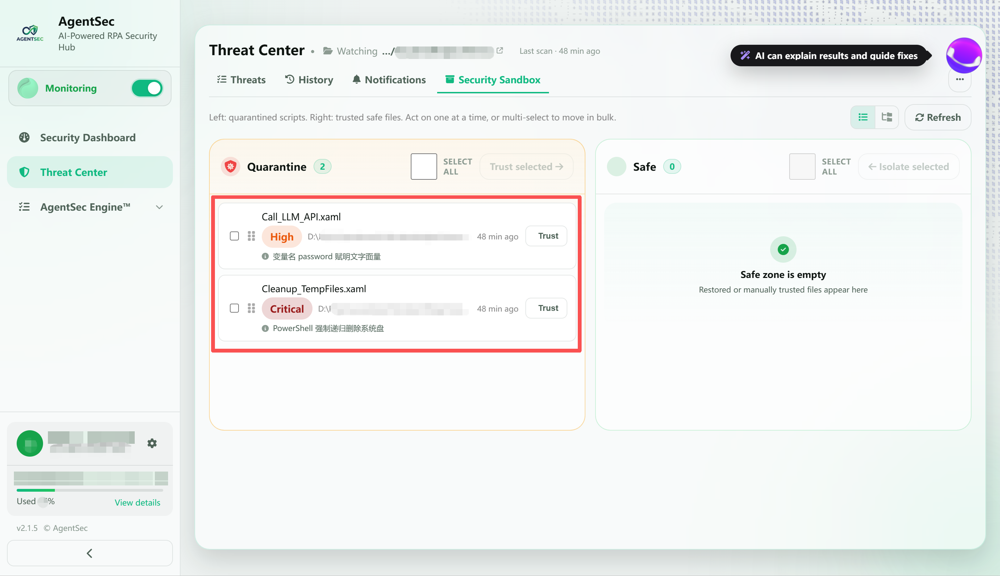
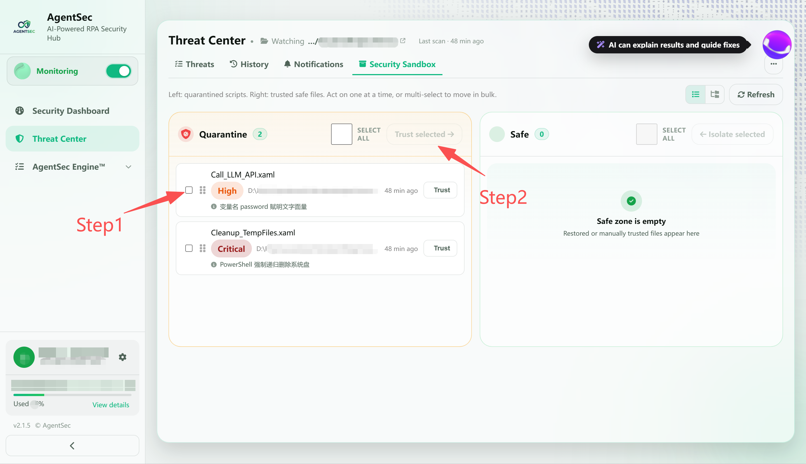
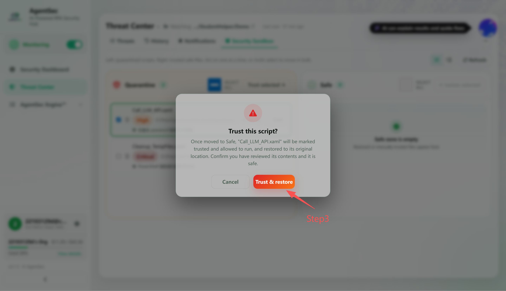
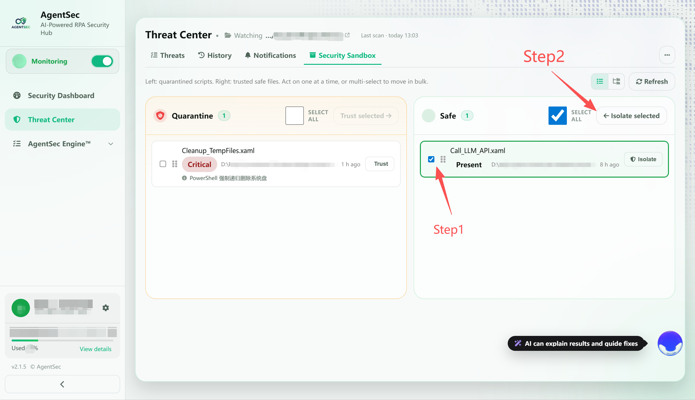

# 安全沙箱 — 隔离区与安全区管理

> 安全沙箱用于管理被 AgentSec 拦截的脚本，支持将误拦的文件还原，或将信任的文件重新隔离。

---

## 什么是安全沙箱？

安全沙箱是 AgentSec 的**文件安全隔离管理系统**。它分为两个区域：

| 区域 | 用途 |
| --- | --- |
| 隔离区 | 存放被 AgentSec 拦截、等待审查的脚本 |
| 安全区 | 存放已确认可信、已从隔离区还原的脚本 |

> 

---

## 打开安全沙箱

安全沙箱已整合进**威胁中心**。在左侧导航栏点击 **「威胁中心」**，再点击顶部的 **「安全沙箱」** Tab。

> 

---

## 隔离区 — 被拦截的文件

### 什么情况下脚本会进入隔离区？

- AI 分析判定为 `block`（拦截）
- 正则预扫命中高危恶意模式
- 用户手动将安全区的文件移回隔离区

### 隔离时发生了什么？

当脚本被判定需要隔离时，AgentSec 会尝试终止正在运行的相关进程，将原文件移入隔离区，在原路径生成安全桩文件，并记录隔离元数据。

### 隔离区条目信息

每个隔离区条目显示：

| 信息 | 说明 |
|------|------|
| 文件名 | 被隔离的脚本文件名称 |
| 风险等级 | `CRITICAL` / `HIGH` 标签 |
| 原始路径 | 文件被隔离前的完整路径 |
| 隔离时间 | 何时被隔离 |

> 

---

## 安全区 — 已信任的文件

### 什么情况下文件进入安全区？

- 从隔离区还原后，**自动加入**安全区
- 加入时会计算文件的 SHA-256 哈希值

### 安全区的「文件存在」标记

| 标记 | 含义 |
|------|------|
| ✅ `文件存在`（绿色） | 文件仍在磁盘上，内容与加入时一致 |
| ❌ `文件不存在`（红色） | 文件已被删除或移动 |

### 内容变更检测

安全区不只记录路径，还记录了文件的 **SHA-256 哈希值**。如果文件内容后来被修改：
- AgentSec 会**自动将其移出安全区**
- 触发重新分析
- 确保「已信任」的文件不会因为被篡改而成为安全漏洞

---

## 操作指南

### 从隔离区还原文件（隔离 → 安全）

如果某个脚本被误拦，您可以将它还原：

**方式一：逐文件还原**

1. 在隔离区勾选要还原的文件
2. 点击 **「批量信任」** 按钮
3. 确认操作

> 
>
> 

**方式二：拖拽还原**

1. 在隔离区勾选文件
2. 将文件拖拽到右侧「安全区」

**方式三：从防护日志还原**

1. 在中找到被隔离的脚本
2. 点击展开详情面板
3. 点击 **「信任」** 按钮

> 

还原时，AgentSec 会删除安全桩文件，将隔离文件移回原路径，计算文件哈希并加入信任列表。只要文件内容不变，后续扫描不会重复分析。

### 将文件重新隔离（安全 → 隔离）

如果之前还原的文件经过审查发现确实有风险，或想撤销信任：

1. 在安全区勾选要重新隔离的文件
2. 点击上方 **「批量隔离」** 按钮
3. 确认操作

文件会被从安全区移除，重新执行隔离流程。

> 

### 多选操作

- 勾选单个文件的复选框
- 点击「全选」可一次选中当前区域全部文件
- 选中后可通过批量按钮或拖拽进行统一操作

---

## 物理文件位置

隔离的文件存储在**原脚本所在目录的 `.agentsec_quarantine` 子目录**中：

```
原脚本目录/
├── Main.xaml              ← 安全桩文件（只读，不可执行）
├── Process.py              ← 安全桩文件（只读，不可执行）
├── .agentsec_quarantine/   ← 隔离目录（AgentSec不会重复扫描）
│   ├── Main_20260101T120000Z.xaml      ← 被隔离的原文件
│   ├── Main_20260101T120000Z.xaml.meta.json ← 隔离元数据
│   ├── Process_20260102T093000Z.py
│   └── Process_20260102T093000Z.py.meta.json
└── ...
```

> ⚠️ **请勿手动修改** `.agentsec_quarantine` 目录中的文件。通过 AgentSec 界面操作才能保证白名单和数据库的一致性。

---

## 安全桩文件

被隔离后，原路径会留一个**安全桩（Stub）**文件，用来说明情况：

- **Python 脚本**的桩：打印警告信息并以错误码退出
- **UiPath 脚本**的桩：一个空的 Sequence，包含 `Terminate` 活动
- **其他类型**的桩：纯文本警告

即使有人尝试执行该文件，也只会看到警告信息，不会产生实际危害。

---

## 常见问题

**Q: 还原后文件会被重新分析吗？**
A: 不会。还原时文件自动加入白名单并记录 SHA-256 哈希值。只要内容不变，后续扫描会跳过。

**Q: 如果还原后修改了文件内容呢？**
A: AgentSec 会在下次扫描时检测到哈希变化，自动将文件移出白名单并重新分析。这是有意为之——您改了代码就应该重新检查。

**Q: 可以手动把文件加入安全区吗？**
A: 当前版本不支持手动添加。安全区文件来自隔离区还原。

**Q: 安全区文件被删除了怎么办？**
A: 安全区会标记为「文件不存在」，但不会自动清理记录。您可以手动将其移回隔离区或联系管理员。
