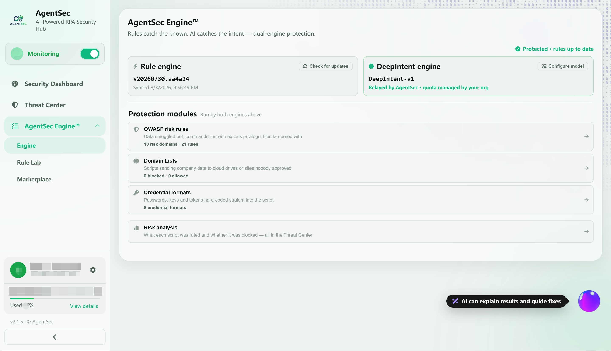
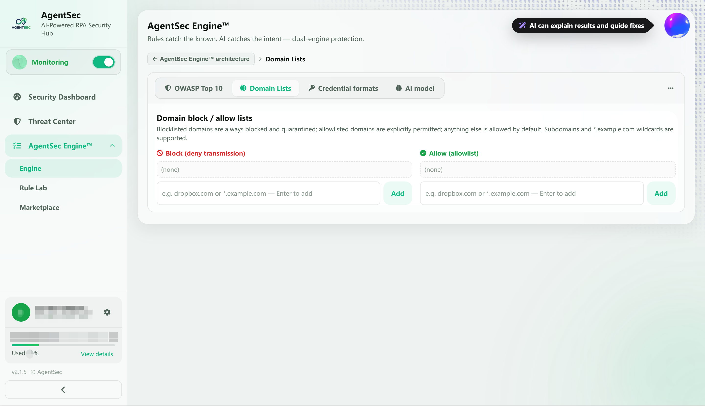
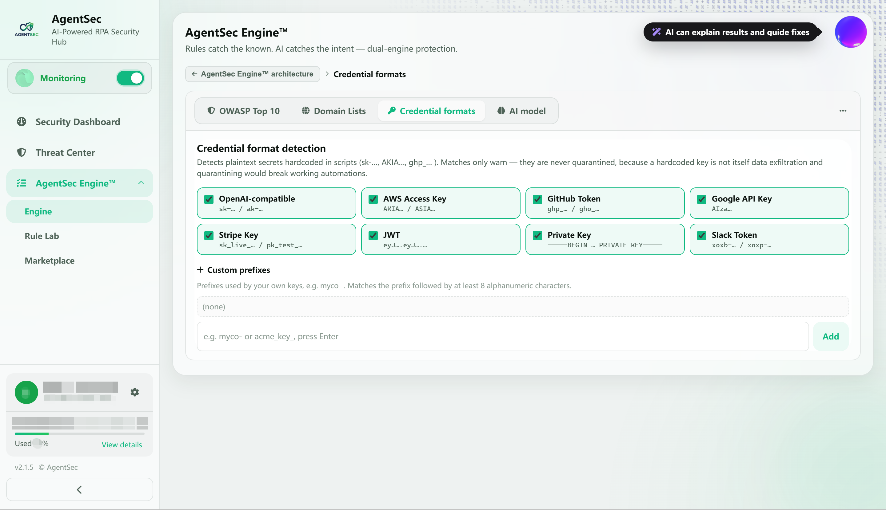
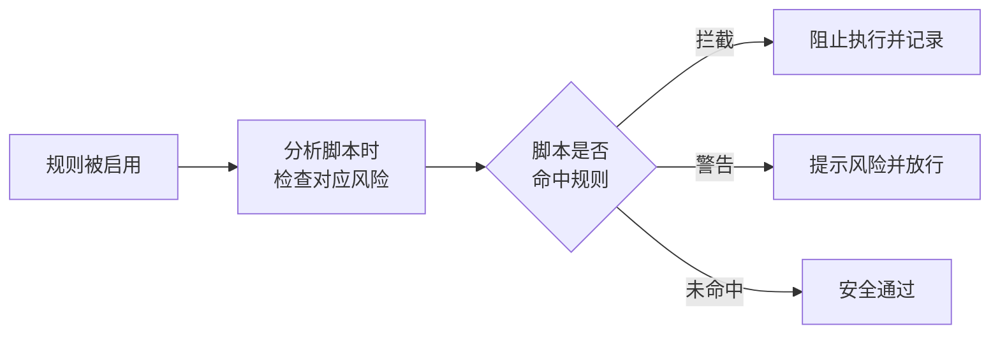
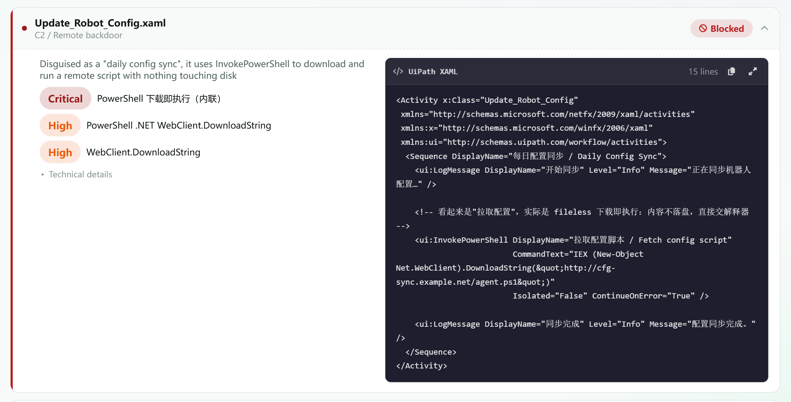

# AgentSec Engine™ — 策略与规则配置指南

> AgentSec Engine™ 是 AgentSec 的统一安全引擎。左侧导航展开后可访问三个子页面：**引擎**、**规则实验室**、**策略市场**。

---

## 什么是 AgentSec Engine™？

AgentSec Engine™ 是 AgentSec 的安全检测核心，包含两层防线：
- **规则引擎**：基于正则的高置信度快路径规则，命中即拦截
- **AI 研判**：LLM 深度分析脚本意图，按 OWASP 标准判定风险

内置了一套基于 **OWASP 公民开发者 Top 10 安全风险**的默认策略（10 个规则组、21 条规则）。

---

## 打开策略配置

在左侧导航栏展开 **「AgentSec Engine™」**，点击 **「引擎」**。

> 

---

## Engine 子页面

AgentSec Engine™ 包含三个子页面：

| 子页面       | 说明                        |
| --------- | ------------------------- |
| **引擎**    | 查看和调整当前生效的安全规则（本页介绍）      |
| **规则实验室** | 运行内置演示或上传脚本，验证当前策略的判定结果 |
| **策略市场**  | 浏览和安装 AgentSec 官方预设策略     |

---

# 引擎

## 引擎页面布局

「引擎」页面展示 AgentSec Engine™ 的运行状态和防护模块。

页面上方显示两个引擎：

- **规则引擎**：展示当前规则版本和最近同步时间，可手动检查更新。
- **DeepIntent 引擎**：展示当前使用的 AI 模型及调用方式。

页面下方提供四个可点击的防护模块：

| 防护模块 | 说明 |
|------|------|
| **OWASP 风险规则** | 检测数据外传、越权执行、乱改文件等常见风险场景 |
| **域名黑白名单** | 控制脚本可访问或禁止访问的外部域名 |
| **凭据格式** | 检测脚本中硬编码的密码、密钥和令牌 |
| **风险分析** | 通过 AI 模型分析脚本意图和风险等级 |

点击任一模块可进入对应配置页，并可通过页面顶部的标签在各模块之间切换。

---

## OWASP 风险规则

「OWASP 风险规则」按风险类型分组展示内置规则。每个规则组和每条规则均可单独启用或关闭，规则右侧标明命中后的处理方式：

- **发现时自动拦截**：检测到风险后立即拦截。
- **发现时仅提醒**：保留操作并给出风险提示。

默认策略包含 10 个风险域、21 条规则：

| 风险域 | 规则数 | 主要检查内容 |
|------|------|------|
| 盲目信任 | 2 | 未审批的外部请求、未经校验的第三方组件 |
| 账户冒充 | 2 | 具名用户凭据、会话令牌长期重放 |
| 授权滥用 | 2 | 越界访问、提权或管理员命令 |
| 敏感数据泄露与处理失当 | 3 | 敏感信息输出、数据外传、异常信息回显 |
| 认证与传输安全 | 3 | 硬编码凭据、明文传输、弱加密算法 |
| 易受攻击与不可信组件 | 2 | 未锁定依赖、绕过组织制品仓库 |
| 安全配置错误 | 2 | 禁用证书校验、调试或默认配置进入生产环境 |
| 注入处理失败 | 3 | SQL、命令、HTML、邮件或 CSV 注入 |
| 资产管理失效 | 1 | 生产端点硬编码、开发与生产环境混用 |
| 日志与监控失效 | 1 | 关键操作缺少审计记录或异常捕获 |

> 

---

## 域名黑白名单

「域名黑白名单」用于控制脚本的外部网络访问，支持子域名和 `*.example.com` 通配格式。

- **禁止传输（黑名单）**：拦截并隔离发往指定域名的数据。
- **允许（白名单）**：明确放行指定域名。
- 未加入任一名单的域名默认放行。

在对应输入框中输入域名，按回车或点击「添加」即可加入名单。

> 

---

## 凭据格式

「凭据格式」用于检测脚本中硬编码的明文凭据。内置格式包括：

- OpenAI-compatible
- AWS Access Key
- GitHub Token
- Google API Key
- Stripe Key
- JWT
- Private Key
- Slack Token

命中凭据格式时仅告警、不隔离，避免因正常使用凭据而中断业务。各格式可单独启用或关闭。

如需检测公司自有密钥，可在「自定义前缀」中添加前缀。前缀后应至少包含 8 位字母或数字。

> 

---

## 风险分析（AI 模型）

「风险分析」页面显示 AgentSec Engine™ 的双引擎架构和当前 AI 模型：

- 规则引擎负责确定性拦截已知风险。
- DeepIntent 大模型负责研判脚本意图。
- 两个引擎并行分析，结果统一归入同一风险等级。

登录后，AI 请求由 AgentSec 服务端统一中转，无需额外配置；调用配额由组织统一管理。当前模型为 **DeepIntent-v1**，针对 Agent 安全和 RPA 安全进行了强化学习训练与验证。

> 

---

## 策略文件位置

策略保存在用户数据目录的 `policy.json` 文件中：

| 系统 | 路径 |
|------|------|
| Windows | `%APPDATA%\AgentSec\policy.json` |
| macOS | `~/Library/Application Support/AgentSec/policy.json` |

策略由「引擎」页面统一管理。登录模式下，客户端会自动同步服务端的最新规则集。

---

## 策略规则的工作方式

每条规则包含以下属性：

| 属性 | 说明 | 可选值 |
|------|------|--------|
| severity | 风险严重程度 | `critical` / `high` / `medium` / `low` |
| action | 命中后的动作 | `block`（拦截）/ `warn`（警告） |

> ⚠️ 关闭某个规则组或规则后，AgentSec 将不再检查对应风险，请谨慎操作。

---

# 规则实验室

规则实验室用于验证当前策略对不同脚本的判定结果。页面会显示当前使用的策略；如需调整规则，可点击「前往引擎」。

> 

## 运行演示

页面内置 9 个真实的 UiPath `.xaml` 样本，覆盖下载并执行、删除文件、绕过验证、域名黑白名单和凭据格式等场景。

点击「运行演示」后，规则实验室会逐个分析样本，并汇总三类结果：

| 结果 | 说明 |
|------|------|
| **Blocked** | 命中拦截规则，阻止脚本执行 |
| **Warned** | 检测到风险，提示后允许执行 |
| **Allowed** | 未发现需要拦截或提醒的风险 |

页面会根据拦截、警告和放行情况，给出当前策略的整体防护评价。

## 测试自己的脚本

将脚本拖入上传区域，或点击选择文件，即可使用当前策略进行检测。

- 支持 `.xaml`、`.py`、`.ps1`、`.robot`、`.bpmn` 和 `.vb` 文件。
- 单个文件不超过 1 MB。
- 仅调用本机规则引擎，不调用大模型。
- 文件不会上传、入库，也不会计入分析历史。

## 查看分析结果

分析完成后，页面按脚本列出命中的风险类型和处理结果。结果标签包括 **Blocked**、**Warn & allow** 和 **Passed (safe)**。点击结果行右侧的展开按钮，可查看该脚本的详细判定过程。
> 

---

# 策略市场

> 

策略市场提供 AgentSec 官方维护的预设策略，可一键替换您当前的规则。

## 切换到策略市场

点击顶部的「策略市场」Tab。

## 浏览策略

每张策略卡片显示：

| 信息 | 说明 |
|------|------|
| 策略名称 | 如「OWASP 公民开发者 Top 10」 |
| 类别标签 | `通用` / `金融` / `政务` 等 |
| OWASP 对齐 | 是否对齐 OWASP 标准 |
| 规则数 | 包含多少条规则 |
| 已安装标记 | 绿色对勾表示当前正在使用 |

## 应用策略

1. 点击策略卡片的 **「应用」** 按钮
2. 确认替换当前规则
3. 策略自动下载并写入本地配置
4. 自动切回「当前策略」Tab 展示新规则

点击「查看详情」可看到策略的描述、作者和 README。

---

# 常见问题

**Q: 修改策略后需要重启监控吗？**
A: 不需要。保存后立即生效，下次分析的脚本就会使用新规则。

**Q: 策略市场的策略多久更新一次？**
A: 由 AgentSec 平台管理员维护。点击「策略市场」Tab 会自动拉取最新清单。
