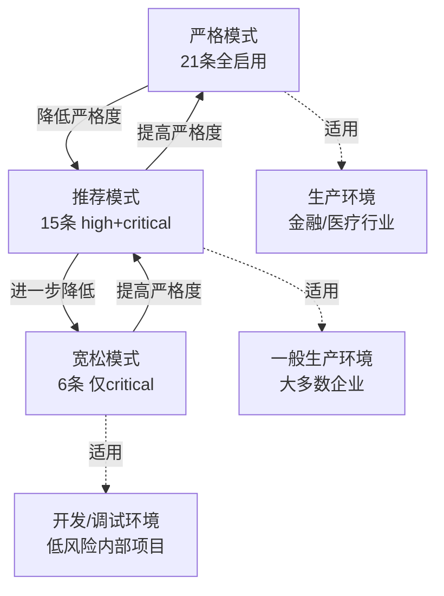
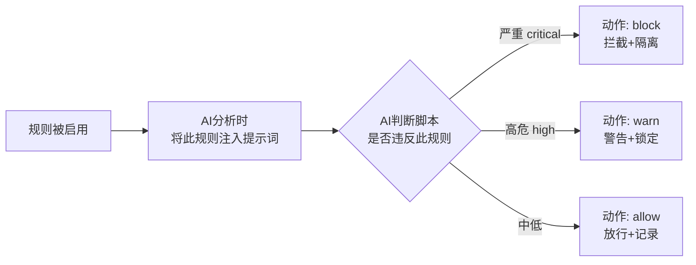

# 安全策略配置指南

> 安全策略决定了 AgentSec 用什么样的标准来检测脚本。您可以调整策略的严格程度，从「宽松」到「严格」，或者逐条定制规则。

---

## 什么是安全策略？

安全策略是一套**安全检测规则**，告诉 AI 应该检查什么、发现后应该怎么做。

AgentSec 内置了一套基于 **OWASP 公民开发者 Top 10 安全风险**的默认策略，包含 **10 个规则组、21 条规则**。

---

## 打开安全策略

在左侧导航栏点击 **「安全策略」**。

> 📸 **[截图位置]** `screenshots/rules-overview.png` — 安全策略页面全景

---

## 策略页面布局

```
┌─────────────────────────────────────────────┐
│  [当前策略]  [策略市场]                       │  ← Tab 切换
├─────────────────────────────────────────────┤
│  🛡 当前防护：推荐                           │  ← 防护档位
│  严重/高危规则启用 · 中等风险已关闭            │
│  [严格] [推荐] [宽松]       [切换到高级模式]   │  ← 档位选择
├─────────────────────────────────────────────┤
│  ▼ 盲目信任 (CD-SEC-01)                     │  ← 规则组卡片
│    2 条 · 全部开启                          │
│    ├─ ⚡自动拦截  调用未审批的外部接口         │
│    │   脚本向白名单外的外部域名发起请求...     │
│    └─ ⚡仅提醒    导入未签名的第三方组件        │
│  ▼ 账户冒充 (CD-SEC-02)                     │
│  ...                                        │
└─────────────────────────────────────────────┘
```

---

## 简单模式 vs 高级模式

AgentSec 提供两种策略编辑方式：

### 简单模式（默认）

> 📸 **[截图位置]** `screenshots/rules-simple-mode.png` — 简单模式界面

- 显示**大白话描述**，不出现技术术语
- 每条规则标注了「自动拦截」还是「仅提醒」
- 通过**预设档位**（严格/推荐/宽松）一键调整

**适合**：不需要了解安全细节，只想控制严格程度的用户。

### 高级模式

> 📸 **[截图位置]** `screenshots/rules-advanced-mode.png` — 高级模式界面

- 显示技术名称、OWASP 编号、severity/action 标签
- **逐条开关**每条规则
- 可直接编辑策略的 JSON 源码

**适合**：安全管理员、需要精细控制每条规则的用户。

点击「切换到高级模式」按钮在两模式间切换。

---

## 三种预设防护档位

> 📸 **[截图位置]** `screenshots/rules-preset-buttons.png` — 三种档位按钮截图

| 档位 | 启用规则 | 适用场景 |
|------|---------|---------|
| **严格** | 全部 21 条规则 | 生产环境高安全要求 |
| **推荐**（默认） | 15 条（critical + high） | 大多数情况 |
| **宽松** | 6 条（仅 critical） | 调试环境、低风险场景 |

点击档位按钮即时切换，切换后底部会出现「保存规则」按钮。



### 严格模式启用的全部规则

| 序号 | 规则组 | 规则 |
|------|--------|------|
| R-001 | 盲目信任 | 调用未审批的外部接口 |
| R-002 | 盲目信任 | 导入未签名的第三方组件 |
| R-003 | 账户冒充 | 使用具名个人账户运行机器人 |
| R-004 | 账户冒充 | 会话令牌 / Cookie 重放 |
| R-005 | 授权滥用 | 访问超出业务范围的资源 |
| R-006 | 授权滥用 | 调用提权/管理员命令 |
| R-007 | 数据泄露 | 日志/截图含 PII/卡号/密钥 |
| R-008 | 数据泄露 | 向外部存储外传业务数据 |
| R-009 | 数据泄露 | 错误信息回显原始敏感字段 |
| R-010 | 认证安全 | 硬编码凭证/API Key |
| R-011 | 认证安全 | 使用明文 HTTP 传输敏感数据 |
| R-012 | 认证安全 | 使用弱/已废弃的密码学算法 |
| R-013 | 组件安全 | 依赖未锁定版本 |
| R-014 | 组件安全 | 从非官方源拉取组件 |
| R-015 | 安全配置 | 禁用 SSL/TLS 证书校验 |
| R-016 | 安全配置 | 生产环境保留 debug/默认凭证 |
| R-017 | 注入防护 | 字符串拼接 SQL 查询 |
| R-018 | 注入防护 | 系统命令拼接执行 |
| R-019 | 注入防护 | 未转义的 HTML/模板输出 |
| R-020 | 资产管理 | 硬编码生产端点/缺少环境隔离 |
| R-021 | 日志审计 | 关键操作缺少审计日志 |

---

## 保存和重置

### 保存修改

修改任何规则开关后，页面底部会出现保存条：

> 📸 **[截图位置]** `screenshots/rules-savebar.png` — 保存条截图

点击 **「保存规则」** 将修改写入本地配置文件（`policy.json`）。修改立即生效，下次分析就会使用新规则。

### 重置为默认

点击 **「恢复默认规则」** 按钮 → 确认 → 规则恢复为 AgentSec 内置默认（推荐档位）。

---

## 策略市场

> 📸 **[截图位置]** `screenshots/rules-marketplace.png` — 策略市场 Tab

策略市场提供 AgentSec 官方维护的预设策略，可一键替换您当前的规则。

### 切换到策略市场

点击顶部的「策略市场」Tab。

### 浏览策略

每张策略卡片显示：

| 信息 | 说明 |
|------|------|
| 策略名称 | 如「OWASP 公民开发者 Top 10」 |
| 类别标签 | `通用` / `金融` / `政务` 等 |
| OWASP 对齐 | 是否对齐 OWASP 标准 |
| 规则数 | 包含多少条规则 |
| 已安装标记 | 绿色对勾表示当前正在使用 |

### 应用策略

1. 点击策略卡片的 **「应用」** 按钮
2. 确认替换当前规则
3. 策略自动下载并写入本地配置
4. 自动切回「当前策略」Tab 展示新规则

> 📸 **[截图位置]** `screenshots/rules-marketplace-detail.png` — 策略详情抽屉

点击「查看详情」可看到策略的描述、作者和 README。

---

## 策略文件位置

策略保存在用户数据目录的 `policy.json` 文件中：

| 系统 | 路径 |
|------|------|
| Windows | `%APPDATA%\AgentSec\policy.json` |
| macOS | `~/Library/Application Support/AgentSec/policy.json` |

在高级模式下点击「用编辑器打开 policy.json」可直接用系统默认编辑器修改。

---

## 策略规则的工作方式

每条规则包含以下属性：

| 属性 | 说明 | 可选值 |
|------|------|--------|
| severity | 风险严重程度 | `critical` / `high` / `medium` / `low` |
| action | 命中后的动作 | `block`(拦截) / `warn`(警告) |



> ⚠️ 关闭某个规则组或规则意味着 AI **不再检查**该类安全风险。请谨慎操作。关闭 `critical` + `block` 级别的规则前，应用会弹出确认对话框。

---

## 常见问题

**Q: 修改策略后需要重启监控吗？**
A: 不需要。保存后立即生效，下次分析的脚本就会使用新规则。

**Q: 策略市场的策略多久更新一次？**
A: 由 AgentSec 平台管理员维护。点击「策略市场」Tab 会自动拉取最新清单。

**Q: 企业内网部署版能改策略吗？**
A: 企业内网部署（onpremise）模式下，策略由服务端管理员统一管理，客户端只读。
