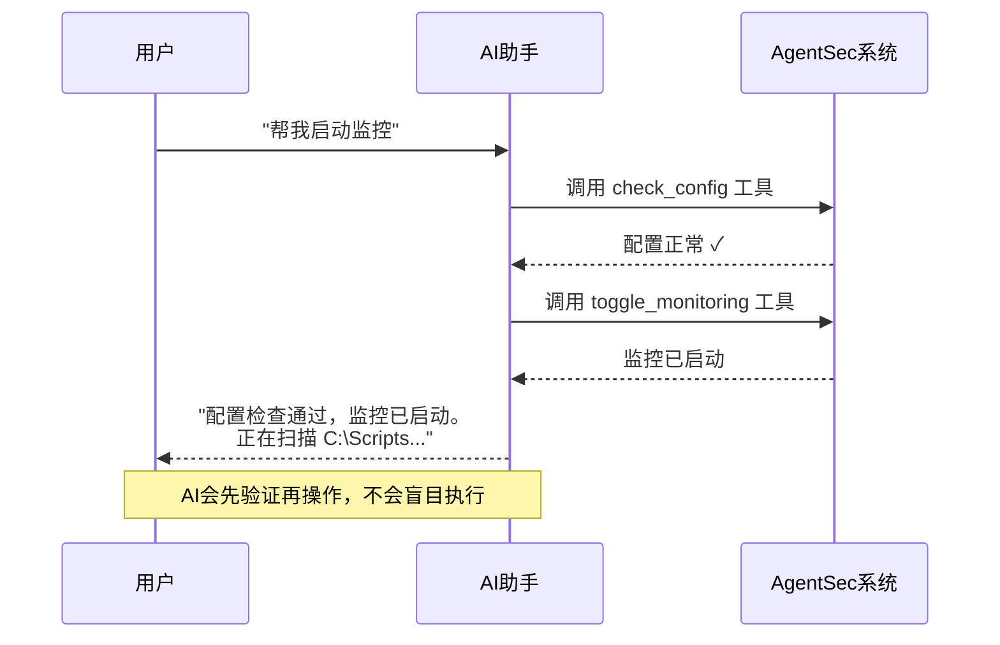

# AI 安全助手使用指南

> AgentSec 内置了一个 AI 安全助手（Copilot）。您可以用自然语言向它提问，它会根据当前的监控状态、分析结果和配置信息给出回答，还可以直接帮您执行操作。

---

## 打开 AI 助手

**三种方式：**

| 方式 | 操作 |
|------|------|
| 点击 FAB | 点击主界面右下角的蓝色「AI 助手」浮动按钮 |
| 快捷键 | 按 `Ctrl+K`（Windows）或 `Cmd+K`（macOS） |
| 再次按快捷键 | 关闭面板 |

> 📸 **[截图位置]** `screenshots/chat-fab.png` — 右下角 AI 助手 FAB 按钮

---

## 助手面板布局

```
┌──────────────────────────┐
│ AI 安全助手           ✕ ⛶│  ← 标题栏（可展开全屏）
│ ──────────────────────── │
│ 📍 当前：防护日志         │  ← 上下文指示器
│     [就这个问 AI →]       │
│ ──────────────────────── │
│                          │
│   🤖 你好！我是 AgentSec  │
│   AI 助手...              │
│                          │
│   ┌──────────────────┐   │
│   │ 总结当前安全状况   │   │  ← 建议问题
│   │ 哪些脚本风险最高？  │   │
│   │ 如何降低高风险？    │   │
│   │ 当前安全策略是什么？│   │
│   └──────────────────┘   │
│                          │
│ ──────────────────────── │
│ [📊 检查配置中...]        │  ← 工具执行进度（需要时出现）
│ ──────────────────────── │
│ ┌────────────────────────┤
│ │ 输入你的问题...         │  ← 输入框
│ │                        │
│ │ 模型名   Enter发送  ↑  │
│ └────────────────────────┤
└──────────────────────────┘
```

> 📸 **[截图位置]** `screenshots/chat-panel-full.png` — AI 助手面板全景截图

### 三种显示模式

| 模式 | 效果 |
|------|------|
| 关闭 | FAB 按钮在右下角，面板隐藏 |
| 停靠 | 面板在右侧，占 1/3 宽度，主内容区自动压缩 |
| 全屏 | 面板扩展到最大，适合查看复杂内容 |

在停靠模式下点击标题栏的展开按钮可切换全屏。

---

## AI 助手能做什么？

### 1. 回答安全问题

您可以用自然语言询问：

| 可以问 | 示例 |
|--------|------|
| 安全概况 | 「总结一下当前所有脚本的安全状况」 |
| 风险分析 | 「哪些脚本风险最高？为什么？」 |
| 修复建议 | 「如何降低 Main.xaml 的安全风险？」 |
| 规则解释 | 「AgentSec 当前的安全策略是什么？有哪些规则？」 |
| 配置检查 | 「帮我检查当前配置是否合理」 |
| 状态查询 | 「现在有哪些脚本正在分析？」 |

**上下文感知**：AI 助手知道您当前在哪个页面、选中了什么内容。例如在防护日志中选中 `Main.xaml` 时，上下文提示会自动变为「解读一下 Main.xaml 的分析结果」。

> 📸 **[截图位置]** `screenshots/chat-context-chip.png` — 上下文指示器截图

### 2. 自动执行操作

AI 助手可以帮您执行以下操作（7 个内置工具）：

| 能力 | 触发方式 |
|------|---------|
| 检查配置 | 「检查配置」→ AI 自动验证目录、LLM、服务端连通性 |
| 设置监控目录 | 「换个监控目录」→ AI 弹出文件夹选择器 |
| 启动/停止监控 | 「启动监控」→ AI 会先检查配置，确认无误后启动 |
| 查看监控状态 | 「监控状态怎么样？」→ AI 返回当前监控情况 |
| 查看策略 | 「当前有哪些安全规则？」→ AI 列出所有启用的规则 |
| 查询分析进度 | 「分析进度怎么样了？」→ AI 返回正在分析的脚本 |
| 导出日志 | 「帮我导出日志」→ AI 弹出保存对话框 |

**AI 在操作前会先检查配置**。例如您说「启动监控」，它会先调用 check_config 工具确认配置正确，如果有问题会先告诉您哪里需要修复。



> 📸 **[截图位置]** `screenshots/chat-tool-executing.png` — AI 执行工具时的进度卡片

### 3. 快捷操作按钮

AI 回复末尾可能会附上 **快捷操作按钮**，例如：

```
[总结当前安全状况]  [查看高风险脚本详情]  [如何修复这些风险]
```

点击任一按钮即可自动发送对应问题，无需手动输入。

> 📸 **[截图位置]** `screenshots/chat-suggested-actions.png` — AI 回复末尾的快捷操作按钮

---

## 对话技巧

### ✅ 好的提问方式

- 「Main.xaml 有哪些安全问题？帮我逐一解释」
- 「对比一下 Process.py 和 Main.xaml 的风险等级」
- 「如何修复硬编码密码的问题？给出具体步骤」

### ❌ 不太有效的提问

- 「安全」（太模糊）
- 「帮我写代码」（超出了安全分析范围）
- 「今天天气怎么样」（与 RPA 安全无关）

### 💡 提示

- AI 助手会根据您当前的界面语言自动选择回复语言
- 对话历史会保留最近 10 轮（关闭面板不丢失，关闭应用不保留）
- 点击「清空对话」可清除所有历史，从头开始

---

## 模型信息显示

输入框左下角有一个 **模型标签**，显示当前使用的 AI 模型：

- **登录模式**：`AgentSec / gpt-4o`（服务端中转，您无需配置）
- **本地模式**：`OpenAI / gpt-4o-mini` 或 `Ollama / qwen3:latest`（取决于您的设置）

点击标签可快速跳转到 **AgentSec Engine™ → AI 模型**页面。

> 📸 **[截图位置]** `screenshots/chat-model-pill.png` — 模型标签截图

---

## 常见问题

**Q: AI 助手需要联网吗？**
A: 取决于您的使用模式。登录模式下需要联网（通过 AgentSec 服务端中转调用 AI）。本地模式下如果使用 Ollama 本地模型则不需要联网。

**Q: AI 助手会消耗多少配额？**
A: 登录模式下，每次对话消耗组织的 AI 配额。您可以在侧边栏底部查看剩余配额。本地模式下无配额限制（取决于您自己的 API 账户）。

**Q: 对话内容会被记录吗？**
A: 对话历史保存在本机数据库（`chat_logs` 表）中，不会上传到服务端。导出的日志中包含对话记录。

**Q: 组织的 AI 配额用完了怎么办？**
A: 联系您的组织管理员在 AgentSec 控制台中充值。用完配额后 AI 助手和 AI 分析都会暂停。

**Q: AI 助手为什么不能回答某些问题？**
A: AgentSec AI 助手的定位是 RPA 安全专家，它会尽量把回答限定在安全分析、脚本风险、修复建议等范围内。与 RPA 安全无关的问题可能会被婉拒。
