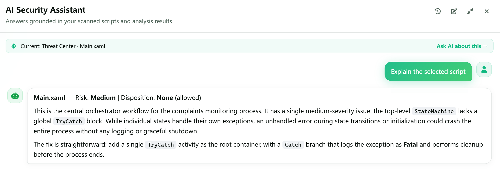
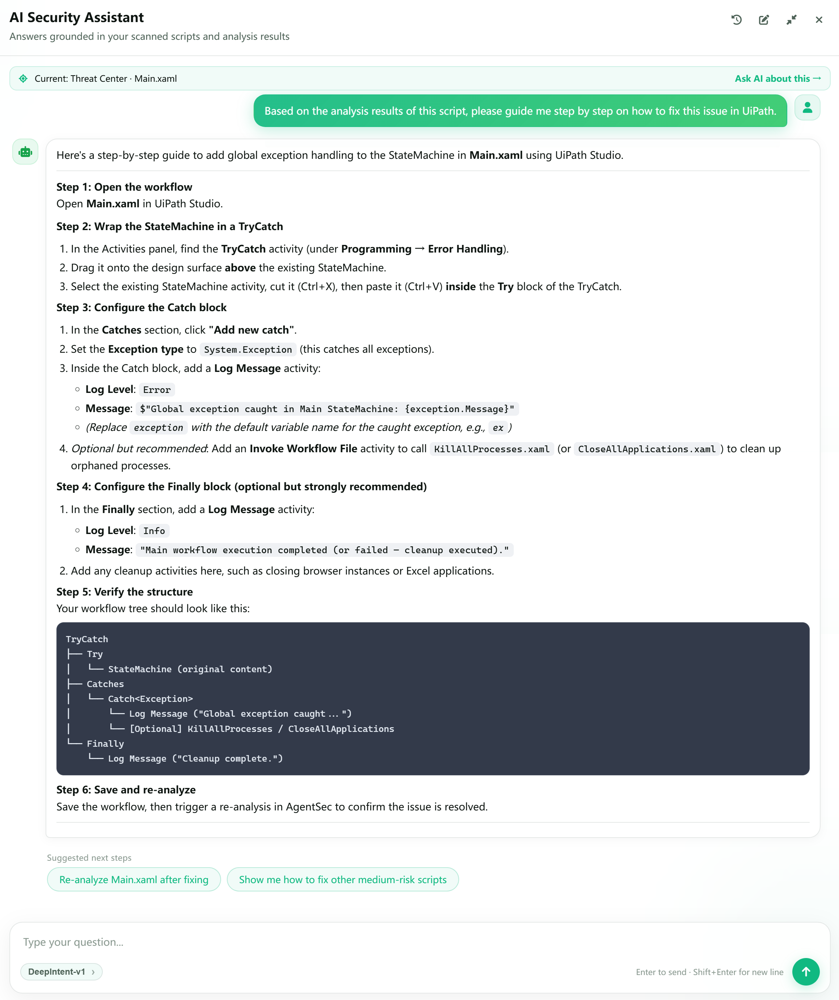
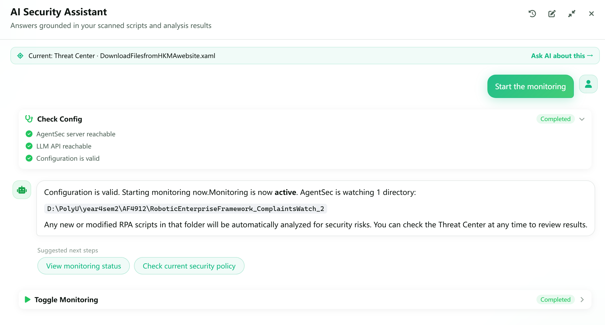

# AI 安全助手：使用场景

> 本章通过几个常见任务，展示如何把 AI 助手用于日常的 RPA 脚本安全工作。

---

## 使用前准备

为了让回答更贴合您的实际情况，请先：

1. 选择并启动监控目录；
2. 等待至少一个脚本完成分析；
3. 在需要时，从仪表盘或威胁中心选中对应的脚本后，再打开 AI 助手。

AI 助手会结合当前页面、已选脚本和分析结果回答问题；它的建议应作为安全排查的辅助信息，执行会影响文件或监控状态的操作前，请确认结果符合预期。

---

## 场景一：快速了解当前风险

**适用情况**：刚打开 AgentSec，想先判断今天是否有需要优先处理的问题。

**可以这样问：**

> 总结一下当前所有脚本的安全状况，并按风险等级告诉我应该先处理哪些。

AI 助手会概括已分析脚本、风险等级和主要问题类型，并指出值得优先查看的高风险脚本。

>

**追问示例：**
- 哪个脚本的风险最高？原因是什么？
- 哪些问题需要在今天内优先修复？

---

## 场景二：解释单个脚本的分析结果

**适用情况**：在威胁中心发现一个风险脚本，但不清楚某条检测结果的含义。

1. 在威胁中心打开目标脚本的详情；
2. 选中该脚本或点击「就这个问 AI」；
3. 点击对话框上方的建议问题，或者手动输入问题，例如：

> 请解读一下 `Main.xaml` 的分析结果。

AI 助手会基于该脚本的分析结果，用更容易理解的语言说明风险原因。

>

**继续追问：**

> 请按优先级列出修复这个脚本的步骤，并说明每一步需要验证什么。

---

## 场景三：获取可执行的修复建议

**适用情况**：已经知道问题类型，希望得到具体的修复方法。

**示例提问：**

> 根据这个脚本的分析结果，请一步一步指导我如何在UiPath中修复这个问题。

AI助手会根据分析的结果，给出具体的修复方法。

>

修复完成后，保存脚本并等待 AgentSec 再次分析，确保安全问题已经被成功解决。

---

## 场景四：咨询、理解和调整当前策略

**适用情况**：想了解当前启用了哪些安全策略、某类风险为何会触发警告，或希望根据可接受的风险范围调整策略。

**示例提问：**

> 当前策略中有哪些规则会针对这类风险发出警告？请用通俗的方式解释它们的作用，以及调整后可能带来的影响。

例如，若您不在意某一种风险，希望停止收到该类警告，可以继续问：

> 我不在意「缺少版本标签」这一类风险。如何调整当前策略，使 AgentSec 不再针对这类问题发出警告？

AI 助手会先说明相关规则和调整的安全影响，之后详细解释调整的具体方法。调整完成后，建议重新分析相关脚本，确认该类告警已按预期停止，同时留意由此降低的检测覆盖范围。

>

---

## 场景五：自动执行操作

**适用情况**：希望 AI 助手直接协助完成应用内操作，包括检查配置、设置监控目录、启动或停止监控、查看监控状态、查询分析进度和导出日志。

以启动监控为例，您可以输入：

> 帮我启动监控。

AI 助手会先检查监控目录、AI 模型和相关连接配置；确认配置无误后，再启动监控，并反馈当前状态或扫描进度。

>

更多可自动执行的操作及其说明，请参阅 [08 — AI 安全助手](08-ai-assistant.md#2-自动执行操作)。

---

## 提问小技巧

- **说清对象**：使用脚本名、风险等级或问题类型，例如“解释 `Process.py` 的拦截风险”。
- **说明目标**：说明您是想了解原因、寻找修复方法，还是检查运行状态。
- **逐步追问**：先让 AI 总结，再针对其中一个脚本或一个问题深入提问。

想了解 AI 助手的入口、面板和全部能力，请参阅[08 — AI 安全助手](08-ai-assistant.md)。
