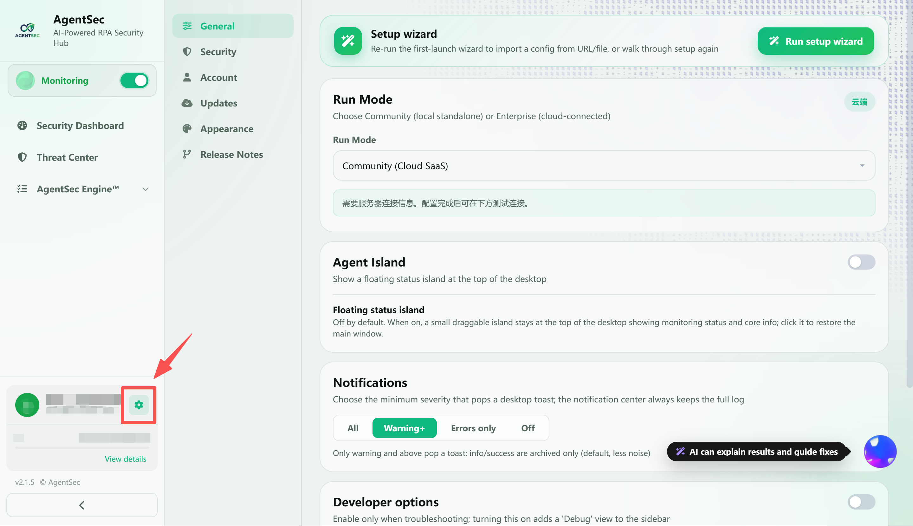
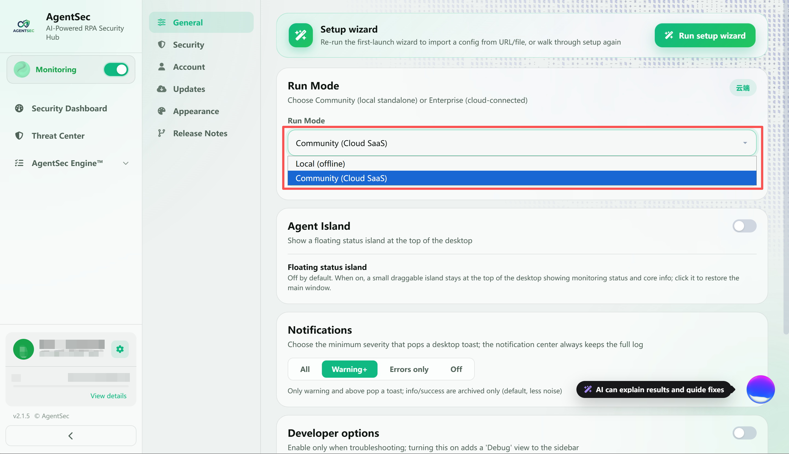
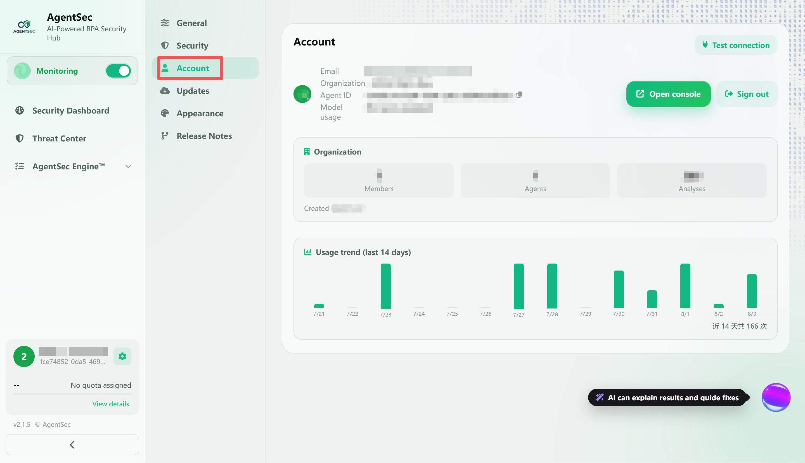
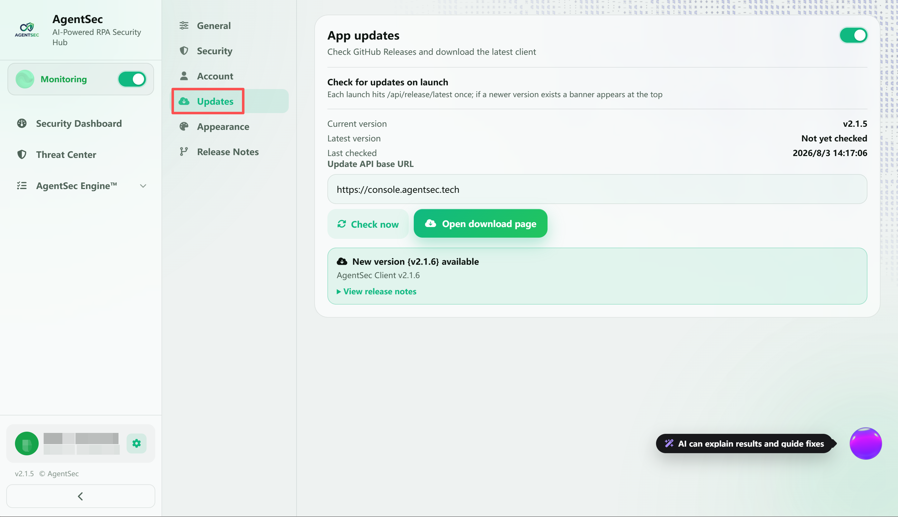

# 设置与账户指南

> 设置页面用于管理 AgentSec 的所有配置：常规、安全配置、账户、AI 模型、自动更新等。

---

## 打开设置

在左侧导航栏点击 **⚙ 设置**（齿轮图标），或点击侧边栏底部的齿轮按钮。

> 

---

## 设置页面布局

设置页采用**左右分类导航**布局：

```
┌──────┬──────────────────────────────────┐
│ 常规  │                                  │
│ 安全配置│   当前选中分类的设置内容            │
│ 账户  │                                  │
│ 更新  │   （右侧面板）                     │
│ 外观  │                                  │
│ 版本  │                                  │
├──────┴──────────────────────────────────┤
│         [所有配置共用一个保存按钮]         │
└─────────────────────────────────────────┘
```

### ⚡ 自动保存

AgentSec 支持**自动保存**。修改任何设置后，1-2 秒内会自动写入配置文件。底部保存条会显示状态：

| 状态 | 提示文字 |
|------|---------|
| 无改动 | 「所有配置共用一个保存按钮」 |
| 有未保存 | 「有未保存的更改」 |
| 保存中 | 「正在保存...」 |
| 已保存 | 「已保存」 |
| 出错 | 「保存出错: ...」 |

> 💡 自动保存适用于绝大多数改动。如果想要手动保存，也可以点击底部的「保存设置」按钮。

---

## 一、常规

> 

### 配置向导

点击 **「配置向导」** 可以重新运行首次配置向导。适合想要重新设置使用方式或监控目录的情况。

### 运行模式

| 模式                 | 说明                         |
| ------------------ | -------------------------- |
| Local（离线本地）        | 不连接任何服务端，AI 分析完全在本地完成      |
| Community（云端 SaaS） | 连接 AgentSec 云服务，AI 分析在云端处理 |

> 

切换模式后，下方会显示对应的提示和配置项。

### 开发者选项

- **启用 Debug 视图**：开启后侧边栏出现「Debug」入口，可查看实时分析日志流
- 仅在排查问题时需要开启

### 危险区域

**「重置所有数据」** 按钮会：
- 清空配置、Agent ID、分析历史、聊天记录、白名单
- 删除完成后应用自动退出
- 重新打开时如同首次安装

> ⚠️ 此操作不可撤销！

---

## 二、安全配置

> 

### 监控开关

使用页面顶部的开关可以直接启动或停止对监控目录的实时防护。关闭后，AgentSec 不再实时分析目录中新建或修改的 RPA 脚本；重新开启即可恢复监控。

### 监控目录

支持**多目录同时监控**。可以通过以下方式添加需要保护的 RPA 脚本目录：

- 在输入框中填写路径并按回车
- 点击 **「添加目录」** 打开目录选择器，可一次选择多个目录
- 点击 **「搜索本机」** 检测常见 RPA 工具的脚本目录

搜索到的目录会显示在 **「检测到的 RPA 目录」** 中，并标注工具名称、路径和脚本数量。检测结果不会自动加入监控，需要确认后才会生效。

#### 启动即开启监控

启用后，AgentSec 启动时会自动监控已配置且当前存在的目录，无需每次手动启动。未配置监控目录或目录已不存在时，不会自动开启监控。

### 隐私与安全

#### 敏感凭据密文显示

默认开启。上传脚本或使用 AI 问答时，凭据会在离开本机及显示到界面前替换为不可逆占位符，避免 API Key、密码等敏感信息被直接展示或发送；本地脚本原文不会被修改。

### 分析引擎

#### 规则引擎（DSL 规则集）

规则引擎**始终启用**，负责进行确定性规则匹配。分析在本地以毫秒级完成，不依赖网络或大型模型；命中规则后，AgentSec 会按照规则给出风险结论和处置建议。

规则可以通过两种方式更新：

- **从 Console 更新规则**：连接 Console 获取最新规则
- **导入规则更新包（离线）**：适用于内网或无法连接 Console 的环境，由管理员导出签名规则包后在此导入

#### AI 研判（可选）

AI 研判用于理解脚本意图，补充识别规则暂未覆盖的风险。关闭后，脚本正文不会因 AI 研判离开本机，分析结论仅由规则引擎给出。

---

## 三、账户

> 

### 登录状态

#### 已登录

显示以下信息：

| 字段 | 说明 |
|------|------|
| 头像 | 根据邮箱自动生成的标识 |
| 邮箱 | 登录时使用的邮箱 |
| 组织 | 您所属的 AgentSec 组织（租户） |
| Agent ID | 当前机器的唯一标识 |
| 模型用量 | 组织的 AI 配额使用情况 |

点击 **「退出登录」** 可断开与服务端的连接。

#### 未登录

- 显示「连接控制台（登录）」按钮

### 连接测试

点击 **「测试连接」** 可以验证服务端是否可达、登录凭证是否有效。

> 

---

## 四、更新

> 

### 自动检查更新

- **开关**：启用/禁用启动时和周期性的自动更新检查
- **默认**：启用，每 6 小时检查一次

### 当前版本信息

| 信息 | 说明 |
|------|------|
| 当前版本 | 您正在使用的 AgentSec 版本 |
| 最新版本 | GitHub Release 上的最新版本 |
| 上次检查 | 上次检查更新的时间 |

### 手动检查更新

点击 **「立即检查更新」** 按钮，实时查询最新版本。

检测到新版本后：
- 设置页面显示新版本详情 + 发布说明
- 仪表盘顶部弹出更新横幅
- 点击「下载并安装」自动下载和安装（Windows）/ 打开 DMG（macOS）

---

## 五、外观

> 

### 主题

- **深色模式**：开关切换
- 默认跟随系统偏好（`prefers-color-scheme`）

### 界面语言

支持三种语言：
- 简体中文（默认）
- 繁體中文
- English

切换后整个界面立即生效，AI 助手也会自动切换回复语言。

---

## 六、版本说明

> 

显示版本更新历史（Changelog），从 v1.0.0 到当前版本，按版本倒序排列。

每条更新记录标注类型：
- `feat`（绿色）— 新功能
- `fix`（红色）— 问题修复
- `improve`（绿色）— 改进优化
- `ui`（黄色）— 界面调整
