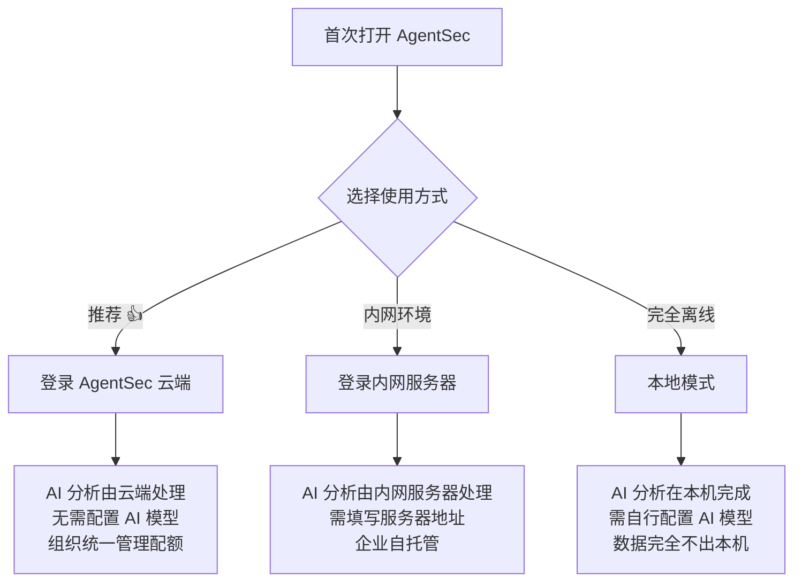
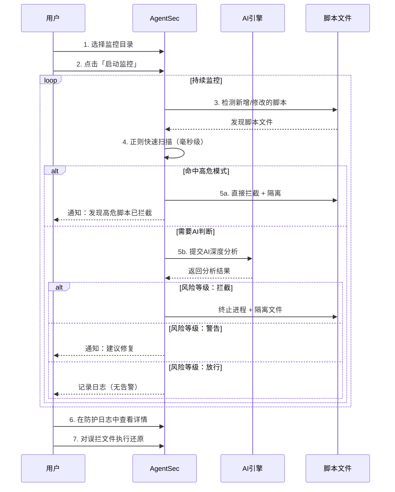

# AgentSec Desktop — 用户手册

欢迎使用 AgentSec Desktop！本手册将帮助您快速上手，全面了解如何使用 AgentSec 保护您的 RPA 脚本安全。

---

## 什么是 AgentSec？

AgentSec 是一款 **AI 驱动的 RPA 脚本安全监控工具**。它可以：

- 🔍 **自动扫描**：实时监测您电脑上的 RPA 脚本（UiPath、Python、PowerShell 等）
- 🛡️ **智能分析**：利用 AI 自动发现脚本中的安全隐患（数据外泄、硬编码密码、恶意命令等）
- 🚫 **主动拦截**：对高危脚本自动隔离，阻止其运行，保护您的数据安全
- 💬 **AI 助手**：内置安全助手，您可以像聊天一样询问安全问题和修复建议

**简单来说**：把 AgentSec 安装到 RPA 工作站上，它就像一个永不休息的「安全巡检员」，帮您盯着所有脚本，发现风险自动处理。

---

## 📖 阅读顺序（推荐）

| # | 章节 | 内容 | 用时 |
|---|------|------|------|
| 01 | [快速入门（跟我做）](01-quickstart.md) | 安装 → 配置 → 第一次监控 → 看懂结果 | 10 分钟 |
| 02 | [仪表盘详解](02-dashboard.md) | 主界面每个数字的含义 | 5 分钟 |
| 03 | [第一次安全分析](03-first-analysis.md) | 🆕 完整案例：三个脚本从发现到处理的全过程 | 10 分钟 |
| 04 | [监控配置详解](04-monitoring.md) | 监控目录、三关检查、大目录优化 | 5 分钟 |
| 05 | [安全防护日志](05-security-log.md) | 查看分析结果、理解问题卡片 | 5 分钟 |
| 06 | [安全沙箱](06-sandbox.md) | 管理隔离区文件、还原误拦 | 5 分钟 |
| 07 | [安全策略](07-security-policy.md) | 调整严格程度、使用策略市场 | 5 分钟 |
| 08 | [AI 安全助手](08-ai-assistant.md) | 与 AI 对话、让它帮您操作 | 5 分钟 |
| 09 | [设置详解](09-settings.md) | 账户、AI模型、更新、语言等 | 按需查阅 |
| 10 | [关键概念](10-concepts.md) | 🆕 术语解释：什么是隔离？什么是风险等级？ | 按需查阅 |
| 11 | [常见问题](11-faq.md) | 遇到问题怎么办 | 按需查阅 |

> 💡 **新手路径**：01 → 02 → 03 三篇看完，就完全上手了。其余按需查阅。

---

## 三种使用模式

AgentSec 支持三种运行模式，您可以根据实际情况选择：



| 模式 | 适用场景 | 需要什么 |
|------|---------|---------|
| **登录 AgentSec**（推荐） | 大多数用户 | 一个 AgentSec 账号（浏览器登录即可） |
| **内网部署** | 企业自建了 AgentSec 服务器 | 公司提供的服务器地址 + 账号 |
| **本地模式** | 完全离线、数据不能出本机 | 自备 OpenAI / Ollama 等 AI 接口 |

> 💡 **不确定选哪个？** 选「登录 AgentSec」即可，这是最简单的方式。

---

## 快速了解界面

```
┌──────────────────────────────────────────────────────────┐
│  ┌────────────┐                                          │
│  │            │  仪表盘 / 设置 / Debug                     │
│  │  侧边栏    │                                          │
│  │            │  ┌─────────────────────────────────────┐ │
│  │  概览      │  │                                     │ │
│  │  防护日志  │  │       主内容区域                      │ │
│  │  安全沙箱  │  │                                     │ │
│  │  安全策略  │  │  （随左侧导航切换）                   │ │
│  │            │  │                                     │ │
│  │            │  └─────────────────────────────────────┘ │
│  │  ⚙ 设置   │                                          │
│  │            │                              ┌──────────┤
│  │  v1.8.1    │                              │ AI 助手  │
│  └────────────┘                              │ (可收起) │
│                                              └──────────┘
└──────────────────────────────────────────────────────────┘
```

> 📸 **[截图位置]** `screenshots/main-overview.png` — AgentSec 主界面总览

---

## 典型工作流程



---

## 支持检测的脚本类型

| 扩展名 | 脚本类型 | 常见来源 |
|--------|---------|---------|
| `.xaml` `.xmal` | UiPath 工作流 | UiPath Studio |
| `.py` | Python 脚本 | Python 自动化 |
| `.robot` | Robot Framework | 测试自动化 |
| `.bpmn` | BPMN 流程 | 流程建模工具 |
| `.ps1` | PowerShell 脚本 | Windows 系统管理 |
| `.vb` | VBScript 脚本 | 传统 Windows 自动化 |

---

## 需要帮助？

- 📖 按左侧目录浏览详细手册
- 💬 使用应用内的 AI 安全助手（按 `Ctrl+K` 或 `Cmd+K` 唤起）
- ❓ 查看 [常见问题](faq.md)

---

> 📄 文档版本：v1.8 | 更新日期：2026年6月
