# 01 — Quick Start (Hands-on)

> Estimated time: 10 minutes | You will: Install → Login → Configure → First scan → Understand results

This tutorial will **guide you step by step**. Open AgentSec and follow along.

---

## 1. Install and Launch

### Windows

1. Download `AgentSec-Client-x64-win.zip`
2. Extract to any directory (e.g. `D:\AgentSec Client`) — create a new folder if needed
3. Double-click `agentsec.exe`

> 

> 

> ⚠️ If Windows SmartScreen warns you, click "More info" → "Run anyway".
>
> 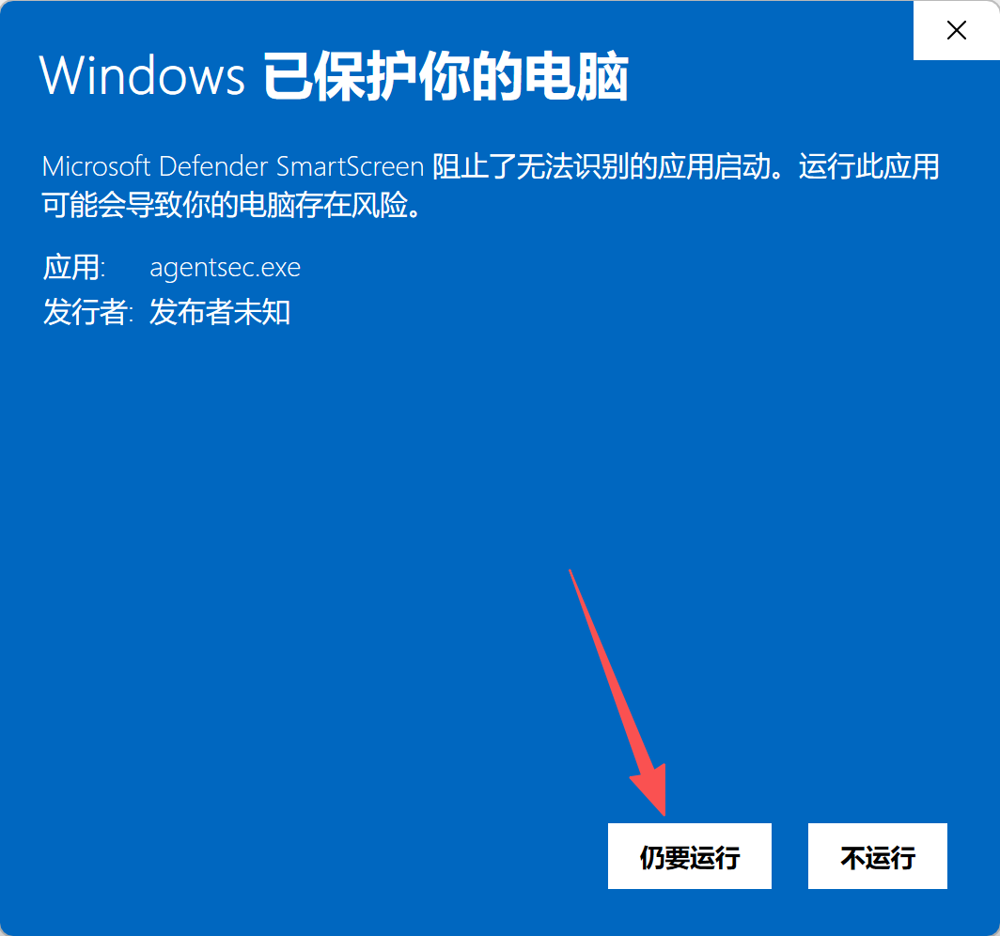

### macOS

1. Download the `.dmg` file, double-click to mount
2. Drag into the `Applications` folder
3. If blocked on first launch: **System Settings → Privacy & Security → Open Anyway**

---

## 2. First-time Setup (Onboarding Wizard)

After launching the app, the onboarding wizard will appear automatically.

> **If the wizard doesn't appear**, this machine has been configured before. Re-open it two ways:

**Option 1: From within the app (recommended)**

Click the ⚙ **Settings** icon at the bottom of the sidebar → select **General** on the left → click the **"Run setup wizard"** button.

> 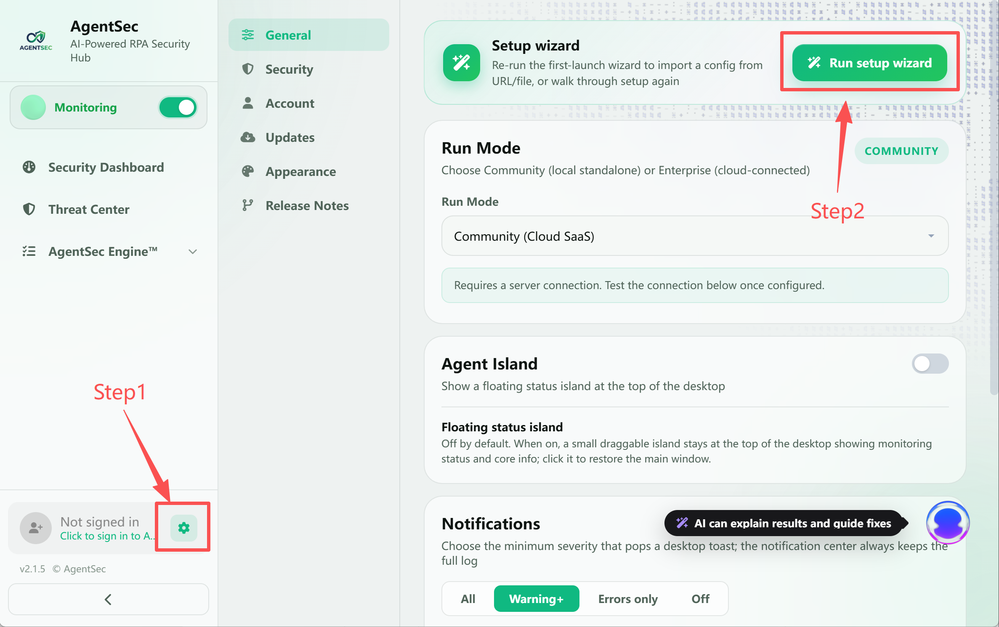

**Option 2: Delete config file (factory reset)**

Delete the config file and restart the app — it will act like first launch.

| OS      | Delete this file                                     |
| ------- | ---------------------------------------------------- |
| Windows | `%APPDATA%\AgentSec\config.json`                     |
| macOS   | `~/Library/Application Support/AgentSec/config.json` |

> ⚠️ Option 2 clears ALL settings. Option 1 is recommended.

### 2.1 Choose your mode

You'll see two options:

> 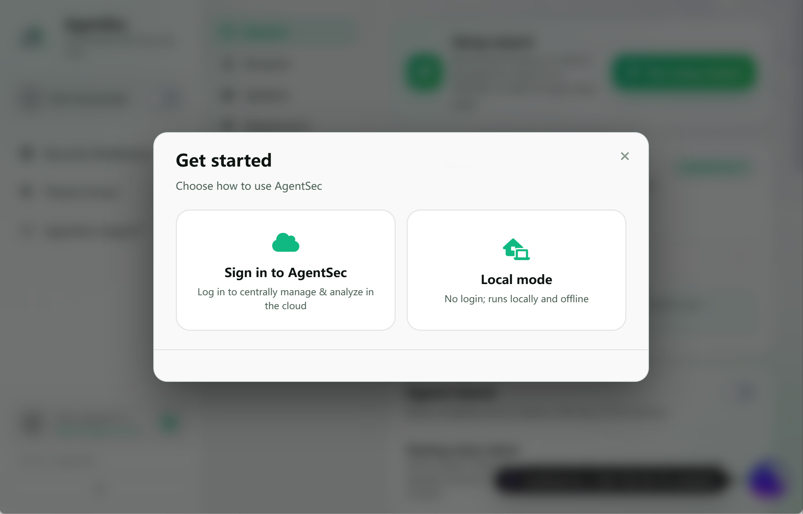

| Option | Best For | Needs |
|--------|----------|-------|
| **Login via AgentSec** (Recommended 👍) | Have an account, can connect to internet | An email address (to sign up) |
| **Local Mode** | Fully offline, have your own AI API | AI model API key or installed Ollama |

> 💡 **Not sure?** Choose "Login via AgentSec" — no extra AI config needed.

### 2.2 Login (for "Login" users)

1. Click "Next"
2. Browser opens the AgentSec login page automatically
3. Enter email and password (no account? Click Sign Up)
4. After login, the browser **auto-redirects back to the app**

> 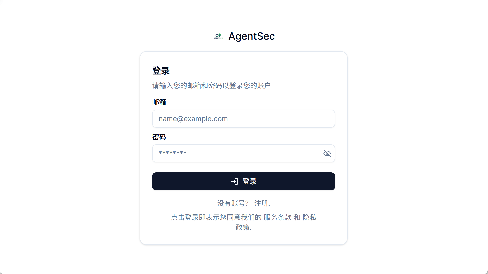
>
> 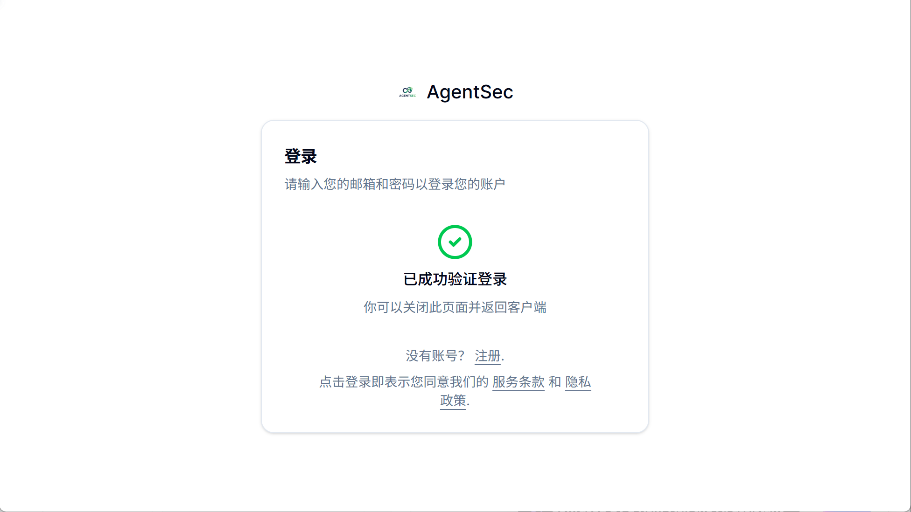

**Success indicator**: Your email and avatar appear at the bottom of the sidebar.

> 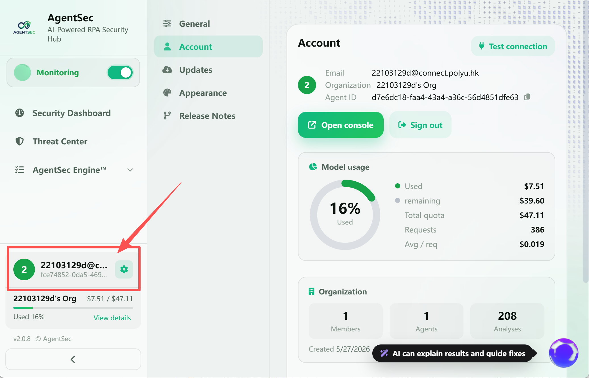

### 2.3 Local Mode Setup (for "Local" users)

After choosing local mode, configure your AI model:

| Field | What to enter |
|-------|---------------|
| Model Provider | Ollama for free local model; OpenAI if you have a key |
| Model Name | Ollama users use `qwen3:latest`; OpenAI users use `gpt-4o-mini` |
| API Key | OpenAI/Anthropic users enter key; Ollama leave blank |

> 💡 No AI key? Use [Ollama](https://ollama.com) (completely free). Run `ollama pull qwen3` to download a model.

### 2.4 Choose Monitoring Directories

Click "Select Directory" and pick the folder containing your RPA scripts. **Multiple directories can be monitored simultaneously.**

> 
> 

> 💡 If UiPath is installed, AgentSec will auto-detect and suggest the default directory — just click it.

---

## 3. Start Your First Scan

After the wizard, you'll see the **Dashboard**.

> 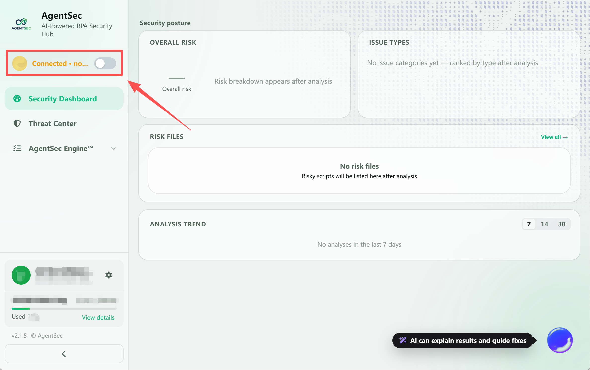

Now turn on the monitoring switch.

**What changes immediately:**

| Change | Explanation |
|--------|-------------|
| Monitoring switch | Changes from off to on; the status text displays `Monitoring` |
| Risk notification | A banner at the top shows the number of at-risk scripts pending action |
| Analysis results | The analyzed-script count and Risk Files list update as scanning completes |

> 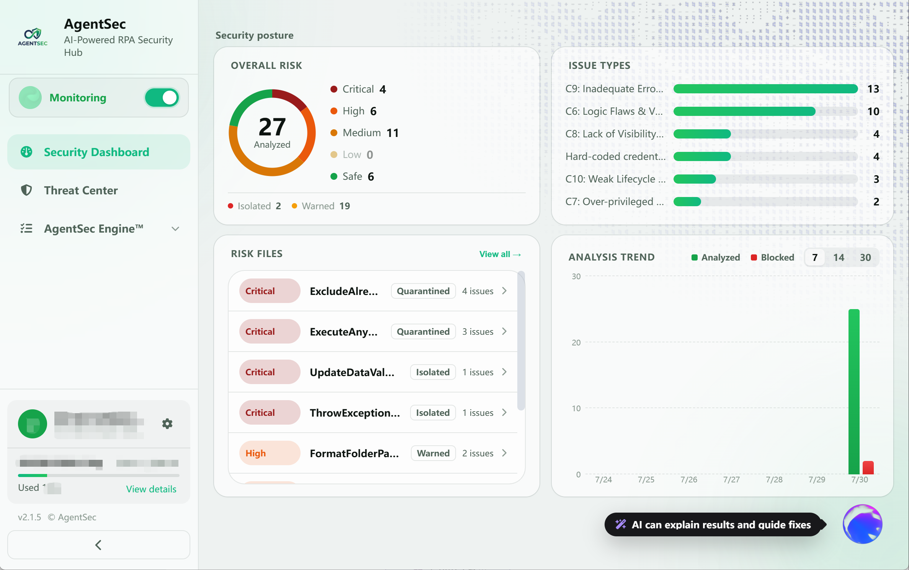

**What AgentSec is doing:**

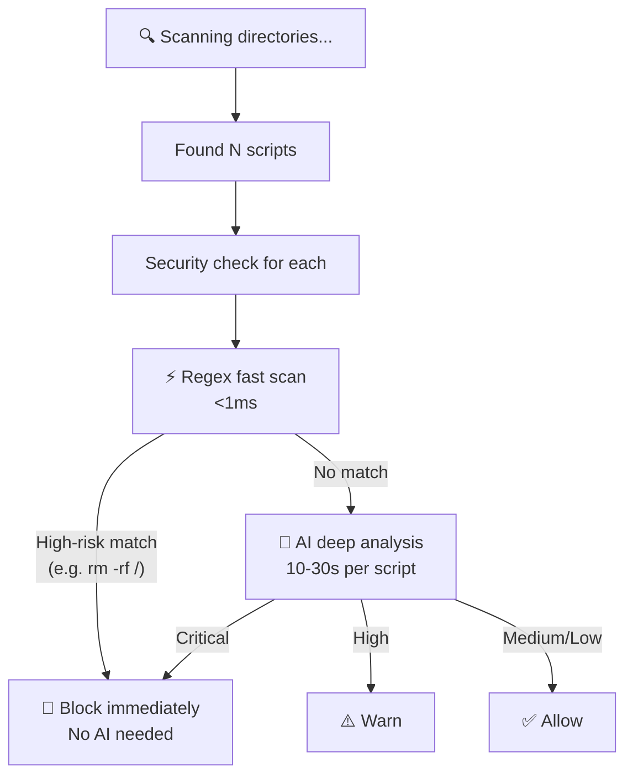

---

## 4. Understanding Analysis Results

Wait a few seconds to tens of seconds, and results will appear.

### 4.1 Dashboard Overview

| Look at | Meaning |
|---------|---------|
| **Analyzed** | Number of scripts with completed analysis |
| **Overall Risk** | Distribution of scripts across risk levels |
| **Issue Types** | Distribution of detected issue types across monitored scripts |
| **Risk Files** | Risky scripts and their issue counts |
| **Analysis Trend** | Analysis and blocked-script totals for the past 7, 14, or 30 days |

### 4.2 Enter Threat Center

Click **"Threat Center"** in the sidebar to view per-script details.

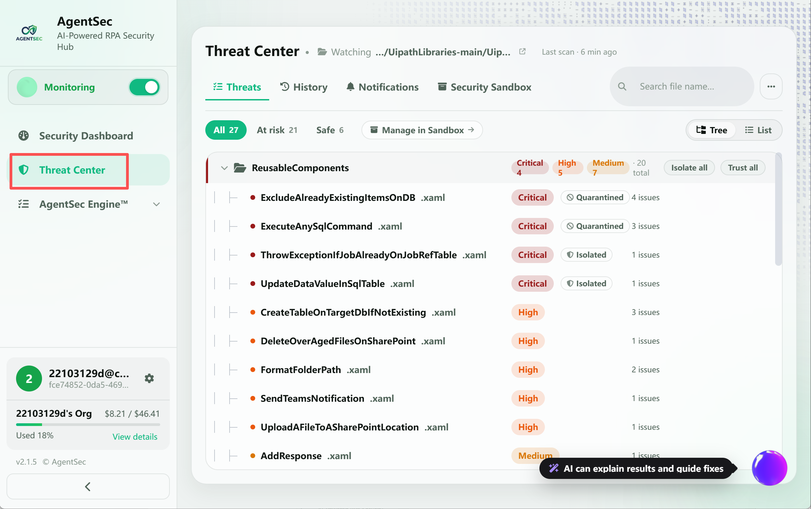

**Click any script** to expand the detail panel:

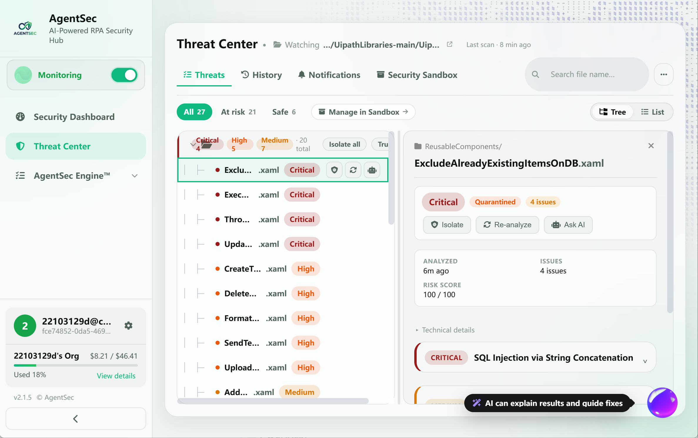

**Three key pieces of information:**
1. **💡 Recommendation**: How to fix the issue
2. **📝 Code Snippet**: The exact lines with problems
3. **Risk Level Color**: Red > Orange > Yellow > Gray (redder = more urgent)

---

## 5. If a Script Gets Blocked

If you see a "Quarantined" label (red), AgentSec considers the script very dangerous and has moved it away.

### You think it's actually malicious?

✅ Do nothing. The original file is safely stored in `.agentsec_quarantine`, the original path replaced with a harmless stub.

### You think it's a false positive (safe script)?

1. Click the script → detail panel opens
2. Click **"Trust"**
3. Confirm → the file moves to the **Safe** area

> 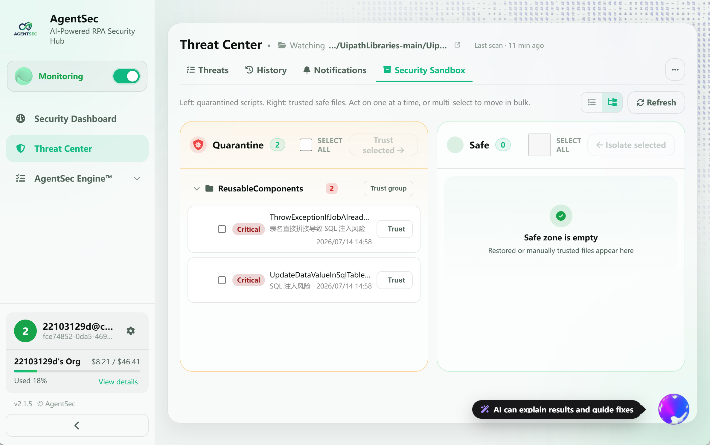
>
> 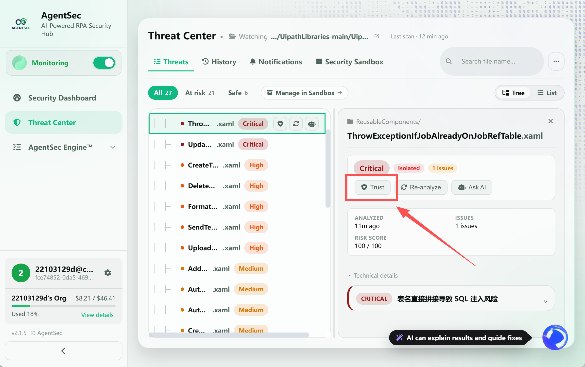
>
> 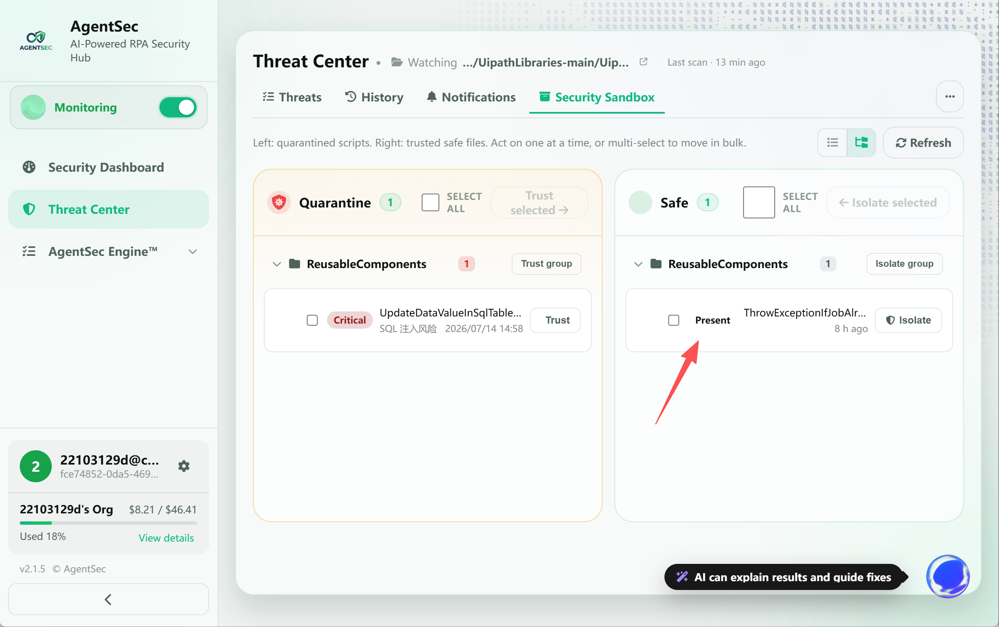

> 💡 After restore, the file content stays the same. If you later modify it, AgentSec will re-analyze it.

---

## 6. Try the AI Assistant

Press **`Ctrl+K`** (Windows) or **`Cmd+K`** (macOS) — the AI assistant panel opens on the right.

Try asking:

> "Summarize the current script security status"

> "Which script has the highest risk? Why?"

> 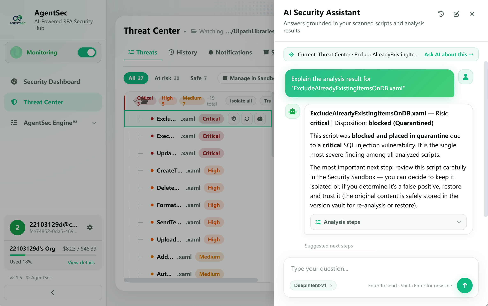

The AI responds based on actual monitoring data and analysis results — not generic replies.

---

## 7. Quick Check: Are You Onboard?

- [ ] Monitoring started, with analyzed scripts or risk files appearing
- [ ] Threat Center has completed analysis records
- [ ] Clicked a script and saw detailed issues (or "No security issues found")

If all three are done — you've mastered AgentSec basics!

---

## Next Steps

| I want to... | Read this |
|--------------|-----------|
| Understand each dashboard number | [02 — Dashboard Overview](02-dashboard.md) |
| See a complete "discover → analyze → remediate" case | [03 — First Security Analysis](03-first-analysis.md) |
| Learn monitoring details and optimization | [04 — Monitoring & Directory Setup](04-monitoring.md) |
| Learn to interpret analysis results | [05 — Threat Center](05-security-log.md) |
| Manage blocked and trusted files | [06 — Security Sandbox](06-sandbox.md) |
| Adjust security detection strictness | [07 — Security Policy](07-security-policy.md) |
| Learn all AI assistant capabilities | [08 — AI Security Assistant](08-ai-assistant.md) |
| Configure account, model, updates, etc. | [09 — Settings Details](09-settings.md) |
| Understand terminology in this manual | [10 — Key Concepts](10-concepts.md) |
| Troubleshoot issues | [11 — FAQ](11-faq.md) |
