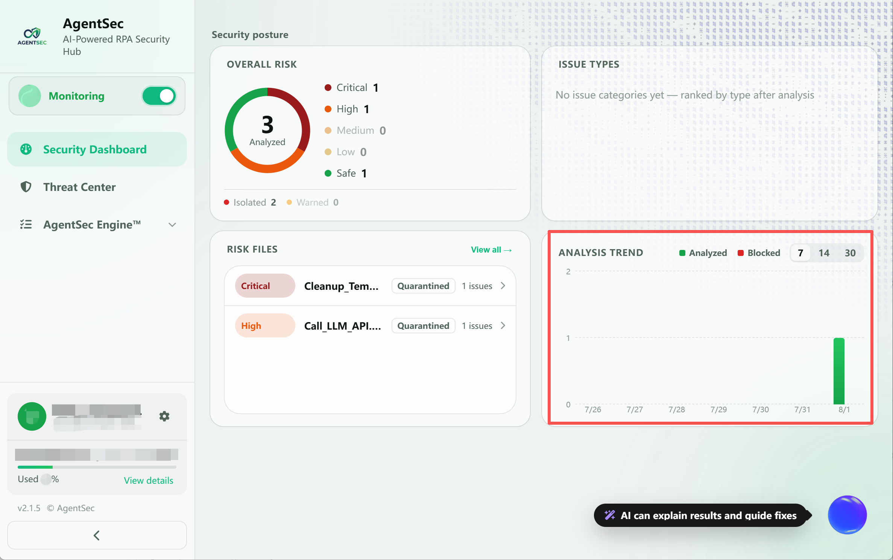

# Security Dashboard Guide

> The Security Dashboard brings together AgentSec's monitoring status, risk distribution, risky files, and analysis trends, helping you quickly understand your current overall security posture.

---

## Dashboard Overview

> 

The new dashboard is divided into the following main areas:

| Area                  | Purpose                                                                        |
| --------------------- | ------------------------------------------------------------------------------ |
| **Monitoring Status** | View AgentSec's connection and monitoring status, and start or stop monitoring |
| **Overall Risk**      | View the overall risk distribution of analyzed scripts                         |
| **Issue Type**        | View the number and ranking of each type of security issue                     |
| **Risky Files**       | Quickly locate script files that contain risks                                 |
| **Analysis Trends**   | View changes in analysis data over the last 7, 14, or 30 days                  |
| **AI Assistant**      | Interpret analysis results and provide remediation suggestions                 |

> When you first open the dashboard or no analysis has been completed, some cards display “No data.” The dashboard updates automatically after monitoring starts and script analysis is completed.

---

## I. View and Switch Monitoring Status

The status card at the top of the left sidebar shows both the current **connection status** and **monitoring status**. Click the switch on the right side of the card to start or stop monitoring.
> 

| Displayed Status | Meaning | Image |
| --- | --- | --- |
| **Connected · Not Monitoring** | Connected to the AgentSec service, but monitoring has not started |  |
| **Monitoring** | Monitoring script changes in the configured directories |  |
| **Not Connected** | Not signed in or the server is unreachable |  |

Before starting monitoring, configure the monitoring directories. For directory configuration and monitoring operations, see [Monitoring Management](04-monitoring.md).

---

## II. Overall Risk

The “Overall Risk” card shows the distribution of analyzed scripts across different risk levels, helping you quickly assess the overall risk of the current environment.
> 

Common risk levels include:

| Risk Level | Description |
| --- | --- |
| **Critical** | May cause a major security impact and should be addressed first |
| **High** | Presents a clear security risk and should be remediated as soon as possible |
| **Medium** | Presents a potential risk and should be reviewed and addressed |
| **Low** | Presents a lower risk and can be assessed in the context of actual business needs |

When there are no analysis results, this area displays “Risk composition will be shown after analysis is complete.”

---

## III. Issue Type Ranking

The “Issue Type Ranking” lists security issue types from most to least frequently detected, making it easier to identify the most common current risks.
> 

This area shows:

- Which type of security issue occurs most frequently;
- The number of findings for each issue type;
- The risk types that currently require the most attention.

When there are no analysis results, this area displays “No issue categories yet. After analysis, issue types will be ranked from most to least frequent.”

---

## IV. Risky Files

The “Risky Files” area lists scripts in which security issues were detected, along with the number of issues in each script. Use the list to quickly locate files that need review.
> 

- Click a risky file to open its analysis details;
- Click **“View All”** in the upper-right corner to open the complete list in the Threat Center;
- If no risky files have been detected, this area displays an empty-state message.

For analysis results and issue details, see [Threat Center](05-security-log.md).

---

## V. Analysis Trends

“Analysis Trends” shows how script analysis data changes over time. Click the time range in the upper-right corner to switch between reporting periods:
> 

- **7**: Last 7 days;
- **14**: Last 14 days;
- **30**: Last 30 days.

If there are no analysis records in the selected period, the page displays “No analysis data in the last N days.”

---

## VI. Sidebar Information

In addition to the monitoring switch, the left sidebar provides the following navigation and information:
> 

| Item | Description |
| --- | --- |
| **Security Dashboard** | Return to the current security posture overview |
| **Threat Center** | View scripts, risk issues, and detailed analysis results |
| **AgentSec Engine™** | Expand features related to AgentSec Engine |
| **User Information** | Display the current signed-in account and user identity |
| **Organization Usage** | Display the current organization's quota, percentage used, and remaining quota |
| **Settings** | Click the gear icon to the right of the user information to open Settings |

---

## VII. AI Assistant

Click the floating AI Assistant button in the lower-right corner to open the AI Security Assistant.
> 

Using the current analysis results, the AI Assistant can:

- Explain risks and their impact;
- Explain why an issue occurred;
- Provide remediation suggestions;
- Help perform related security operations.

For details, see [AI Security Assistant Guide](08-ai-assistant.md).

---

## Next Steps

- [Configure monitoring directories and start monitoring](04-monitoring.md)
- [View script analysis results](05-security-log.md)
- [Configure security policies](07-security-policy.md)
- [Use the AI Security Assistant](08-ai-assistant.md)
