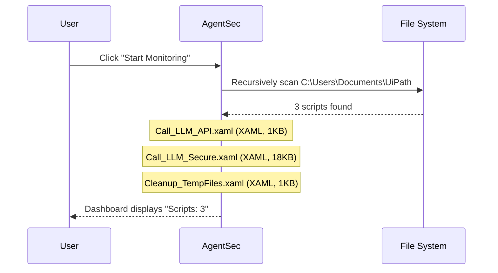
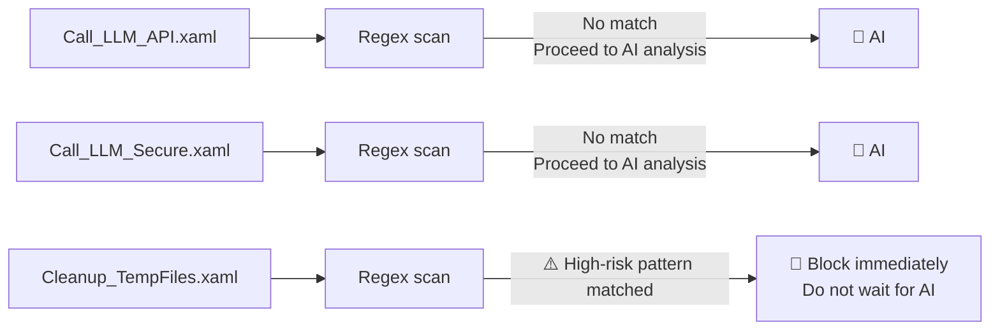
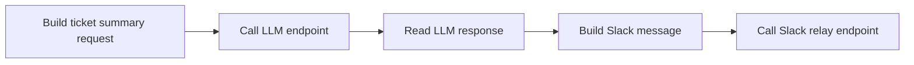
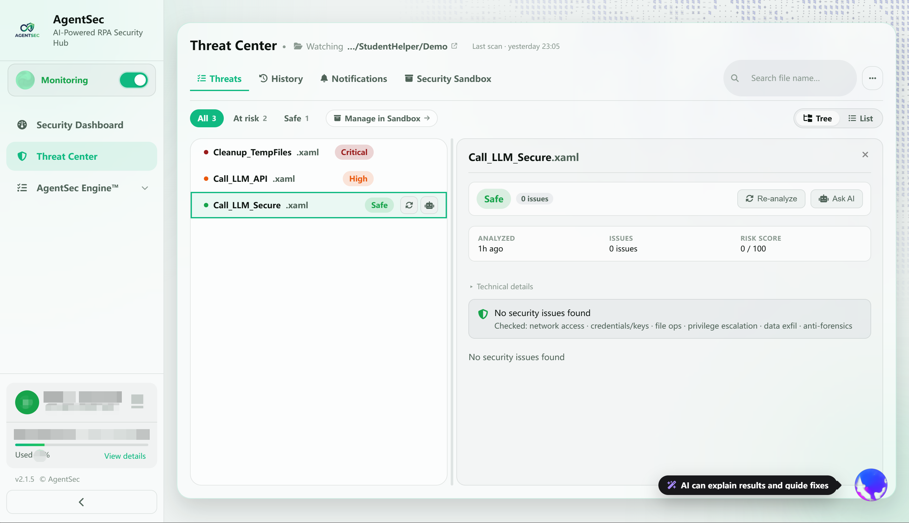
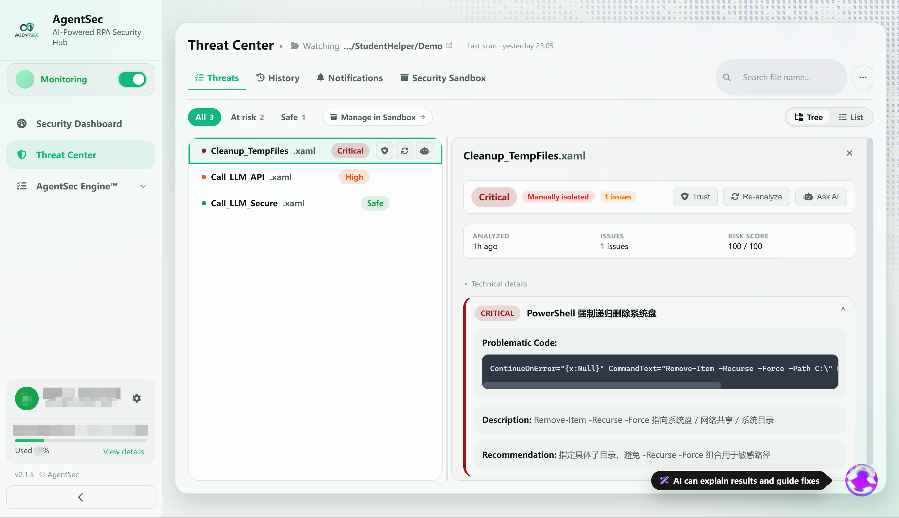
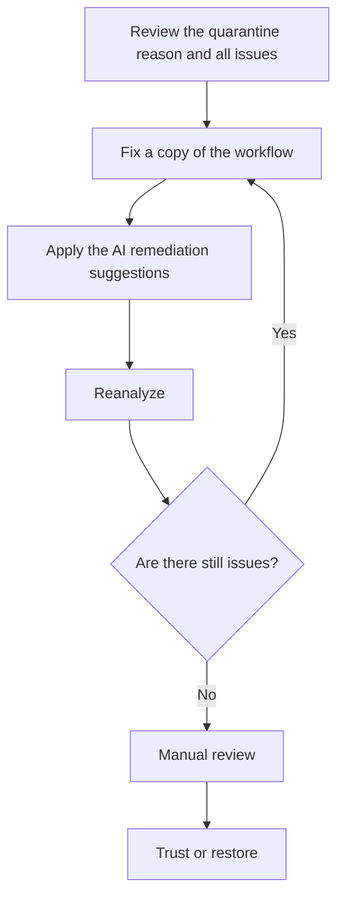

# 03 — First Security Analysis: Three UiPath Workflow Cases

> This page uses three UiPath XAML workflows to demonstrate the complete process, from starting monitoring and viewing analysis results to handling risky files.

---

## Scenario Setup

Assume that your monitoring directory, `C:\Users\Documents\UiPath`, contains three scripts:

| File | Purpose | Main Security Characteristics |
| --- | --- | --- |
| `Call_LLM_API.xaml` | Calls an LLM to generate a ticket summary, then posts the result to Slack | Stores an API key and Slack token directly in the workflow |
| `Call_LLM_Secure.xaml` | A secure rewrite of `Call_LLM_API.xaml` | Reads credentials from Orchestrator Assets and includes exception handling and secure logging |
| `Cleanup_TempFiles.xaml` | Calls PowerShell to clean up files | Executes a forced recursive deletion command against the root of the system drive |

> The keys, tokens, API endpoints, and channel IDs in these examples are demonstration values, not real credentials.

To follow this chapter hands-on, download the companion [UiPath sample package](../demo/agentsec-uipath-demo.zip). After unzipping it, place the `Demo` folder in a test directory and set that directory as the monitored directory in AgentSec.

The package contains three workflows: `Call_LLM_API.xaml`, `Call_LLM_Secure.xaml`, and `Cleanup_TempFiles.xaml`. The following phases explain their analysis results and handling flow step by step.

You have just configured AgentSec and enabled monitoring from the monitoring status card in the left sidebar.

---

## Phase 1: Scan and Discovery

After monitoring starts, AgentSec scans `C:\Users\Documents\UiPath`, discovers the three `.xaml` files, and creates analysis tasks for them one by one.



**What you see:**
> 

---

## Phase 2: Security Checks

Each script goes through the following checks:

### Check 1: Fast Regex Scan



Regex scan results for the three scripts:

| Script | Regex Result | Action |
| --- | --- | --- |
| `Call_LLM_API.xaml` | No match | → Proceed to AI analysis |
| `Call_LLM_Secure.xaml` | No match | → Proceed to AI analysis |
| `Cleanup_TempFiles.xaml` | ⚠️ Matches `fs-remove-item-system` (PowerShell forced recursive deletion) | → **Block immediately** |

**The regex match for Cleanup_TempFiles.xaml means** that the script contains a high-risk command such as `Remove-Item -Recurse -Force C:\...`. AgentSec does not need to wait for AI analysis and blocks it immediately.

After `Cleanup_TempFiles.xaml` is quarantined:

- Original file → `.agentsec_quarantine\Cleanup_TempFiles_20260609T093000Z.xaml`
- Original path → A read-only safe stub that cannot be executed

### Check 2: In-Depth AI Analysis

`Call_LLM_API.xaml` and `Call_LLM_Secure.xaml` proceed to AI analysis. AgentSec calls the AI model to assess the security of each script.

**Analysis process for Call_LLM_API.xaml** (signed-in mode):

```
Upload script content → AgentSec Cloud → AI analysis
  ↓
Checks (based on your enabled security policy rules):
  · Does it send data externally? (network request check)
  · Does it contain hardcoded passwords? (credential check)
  · Does it use plaintext HTTP? (transport security check)
  · Does it include exception handling? (code quality check)
  · Is there a risk of SQL injection? (injection check)
  ... (15–21 rules are checked, depending on your policy settings)
  ↓
Return analysis results
```

---

## Phase 3: View Results

After analysis is complete, click **“Threat Center”** in the left navigation bar, then select a file from the script list to view its details.
> 

| File | Analysis Result | Issues | File Status |
| --- | --- | ---: | --- |
| `Call_LLM_API.xaml` | **High** | 5 | Quarantined |
| `Call_LLM_Secure.xaml` | **Safe** | 0 | Not quarantined |
| `Cleanup_TempFiles.xaml` | **Critical** | 1 | Quarantined |

These represent three typical outcomes:

- **Safe**: No security issues were found, and the file can continue to be used;
- **High**: High-risk issues exist. The file has been quarantined and must be fixed or manually reviewed;
- **Critical**: The file contains an operation that may cause severe damage. It has been quarantined and should be handled first.

> The analysis details page also provides actions such as **“Trust,” “Reanalyze,”** and **“Ask AI.”** Use “Trust” only after confirming that the file is safe.

---

## Phase 4: Interpret Each Result

### Script 1: `Call_LLM_API.xaml` — High · Quarantined

#### What the Workflow Does

This workflow first builds a ticket-summary request and calls an LLM through an HTTP endpoint. It then builds a Slack message and posts the response through another HTTP request.



#### AgentSec's Assessment

AgentSec detects **5 issues**, mainly related to a plaintext API key, Slack token, and password-like fields in the XAML. It therefore classifies the file as **High** and quarantines it.

**Recommended action:** Remove plaintext credentials, rotate the exposed keys, and use UiPath Orchestrator Assets or another secrets-management service instead.

> 

---

### Script 2: `Call_LLM_Secure.xaml` — Safe · Not Quarantined

#### How It Differs from the High-Risk Version

The secure version still performs the same business process—calling an LLM to generate a summary and posting it to Slack—but uses a safer implementation:

| Improvement | XAML Implementation |
| --- | --- |
| Does not store plaintext credentials | Uses `GetRobotAsset` to retrieve `LLM_Gateway_ApiKey` and `Slack_Bot_Token` |
| Supplies tokens at runtime | HTTP requests use the `OAuthToken` variable instead of hardcoding the token in request headers |
| Restricts request behavior | Enables TLS, sets timeouts, and configures a limited number of retries |
| Checks response status | Explicitly throws an exception for non-2xx HTTP status codes |
| Handles runtime exceptions | Wraps the LLM and Slack calls in `TryCatch` |
| Reduces sensitive data in logs | Records only metadata such as success status, HTTP status, elapsed time, and response length |

#### AgentSec's Assessment

This workflow performs the same LLM and Slack calls, but retrieves credentials from Orchestrator Assets and includes exception handling, HTTP status checks, and secure logging. No security issues are found, so the result is **Safe** and the file remains available.

> 

---

### Script 3: `Cleanup_TempFiles.xaml` — Critical · Quarantined

This workflow is nominally intended to clean up temporary files, but its PowerShell activity actually executes:

```powershell
Remove-Item -Recurse -Force -Path C:\
```

This command attempts a forced recursive deletion starting at the root of the system drive. AgentSec classifies it as **Critical** and quarantines it immediately.

**Recommended action:** Do not trust or restore the file directly. Change the deletion target to an explicit, controlled temporary directory, validate the path before execution, and use `-WhatIf` for a dry run.

> 

---

## Phase 5: Handle and Remediate

| File | Primary Action |
| --- | --- |
| `Call_LLM_API.xaml` | Rotate the exposed credentials, remove plaintext keys, and follow the secure version by using Orchestrator Assets |
| `Call_LLM_Secure.xaml` | No quarantine action is needed; test API permissions and business logic through the normal workflow |
| `Cleanup_TempFiles.xaml` | Remove the recursive system-drive deletion command and use a validated, explicit target directory |

After modifying a risky file, click **“Reanalyze.”** Trust or restore the file only after both the analysis result and manual review have passed.



> Manage quarantined files through AgentSec's Threat Center and Security Sandbox. Do not manually modify the original files or metadata in `.agentsec_quarantine`.

---

## Summary: What You Learned from the First Analysis

| Lesson | Description |
| --- | --- |
| AgentSec scanning is **automatic** | After monitoring starts, the entire process is automatic and requires no manual trigger |
| There are two layers of protection | Regex pre-scan (milliseconds) + AI analysis (in-depth checks) |
| Blocking does not mean deletion | Files are quarantined rather than deleted and can be restored |
| Review three things in the details | Risk level, code snippet, and remediation suggestions |
| A blocked file is not necessarily dangerous | A regex block of Cleanup.ps1 may be a false positive and requires human judgment |

---

## Next Steps

- [Configure and manage monitoring directories](04-monitoring.md)
- [View complete analysis details in the Threat Center](05-security-log.md)
- [Manage the quarantine and security zones](06-sandbox.md)
- [Configure security policies](07-security-policy.md)
- [Use the AI Assistant to explain and remediate issues](08-ai-assistant.md)
