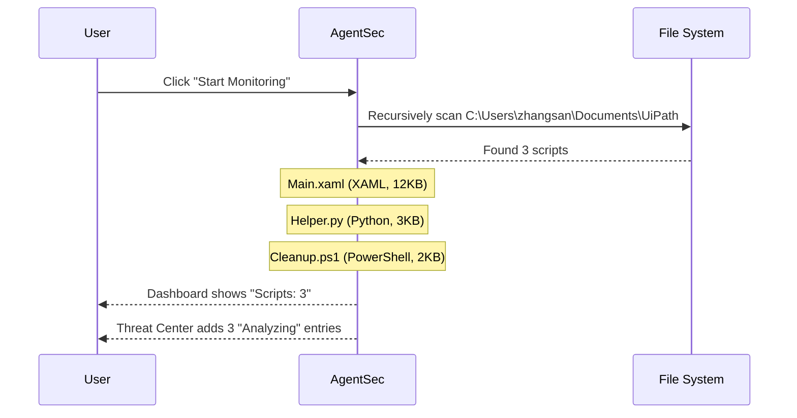
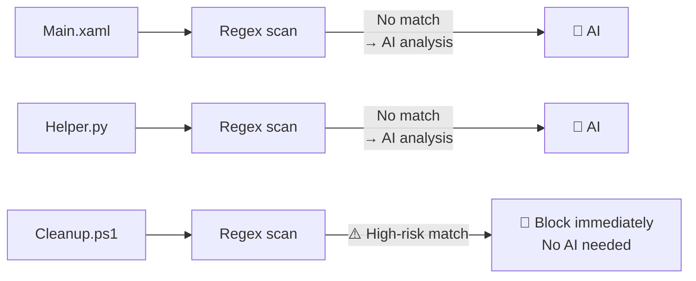
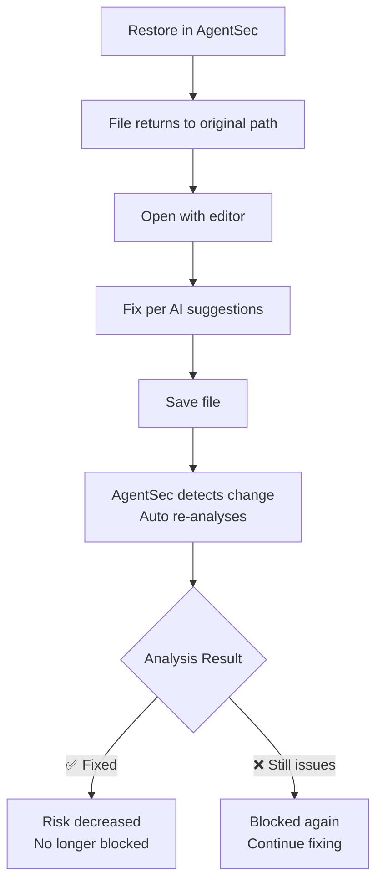

# 03 — First Security Analysis (Full Case Study)

> This page walks you through a real scenario: "discover scripts → AI analysis → view results → handle issues" from start to finish.

---

## Scenario Setup

Your monitoring directory `C:\Users\zhangsan\Documents\UiPath` contains three scripts:

| File | Description |
|------|-------------|
| `Main.xaml` | A UiPath main workflow — reads Excel and sends email |
| `Helper.py` | A Python helper script with a hardcoded database password |
| `Cleanup.ps1` | A PowerShell cleanup script — deletes temp files |

You've just configured AgentSec and clicked "Start Monitoring".

---

## Phase 1: Scan & Discovery



**What you see:**

- Dashboard: Scripts = 3, Analyzing = 3, Analyzed = 0
- Threat Center: 3 entries showing green spinning "Analyzing" icon

---

## Phase 2: Security Check

Each script goes through:

### Stage 1: Regex Fast Scan



Regex scan results:

| Script | Regex Result | Action |
|--------|-------------|--------|
| `Main.xaml` | No match | → Enter AI analysis |
| `Helper.py` | No match | → Enter AI analysis |
| `Cleanup.ps1` | ⚠️ Hit `fs-remove-item-system` (PowerShell forced recursive delete) | → **Block immediately** |

**Cleanup.ps1 regex hit means**: the script contains a command like `Remove-Item -Recurse -Force C:\...` — AgentSec blocks it without waiting for AI.

After Cleanup.ps1 is quarantined:
- Original file → `.agentsec_quarantine\Cleanup_20260609T093000Z.ps1`
- Original path → Safe stub file (read-only, cannot execute)
- Threat Center shows: `CRITICAL · Quarantined · ⚡Regex prefilter block`

### Stage 2: AI Deep Analysis

Main.xaml and Helper.py enter AI analysis. AgentSec calls the AI model to analyze script security.

**Main.xaml analysis process** (signed-in mode):

```
Upload script content → AgentSec Cloud → AI Analysis
  ↓
Checklist (based on your enabled security policy rules):
  · Sending data externally? (network request check)
  · Hardcoded credentials? (credential check)
  · Plaintext HTTP? (transport security check)
  · Exception handling? (code quality check)
  · SQL injection risk? (injection check)
  ... (checks against enabled rules in your policy)
  ↓
Return analysis result
```

---

## Phase 3: View Results

After analysis completes, the three script results:

| Script | Risk Level | Action | Issues |
|--------|-----------|--------|--------|
| `Main.xaml` | MEDIUM | Allow | 2 |
| `Helper.py` | CRITICAL | Block (Quarantined) | 1 |
| `Cleanup.ps1` | CRITICAL | Block (Quarantined) ⚡Regex | 1 |

---

## Phase 4: Individual Analysis

### Script 1: Main.xaml — MEDIUM · Allow

Click Main.xaml, the detail panel opens on the right:

**Issue 1: MEDIUM — Missing global exception handling**

```
📍 Location: Entire workflow
📋 Description: No TryCatch/Finally wrapping the main logic.
       Runtime errors may leak internal paths or data.
💡 Fix: Add TryCatch activity around the Sequence,
       log generic error messages instead of full stack traces.
```

**Issue 2: LOW — Insufficient logging**

```
📍 Location: After email send step
📋 Description: No logging for the email send operation.
       Failure is untraceable.
💡 Fix: Add Log Message activities before and after key operations.
```

**Decision**: Both issues are suggestions only — low risk. AgentSec did not block the file. Fix at your convenience.

---

### Script 2: Helper.py — CRITICAL · Quarantined

Click Helper.py, the detail panel opens:

**Issue: CRITICAL — Hardcoded credential / API Key**

```
📍 Location: Line 15
📝 Code snippet:
    14  | # Database connection
    15  | conn = pyodbc.connect('DRIVER={ODBC};SERVER=prod-db;
         |                      UID=admin;PWD=MyPassword123')
    16  | cursor = conn.cursor()

📋 Description: The Python script hardcodes production database
       credentials (admin/MyPassword123). Anyone with the script
       can access the database.

💡 Fix:
   1. Immediately change the database password (already exposed)
   2. Use environment variables instead:
      conn = pyodbc.connect(os.environ['DB_CONN_STRING'])
   3. Or use a key management service (e.g. Azure Key Vault)
```

**What AgentSec already did**:
- ✅ Checked for running Python processes → terminated
- ✅ Moved original file to `.agentsec_quarantine\`
- ✅ Replaced original path with safe stub
- ✅ Generated `.meta.json` recording quarantine details

**Your next step**: Fix the hardcoded password in the code, then restore from quarantine.

---

### Script 3: Cleanup.ps1 — CRITICAL · Quarantined ⚡Regex prefilter

Cleanup.ps1 skipped AI analysis (blocked by regex prefilter). Its detail panel shows "Regex Prefilter Block":

**Issue: HIGH — PowerShell forced recursive delete on system drive**

```
📍 Code snippet:
    Remove-Item -Path C:\Windows\Temp\* -Recurse -Force

📋 Description: Remove-Item -Recurse -Force pointing at C: drive.
       Even though the target is Temp, the -Recurse -Force
       combination on system drive is highly destructive.

💡 Fix:
   1. Use exact absolute paths, avoid wildcards with -Recurse -Force
   2. Add -WhatIf for dry-run (PowerShell 5.1+)
   3. Consider using built-in Disk Cleanup instead
```

---

## Phase 5: Remediation

### Helper.py (needs fix then restore)

1. Open `.agentsec_quarantine\Helper_20260609T093015Z.py` to view the original
2. Edit line 15 — replace hardcoded password with environment variable
3. In AgentSec, find Helper.py in the Threat Center
4. Click **"Restore"** to put the fixed file back
5. File content changed (hash differs) → AgentSec will re-analyze



### Cleanup.ps1 (regex prefilter block, needs review)

Regex prefilter blocked files need human judgment: is it really dangerous?

- If Cleanup.ps1 really just cleans C:\Windows\Temp (reasonable): Restore + add to whitelist
- If the script is from unknown origin and truly dangerous: Keep in quarantine

---

## Summary: What You Learned

| Lesson | Detail |
|--------|--------|
| AgentSec scanning is **automatic** | After starting, everything is automatic — no manual triggers |
| Two-layer safety net | Regex prefilter (milliseconds) + AI analysis (deep check) |
| Blocked ≠ Deleted | Files are "quarantined", not deleted — restorable anytime |
| Check three things in details | Risk level, code snippet, remediation advice |
| Blocked ≠ always dangerous | Cleanup.ps1's regex block could be a false positive — needs human review |

---

## Next Steps

| I want to... | Read this |
|--------------|-----------|
| More monitoring configuration options | [04 — Monitoring & Directory Setup](04-monitoring.md) |
| All Threat Center features | [05 — Threat Center](05-security-log.md) |
| Managing quarantined/trusted files | [05 — Threat Center (Sandbox tab)](05-security-log.md) |
| Adjusting blocking strictness | [06 — AgentSec Engine™](07-security-policy.md) |
