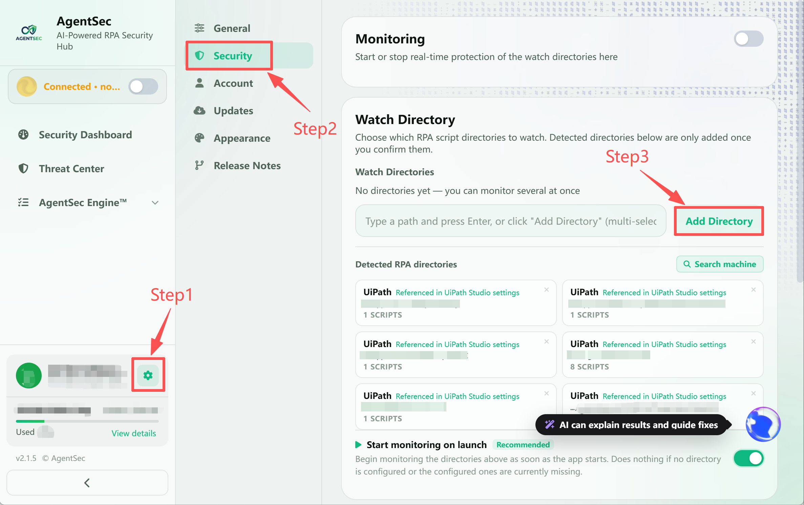
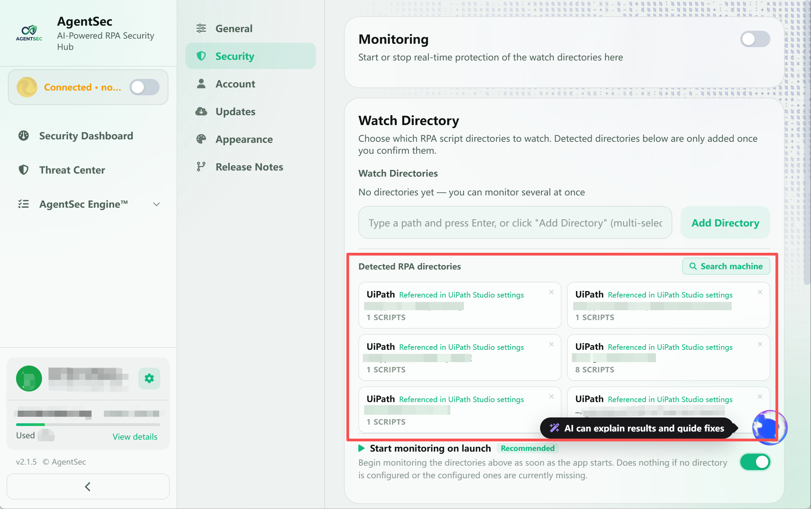

# Monitoring Configuration and Usage Guide

> Monitoring is a core AgentSec feature. Once started, AgentSec continuously watches the directories you specify, automatically detects new or modified scripts, and triggers security analysis.

---

## What Is “Monitoring”?

AgentSec monitoring includes the following automated operations:

1. **Discover scripts**: Scan all RPA scripts in the specified directories
2. **Watch in real time**: Automatically trigger analysis when a file is created or modified in a monitored directory
3. **Perform security checks**: Process each script through a “fast regex scan” followed by “in-depth AI analysis”
4. **Respond automatically**: Block, warn, or allow the script according to the analysis result

---

## How to Choose Monitoring Directories

### Configure from the Dashboard

1. Click **“Settings”** next to your avatar in the lower-left corner
2. Select **“Security Configuration”** on the Settings page
3. Click **“Select Directory”**
4. **Multiple directories can be monitored simultaneously**: Add more than one folder path

> 

### Use Auto-Detection

AgentSec automatically detects RPA tools installed on your computer and lists their default project directories in the suggestions area:

> 

| Tool That May Be Detected | Default Directory |
| --- | --- |
| UiPath | `Documents\UiPath` |
| Power Automate Desktop | `Documents\Power Automate Desktop` |
| Automation Anywhere | `Documents\Automation Anywhere Files` |

> 💡 Click a suggested directory to fill it in automatically, without browsing for it manually.

### Directory Selection Guidelines

| ✅ Recommended | ❌ Not Recommended |
| --- | --- |
| A directory dedicated to RPA projects | The root of the C: drive |
| A folder where scripts are stored together | System directories such as Windows or Program Files |
| A subdirectory for a specific project | A directory containing many non-script files |

---

## Start or Stop Monitoring

### Start Monitoring

1. Confirm that the **“Monitoring Directories”** are configured correctly
2. Turn on the **“Monitoring”** switch

>  → 

After monitoring starts, AgentSec scans existing files, starts watching for new or modified scripts, analyzes each script, and pushes the result back to the interface in real time. Depending on the conclusion, AgentSec blocks, warns, or allows the script.

### Stop Monitoring

- Turn off the **“Monitoring”** switch
- After monitoring stops:
  - New files are no longer watched
  - Analyses already in progress continue to completion
  - Existing analysis results remain visible in the interface

---

## What Happens During Monitoring?

During monitoring, AgentSec performs basic filtering, regex pre-scan, and AI deep analysis in order, then pushes the final result to the interface. If the regex pre-scan already matches a high-risk pattern, the script is blocked immediately without waiting for AI analysis.

### Check 1: Basic Filtering

Before analysis, AgentSec excludes the following files:

- Temporary files (names beginning with `~$` or `.`, or with the `.tmp` / `.swp` extension)
- Unsupported script types
- Files that have been added to the allowlist (trusted list) and whose contents have not changed

### Check 2: Regex Pre-Scan (Milliseconds)

AgentSec performs a fast scan using 23 high-confidence rules. Typical patterns that are blocked include:

| Category | Example |
| --- | --- |
| System destruction | `rm -rf /`, formatting the C: drive |
| Ransomware | Deleting shadow copies, disabling system recovery |
| Malicious code execution | Downloading and immediately executing code from the network, encoded PowerShell bypasses |
| Credential theft | Mimikatz, dumping the lsass process |
| Hardcoded secrets | AWS keys, GitHub tokens, SSH private keys |

> ⚡ The regex pre-scan usually completes within **1 millisecond**. A match is blocked immediately without waiting for AI analysis, greatly improving response time.

### Check 3: In-Depth AI Analysis

Scripts that do not match a regex rule proceed to AI analysis:

- **Signed-in mode**: The script is uploaded to AgentSec Cloud and analyzed by the cloud AI, usually within 10–30 seconds
- **Local mode**: The local AI model you configured performs the analysis; speed depends on the model and hardware

---

## Monitoring Scope

AgentSec recursively monitors the directories you select, up to 10 subdirectory levels, but automatically skips the following directories:

- `node_modules`, `__pycache__`, `.venv` — Dependency and cache directories
- `.git`, `.svn` — Version-control directories
- `.idea`, `.vscode` — IDE configuration directories
- `$RECYCLE.BIN`, `System Volume Information` — System directories
- `.agentsec_quarantine` — AgentSec's own quarantine directory

---

## How Large Directories Are Handled

If a monitoring directory contains **more than 30** script files, AgentSec uses an intelligent two-stage process:

| Stage | Processing |
| --- | --- |
| Fast pre-scan | Uses 32 concurrent tasks for regex scanning; high-risk matches are blocked immediately |
| AI analysis | Uses 8 concurrent tasks for in-depth AI analysis of the remaining scripts |

As a result, even when a directory contains hundreds of scripts, high-risk scripts can be blocked immediately without waiting in the AI queue.

---

## File Status Reference

After analysis, a script file has one of the following states according to the result:

| Status | Label | Meaning | File Permissions |
| --- | --- | --- | --- |
| Quarantined | `Quarantined` (red label) | Determined to require blocking and moved to quarantine | Original path replaced with a safe stub |
| Locked | `Read-only` (red label) | Determined to be at warning level and locked | Read-only (cannot be executed) |
| Not blocked | `Writable` (gray label) | Lower risk and not blocked | Original permissions retained |

> ⚠️ “Writable” does not mean “completely safe.” It only means that the AI determined the current risk level does not require blocking. Regular review is still recommended.

---

## Change Monitoring Directories

To change the monitoring directories:

1. If monitoring is running, **stop monitoring first**
2. Change the monitoring directories in Settings, or click the directory card on the Dashboard to open the relevant setting
3. Turn the **“Monitoring”** switch on again
4. AgentSec performs a new full scan of the new directories

---

## FAQ

**Q: Why are some scripts analyzed quickly while others take longer?**  
A: Scripts that match the regex pre-scan are blocked directly within milliseconds. Scripts that require AI analysis must wait for the model to return a result. Large scripts of more than 15,000 characters may take longer.

**Q: Does monitoring affect system performance?**  
A: The effect is negligible during normal use. File monitoring uses the operating system's native event notification mechanism rather than polling the disk, and AI analysis is limited to 8 concurrent tasks to avoid exhausting resources.

**Q: Does monitoring continue after I close the application?**  
A: No. AgentSec must remain running to monitor files. It is recommended that you configure AgentSec to start automatically when the computer starts.
