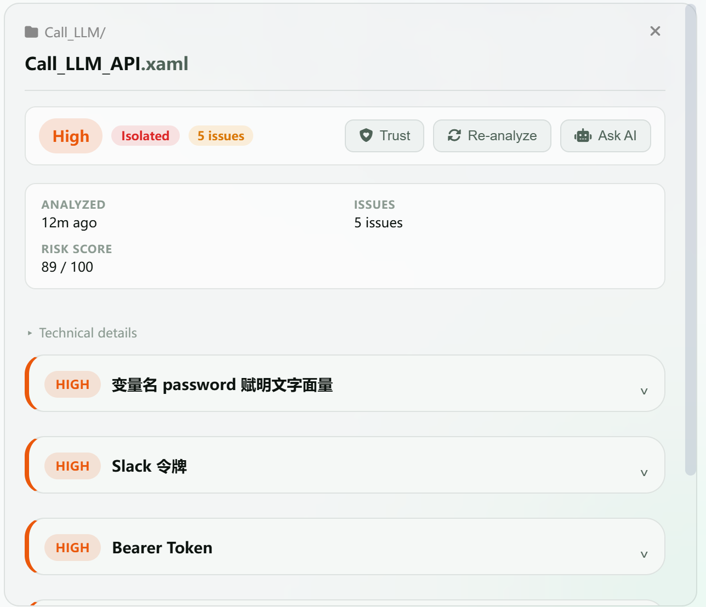
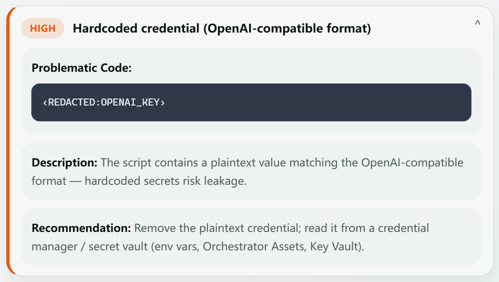
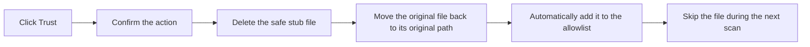

# Threat Center (Protection Logs)

> The four features—**Threat List**, **History**, **Notifications**, and **Security Sandbox**—are combined on a unified **Threat Center** page and can be accessed using the tabs at the top.
> The Threat Center is the main page for viewing each script's analysis result. Here you can see what issues the AI found, how severe the risks are, and how to remediate them.

---

## Open the Threat Center

Click **“Threat Center”** in the left navigation bar.

> 

---

## Interface Layout

The **Threat List** uses a **two-column layout**. When no file is selected, the threat list is the main focus. After you select a file, its analysis details appear on the right:

```
┌──────────────────────┬──────────────────────────┐
│  Left: Script List   │  Right: Detail Panel     │
│                      │                          │
│  📁 Critical 1 · 1  │  ┌────────────────────┐  │
│  └─ Cleanup_        │  │ Call_LLM_API.xaml  │  │
│     TempFiles.xaml  │  │ High · Quarantined │  │
│                      │  │ · 5 issues         │  │
│  📁 High 1 · 2     │  ├────────────────────┤  │
│  ├─ Call_LLM_      │  │ Analyzed: 24m ago  │  │
│  │  API.xaml       │  │ Risk score: 89/100 │  │
│  └─ Call_LLM_      │  ├────────────────────┤  │
│     Secure.xaml    │  │ Issues:            │  │
│                      │  │ HIGH password var  │  │
│                      │  │ HIGH Slack token   │  │
│                      │  │ HIGH Bearer Token  │  │
│                      │  └────────────────────┘  │
└──────────────────────┴──────────────────────────┘
```

- **Left**: Displays all analyzed scripts. You can browse them by risk group in either a directory-tree or list view
- **Right**: After you click a script, displays its analysis result, risk score, and issue list

### Top Toolbar

| Control | Purpose |
| --- | --- |
| `All` / `At Risk` / `Safe` | Filter files by analysis result; the number after each tab shows the file count |
| `Sandbox Management` | Open the Security Sandbox to manage quarantined files |
| Search box | Search by filename |
| `Directory Tree` / `List` | Switch the Threat List display mode |

> 

---

## Left: Threat List

### Grouped Display

In **Directory Tree** view, scripts are grouped by risk level and directory structure. If your monitoring directory contains subdirectories, scripts are grouped by folder. Each group heading shows the group's highest risk level, file count, and a **“Trust Entire Group”** button.

- **Critical**: Red indicator
- **High**: Orange indicator
- **Safe**: Green indicator

Each folder can be collapsed or expanded by clicking it, and the number of scripts in the folder appears on the right.

> 

### Script Entry Information

Each script entry displays:

| Information | Example | Meaning |
| --- | --- | --- |
| Filename | `Call_LLM_API.xaml` | Script name |
| Risk level | `High` (orange) | Highest risk level in the file |
| File status | `Quarantined` | File disposition; displayed in the detail panel |
| Issue count | `5 issues` | Number of detected security issues; details appear in the detail panel |
| Quick actions | Trust / Reanalyze / Ask AI | Perform the corresponding action on the current file |
| Subdirectory | `Call_LLM/` | Subdirectory containing the script |

### Status Labels

| Label | Color | Description |
| --- | --- | --- |
| `Analyzing` | Green spinning icon | AI analysis is in progress and the elapsed waiting time is displayed |
| `Analysis Failed` | Red | An error occurred during analysis, possibly because the model timed out |
| `Quarantined` | Red | The file has been moved to quarantine |
| `Critical` | Red | The file contains a critical risk |
| `High` | Orange | The file contains a high risk |
| `Safe` | Green | No security issues were detected |

---

## Right: Detail Panel

> 

Click any script on the left to display its detailed analysis result on the right.

### Overview Header

| Information | Description |
| --- | --- |
| Filename | Script name |
| Risk-level label | `Critical` / `High` / `Medium` / `Low`; issue cards may display English levels such as `HIGH` |
| File-status label | For example, `Quarantined` |
| Issue count | Total of N issues found |
| Action buttons | Trust / Reanalyze / Ask AI |

### Metadata Grid

| Field | Description |
| --- | --- |
| Analysis time | When analysis was completed, such as “3 minutes ago” |
| Detected issues | Total number of issues |
| Risk score | 0–100; a higher score indicates greater risk |

Expand **“Technical Details”** below the metadata to view more complete analysis information. Each card in the issue list can also be expanded or collapsed individually.

### No Security Issues Found

If no security issues are found after analysis, a green message appears:

> ✅ **No security issues found**
> Checked: Network access · Credentials/keys · File operations · Privilege escalation · Data exfiltration · Anti-forensics
> 

### Issue Cards

Each security issue is displayed in a collapsible card:

```
┌─────────────────────────────────────────┐
│ CRITICAL  Hardcoded credential/API Key⌄│
├─────────────────────────────────────────┤
│ 📍 Location: Line 15                    │
│                                         │
│ 📝 Code snippet:                        │
│ ┌───────────────────────────────────┐   │
│ │ password = "admin123"             │   │
│ │ api_key = "sk-abc123..."          │   │
│ └───────────────────────────────────┘   │
│                                         │
│ 📋 Description: The script contains    │
│   a plaintext password and API key,     │
│   creating a credential exposure risk. │
│                                         │
│ 💡 Recommendation: Use a credential    │
│   manager, such as UiPath Credential   │
│   Manager, or environment variables    │
│   to store sensitive information.      │
└─────────────────────────────────────────┘
```

> 

Click the card heading to expand or collapse the details.

### Risk Level Definitions

| Level | Color | Criteria | Default Action |
| --- | --- | --- | --- |
| **CRITICAL** | Red | Data exfiltration, hardcoded passwords, malicious commands, credential theft | 🚫 Block |
| **HIGH** | Orange | SQL authentication, sensitive data in logs, plaintext HTTP, disabled certificate validation | ⚠️ Warn |
| **MEDIUM** | Yellow | Missing exception handling, unvalidated input, paths pointing to personal directories | ℹ️ Notify |
| **LOW** | Gray | Insufficient logging, nonstandard naming | — Allow |

---

## Restore a Quarantined Script

If a script was blocked incorrectly and you have confirmed that it is safe, you can restore it directly from the detail panel:

1. Click the quarantined script to open the detail panel
2. Locate the red quarantine information bar in the detail panel
3. Click **“Trust.”** To process an entire risk group, you can also click **“Trust Entire Group”** on the left

> 



The restored file is automatically added to the **allowlist** (trusted list). Future scans skip analysis if the file's contents have not changed.

---

## Export Logs

You can export analysis results as a ZIP file for submitting a support ticket or archiving:

1. Click **“Export Logs”** in the upper-right corner of the Protection Logs page
2. Select a save location
3. Click **“Save”**

> 

The export contains:

- Security analysis records, excluding script source code
- Application runtime logs
- AI conversation records

---

## Historical Data

Click **“History”** at the top to view previous analysis records. Existing records remain available after AgentSec is closed and reopened. Protection Logs automatically loads the 200 most recent historical records from the local database.

---

## Next Steps

- [How do I manage quarantined files?](06-sandbox.md)
- [How do I adjust the strictness of detection rules?](07-security-policy.md)
