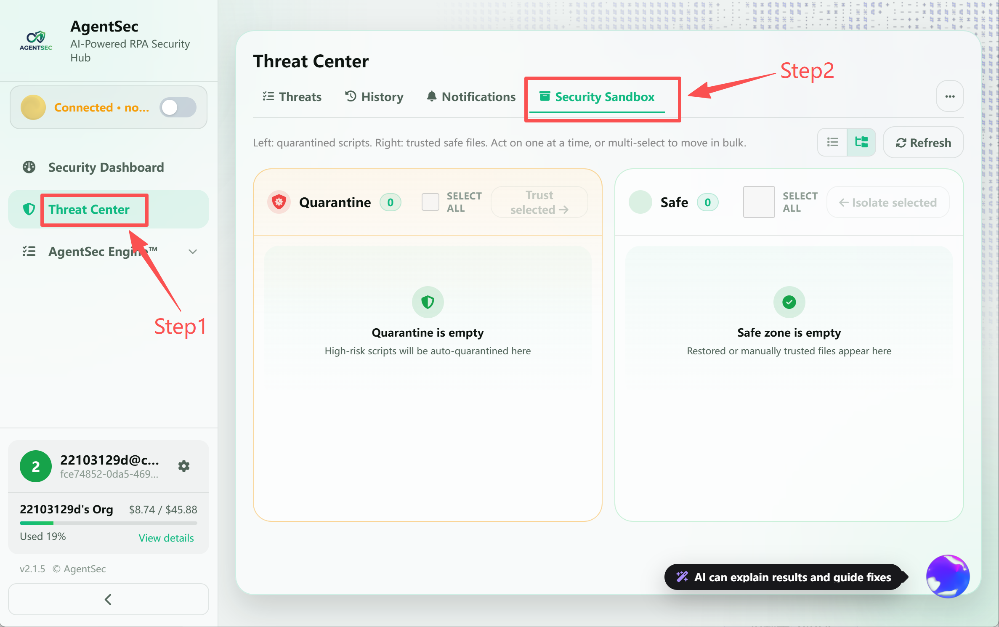

# Security Sandbox — Quarantine and Safe Zone Management

> The Security Sandbox is used to manage scripts blocked by AgentSec. It lets you restore files that were blocked incorrectly or move trusted files back into quarantine.

---

## What is the Security Sandbox?

The Security Sandbox is AgentSec's file security management system with two zones:

| Zone | Purpose |
| --- | --- |
| Quarantine Zone | Stores scripts blocked by AgentSec and waiting for review |
| Safe Zone | Stores scripts confirmed as trusted and restored from quarantine |

> 

---

## Open the Security Sandbox

The Security Sandbox is integrated into the **Threat Center**. Click **“Threat Center”** in the left navigation bar, then click the **“Security Sandbox”** tab at the top.

> 

---

## Quarantine Zone — Blocked Files

### When Does a Script Enter Quarantine?

- AI analysis returns a `block` disposition
- The regex pre-scan matches a high-risk malicious pattern
- A user manually moves a file from the Safe Zone back into quarantine

### What Happens During Quarantine?

When a script must be quarantined, AgentSec attempts to stop the related running process, moves the original file into quarantine, creates a safe stub at the original path, and records quarantine metadata.

### Quarantine Entry Information

Each entry in the Quarantine Zone displays:

| Information | Description |
| --- | --- |
| Filename | Name of the quarantined script file |
| Risk level | `CRITICAL` / `HIGH` label |
| Original path | Full path of the file before it was quarantined |
| Quarantine time | When the file was quarantined |

> 

---

## Safe Zone — Trusted Files

### When Does a File Enter the Safe Zone?

- It is **automatically added** to the Safe Zone after being restored from quarantine
- Its SHA-256 hash is calculated when it is added

### Safe Zone “File Exists” Indicator

| Indicator | Meaning |
| --- | --- |
| ✅ `File exists` (green) | The file is still on disk and its contents match when it was added |
| ❌ `File missing` (red) | The file has been deleted or moved |

### Content Change Detection

The Safe Zone records not only the file path but also its **SHA-256 hash**. If the file's contents are later modified:

- AgentSec **automatically removes it from the Safe Zone**
- Analysis is triggered again
- This prevents a trusted file from becoming a security vulnerability after being tampered with

---

## Operations Guide

### Restore a File from Quarantine (Quarantine → Safe)

If a script was blocked incorrectly, you can restore it:

**Option 1: Restore Selected Files**

1. Select the files to restore in the Quarantine Zone
2. Click **“Trust Selected”**
3. Confirm the operation

> 
>
> 

**Option 2: Restore by Dragging**

1. Select files in the Quarantine Zone
2. Drag the files to the **Safe Zone** on the right

**Option 3: Restore from Protection Logs**

1. Find the quarantined script in the Threat Center's Threat List
2. Expand its detail panel
3. Click **“Trust”**

> 

During restore, AgentSec deletes the safe stub, moves the quarantined file back to its original path, calculates the file hash, and adds it to the trusted list. As long as the file contents remain unchanged, future scans will not analyze it again.

### Quarantine a File Again (Safe → Isolate)

If a previously restored file is found to be risky after review, or you want to revoke trust:

1. Select the files to quarantine again in the Safe Zone
2. Click **“Isolate Selected”** at the top
3. Confirm the operation

The files are removed from the Safe Zone and processed through the quarantine workflow again.

> 

### Select Multiple Files

- Select an individual file using its checkbox
- Click **“Select All”** to select every file in the current zone
- After selecting files, use a batch action or drag them together

---

## Physical File Location

Quarantined files are stored in a `.agentsec_quarantine` subdirectory **under the original script's directory**:

```
Original script directory/
├── Main.xaml              ← Safe stub file (read-only, cannot execute)
├── Process.py             ← Safe stub file (read-only, cannot execute)
├── .agentsec_quarantine/  ← Quarantine directory (AgentSec does not rescan it)
│   ├── Main_20260101T120000Z.xaml           ← Quarantined original file
│   ├── Main_20260101T120000Z.xaml.meta.json ← Quarantine metadata
│   ├── Process_20260102T093000Z.py
│   └── Process_20260102T093000Z.py.meta.json
└── ...
```

> ⚠️ **Do not manually modify** files in the `.agentsec_quarantine` directory. Use the AgentSec interface to keep the allowlist and database consistent.

---

## Safe Stub Files

After a file is quarantined, a **safe stub** remains at the original path to explain what happened:

- **Python script stub**: Prints a warning and exits with an error code
- **UiPath script stub**: An empty Sequence containing a `Terminate` activity
- **Other script stubs**: A plain-text warning

Even if someone attempts to execute the file, they only see a warning and no actual harm occurs.

---

## FAQ

**Q: Is a restored file analyzed again?**  
A: No. When restored, the file is automatically added to the allowlist and its SHA-256 hash is recorded. Future scans skip it as long as its contents remain unchanged.

**Q: What happens if I modify the file after restoring it?**  
A: During the next scan, AgentSec detects the hash change, automatically removes the file from the allowlist, and analyzes it again. This is intentional—changed code should be checked again.

**Q: Can I add a file to the Safe Zone manually?**  
A: The current version does not support adding files manually. Files enter the Safe Zone after being restored from quarantine.

**Q: What happens if a file in the Safe Zone is deleted?**  
A: The Safe Zone marks it as **“File missing”** but does not remove the record automatically. You can manually move the record back into quarantine or contact an administrator.
