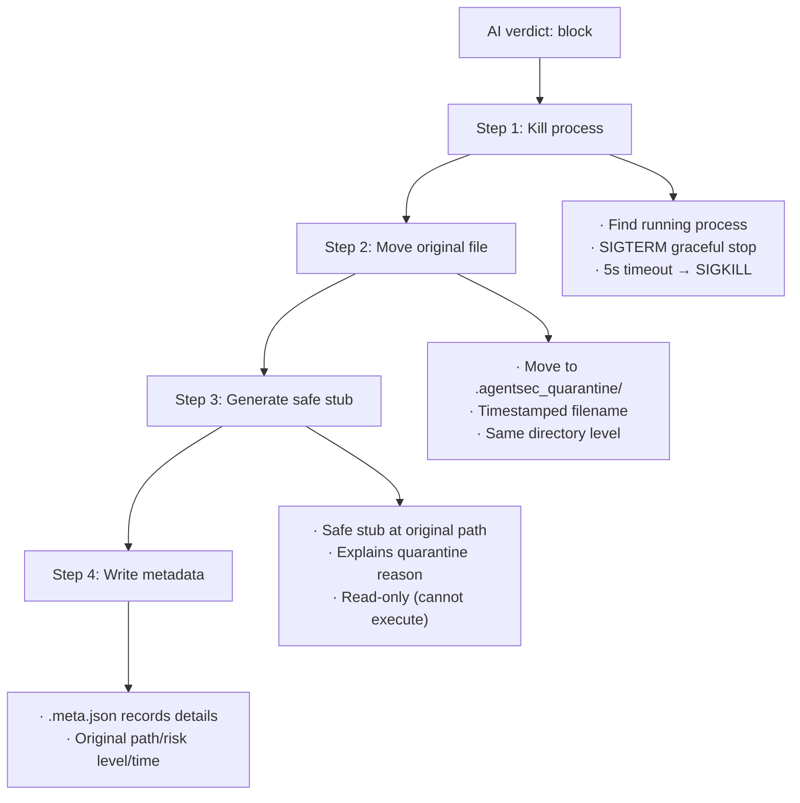
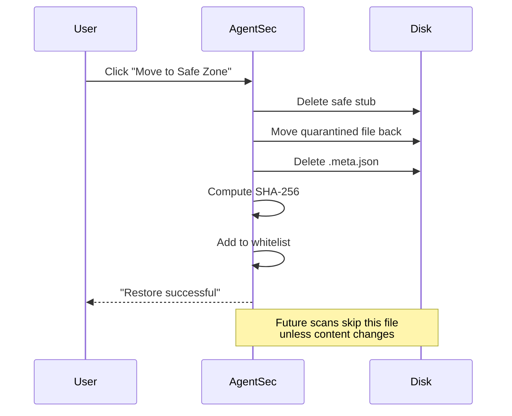

# Security Sandbox — Quarantine & Safe Zone Management

> The Security Sandbox is now a tab within the **Threat Center**. It manages scripts blocked by AgentSec — restore false positives or re-quarantine trusted files.

---

## What is the Security Sandbox?

The Security Sandbox is AgentSec's file security management system with two zones:

```
┌──────────────────────┐    ┌──────────────────────┐
│   Quarantine Zone     │    │   Safe Zone           │
│                      │    │                      │
│  🦠 Blocked scripts   │ ←→ │  ✅ Trusted scripts   │
│   Awaiting review     │    │   Restored/Allowed    │
│                      │    │                      │
│   Entered by:         │    │   Entered by:         │
│   · AI block verdict  │    │   · Restore from QZ   │
│   · Regex prefilter   │    │   · Manual add        │
└──────────────────────┘    └──────────────────────┘
```

---

## Opening the Security Sandbox

The Security Sandbox is integrated into the **Threat Center**. Click **"Threat Center"** in the sidebar, then the **"Security Sandbox"** tab.

---

## Quarantine Zone — Blocked Files

### When do scripts enter quarantine?

- AI analysis determines `block` action
- Regex prefilter hits a high-risk malicious pattern
- User manually moves a file from Safe Zone back to quarantine

### What happens during quarantine?



### Quarantine Entry Info

Each quarantine entry shows:

| Info | Description |
|------|-------------|
| Filename | Name of the quarantined script |
| Risk Level | `CRITICAL` / `HIGH` label |
| Original Path | Where the file was before quarantine |
| Quarantine Time | When it was quarantined |

---

## Safe Zone — Trusted Files

### When do files enter the Safe Zone?

- Restored from quarantine — **auto-added** to Safe Zone
- SHA-256 hash is computed on entry

### Safe Zone "File Exists" Marker

| Marker | Meaning |
|--------|---------|
| ✅ `File exists` (green) | File still on disk, content matches entry hash |
| ❌ `File missing` (red) | File deleted or moved |

### Content Change Detection

The Safe Zone records not just the path, but the file's **SHA-256 hash**. If the file is later modified:
- AgentSec **auto-removes it from the Safe Zone**
- Re-triggers analysis
- Ensures "trusted" files can't become security holes via tampering

---

## Operations Guide

### Restore from Quarantine (Quarantine → Safe)

If a script was wrongly blocked:

**Option 1: Per-file restore**
1. Check the file(s) in the Quarantine Zone
2. Click **"Move to Safe Zone →"** button
3. Confirm

**Option 2: Drag to restore**
1. Check file(s) in Quarantine Zone
2. Drag them to the Safe Zone

**Option 3: Restore from detail panel**
1. In Threat Center → Threat List, find the quarantined script
2. Expand the detail panel
3. Click **"Restore"** button



### Re-quarantine (Safe → Quarantine)

If a previously restored file turns out to actually be risky:

1. Check file(s) in Safe Zone
2. Click **"← Move to Quarantine"** button
3. Confirm

---

## Physical File Location

Quarantined files are stored in a `.agentsec_quarantine` subdirectory **in the same directory as the original script**:

```
Original script directory/
├── Main.xaml              ← Safe stub (read-only, cannot execute)
├── Process.py              ← Safe stub
├── .agentsec_quarantine/   ← Quarantine dir (AgentSec ignores it)
│   ├── Main_20260101T120000Z.xaml      ← Original file
│   ├── Main_20260101T120000Z.xaml.meta.json
│   ├── Process_20260102T093000Z.py
│   └── Process_20260102T093000Z.py.meta.json
└── ...
```

> ⚠️ **Do not manually modify** `.agentsec_quarantine` contents. Use AgentSec's interface to keep the whitelist and database consistent.

---

## Safe Stub Files

After quarantine, the original path holds a **safe stub** file explaining the situation:

- **Python script stub**: Prints a warning and exits with error code
- **UiPath script stub**: An empty Sequence with a `Terminate` activity
- **Other types**: Plain text warning

Even if someone tries to execute the file, they only see a warning — no actual harm.

---

## FAQ

**Q: Will a restored file be re-analyzed?**
A: No. Restored files are auto-whitelisted with SHA-256 hash. As long as content doesn't change, future scans skip it.

**Q: What if I modify the file after restoring?**
A: AgentSec detects the hash change on the next scan, auto-removes it from the whitelist, and re-analyzes. This is intentional — changed code should be re-checked.

**Q: Can I manually add files to the Safe Zone?**
A: The current version doesn't support manual adds. Safe Zone files come from quarantine restores.
