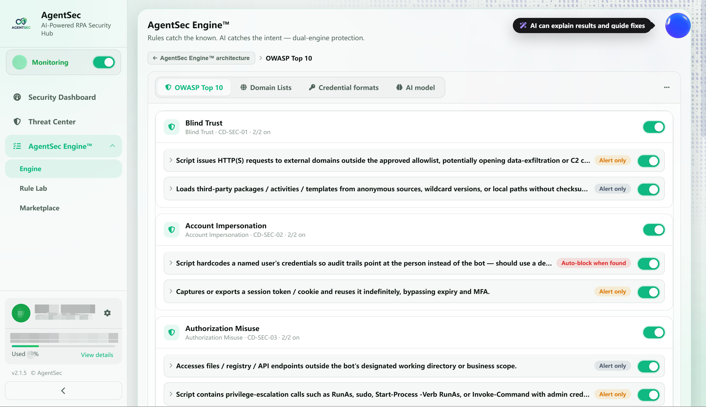
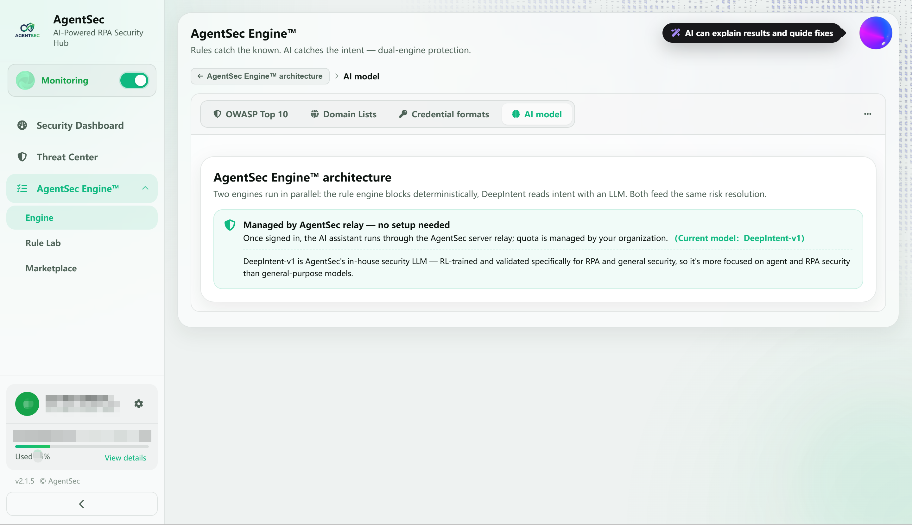
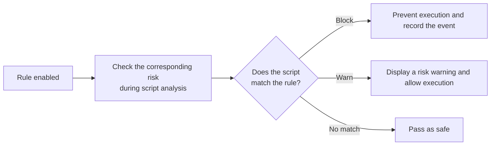
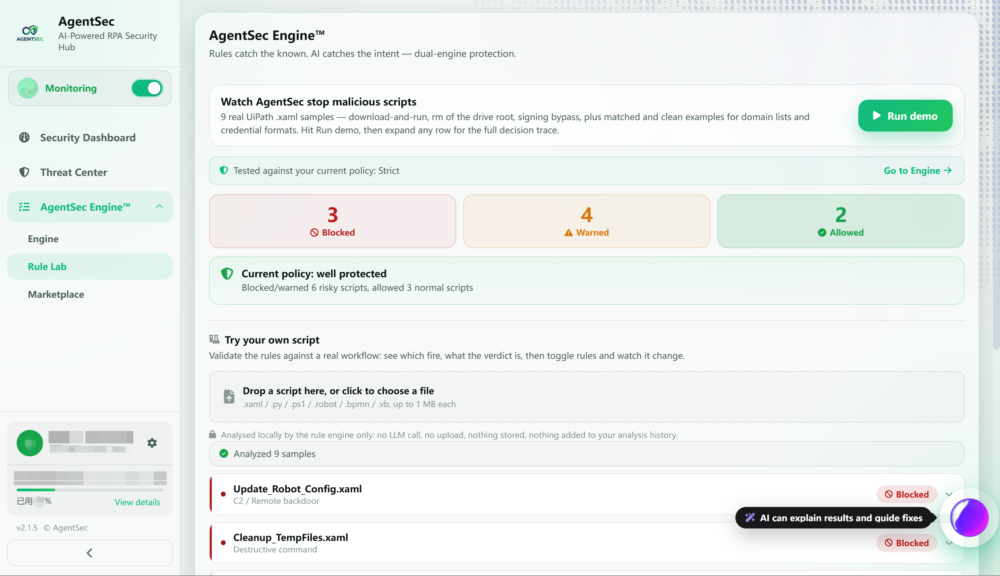
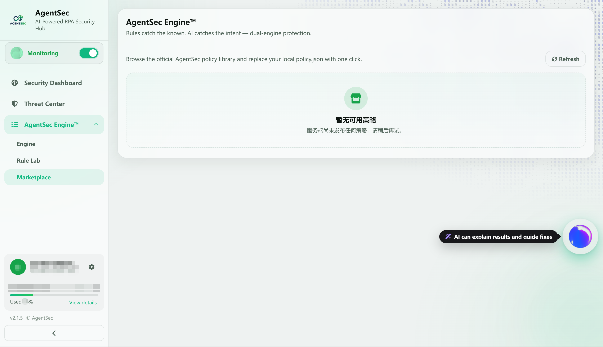

# AgentSec Engine™ — Policy and Rules Configuration Guide

> AgentSec Engine™ is AgentSec's unified security engine. Expand it in the left navigation to access three subpages: **Engine**, **Rule Lab**, and **Policy Marketplace**.

---

## What Is AgentSec Engine™?

AgentSec Engine™ is the core of AgentSec's security detection and provides two layers of defense:

- **Rules Engine**: High-confidence regex fast-path rules — hit = immediate block

- **AI Analysis**: LLM deep analysis of script intent, risk grading per OWASP standards

Includes a built-in default policy based on **OWASP Citizen Developer Top 10** security risks (10 rule groups, 21 rules).

---

## Open Policy Configuration

Expand **“AgentSec Engine™”** in the left navigation bar, then click **“Engine.”**

> 

---

## Engine Subpages

AgentSec Engine™ contains three subpages:

| Subpage | Description |
| --- | --- |
| **Engine** | View and adjust the currently active security rules, as described on this page |
| **Rule Lab** | Run built-in demonstrations or upload scripts to test how the current policy evaluates them |
| **Policy Marketplace** | Browse and install official AgentSec preset policies |

---

# Engine

## Engine Page Layout

The **Engine** page displays the operating status and protection modules of AgentSec Engine™.

Two engines appear at the top of the page:

- **Rules Engine**: Displays the current rules version and most recent synchronization time, with an option to check for updates manually.
- **DeepIntent Engine**: Displays the current AI model and how it is invoked.

Four clickable protection modules appear below:

| Protection Module      | Description                                                                                         |
| ---------------------- | --------------------------------------------------------------------------------------------------- |
| **OWASP Risk Rules**   | Detect common risks such as data exfiltration, unauthorized execution, and unsafe file modification |
| **Domain Blocklist**   | Control which external domains scripts may or may not access                                        |
| **Credential Formats** | Detect hardcoded passwords, keys, and tokens in scripts                                             |
| **Risk Analysis**      | Analyze script intent and risk level using an AI model                                              |

Click any module to open its configuration page. Use the tabs at the top of the page to switch between modules.

---

## OWASP Risk Rules

**OWASP Risk Rules** displays built-in rules grouped by risk type. Each rule group and individual rule can be enabled or disabled separately. The action taken after a match appears on the right side of each rule:

- **Automatically block when detected**: Immediately blocks the script after detecting the risk.
- **Warn only when detected**: Allows the operation to continue but displays a risk warning.

The default policy contains 10 risk domains and 21 rules:

| Risk Domain | Rules | Main Checks |
| --- | ---: | --- |
| Blind Trust | 2 | Unapproved external requests and unvalidated third-party components |
| Account Impersonation | 2 | Named-user credentials and long-term replay of session tokens |
| Authorization Abuse | 2 | Out-of-scope access, privilege escalation, and administrator commands |
| Sensitive Data Exposure and Mishandling | 3 | Sensitive information output, data exfiltration, and exception information disclosure |
| Authentication and Transport Security | 3 | Hardcoded credentials, plaintext transmission, and weak encryption algorithms |
| Vulnerable and Untrusted Components | 2 | Unpinned dependencies and bypassing organizational artifact repositories |
| Security Misconfiguration | 2 | Disabled certificate validation and debug or default configurations used in production |
| Injection Handling Failures | 3 | SQL, command, HTML, email, and CSV injection |
| Asset Management Failures | 1 | Hardcoded production endpoints and mixing development and production environments |
| Logging and Monitoring Failures | 1 | Missing audit records or exception handling for critical operations |

> 

---

## Domain Blocklist

**Domain Blocklist and Allowlist** controls external network access by scripts. It supports subdomains and wildcard patterns such as `*.example.com`.

- **Prohibit transmission (blocklist)**: Blocks and quarantines data sent to a listed domain.
- **Allow (allowlist)**: Explicitly allows a listed domain.
- Domains that are not on either list are allowed by default.

Enter a domain in the relevant input box and press Enter or click **“Add”** to add it to the list.

> 

---

## Credential Formats

**Credential Patterns** detects hardcoded plaintext credentials in scripts. Built-in patterns include:

- OpenAI-compatible
- AWS Access Key
- GitHub Token
- Google API Key
- Stripe Key
- JWT
- Private Key
- Slack Token

A credential-pattern match generates a warning but does not quarantine the file, preventing legitimate credential use from interrupting business operations. Each pattern can be enabled or disabled separately.

To detect proprietary company keys, add their prefixes under **“Custom Prefixes.”** At least eight letters or digits must follow the prefix.

> 

---

## Risk Analysis (AI Model)

The **Risk Analysis** page displays the dual-engine architecture of AgentSec Engine™ and the current AI model:

- The Rules Engine performs deterministic blocking of known risks.
- The DeepIntent large model assesses script intent.
- The two engines analyze in parallel, and their results are consolidated into a single risk level.

After sign-in, AI requests are routed through the AgentSec server and require no additional configuration. Usage quotas are managed centrally by the organization. The current model is **DeepIntent-v1**, which has been trained and validated using reinforcement learning for agent security and RPA security.

> 

---

## Policy File Location

The policy is stored in `policy.json` under the user data directory:

| System | Path |
| --- | --- |
| Windows | `%APPDATA%\AgentSec\policy.json` |
| macOS | `~/Library/Application Support/AgentSec/policy.json` |

Policies are managed centrally from the **Engine** page. In signed-in mode, the client automatically synchronizes the latest ruleset from the server.

---

## How Policy Rules Work

Each rule contains the following properties:

| Property | Description | Values |
| --- | --- | --- |
| severity | Risk severity | `critical` / `high` / `medium` / `low` |
| action | Action after a match | `block` / `warn` |

> ⚠️ After you disable a rule group or individual rule, AgentSec no longer checks for the corresponding risk. Make changes carefully.

---

# Rule Lab

The Rule Lab is used to verify how the current policy evaluates different scripts. The page displays the policy currently in use. To adjust rules, click **“Go to Engine.”**

> 

## Run the Demonstration

The page includes nine real UiPath `.xaml` samples covering scenarios such as downloading and executing code, deleting files, bypassing validation, domain blocklists and allowlists, and credential patterns.

After you click **“Run Demo,”** the Rule Lab analyzes each sample and summarizes three result types:

| Result | Description |
| --- | --- |
| **Blocked** | A blocking rule matched, so script execution was prevented |
| **Warned** | A risk was detected; execution was allowed after a warning |
| **Allowed** | No risk requiring a block or warning was found |

Based on the blocked, warned, and allowed results, the page provides an overall assessment of the current policy's protection.

## Test Your Own Scripts

Drag a script into the upload area or click to select a file, then test it using the current policy.

- Supports `.xaml`, `.py`, `.ps1`, `.robot`, `.bpmn`, and `.vb` files.
- Each file must be no larger than 1 MB.
- Uses only the local Rules Engine and does not invoke the large model.
- Files are not uploaded or stored and are not added to analysis history.

## View Analysis Results

After analysis, the page lists the matched risk types and disposition for each script. Result labels include **Blocked**, **Warn & allow**, and **Passed (safe)**. Click the expand button on the right side of a result row to view the script's detailed evaluation process.

> 

---

# Policy Marketplace

> 

The Policy Marketplace provides preset policies maintained by AgentSec. You can replace your current rules with one click.

## Open the Policy Marketplace

Click the **“Policy Marketplace”** tab at the top.

## Browse Policies

Each policy card displays:

| Information | Description |
| --- | --- |
| Policy name | For example, “OWASP Citizen Developer Top 10” |
| Category label | `General` / `Finance` / `Government`, etc. |
| OWASP alignment | Whether the policy aligns with OWASP standards |
| Rule count | Number of rules included |
| Installed indicator | A green check mark indicates the policy currently in use |

## Apply a Policy

1. Click **“Apply”** on a policy card
2. Confirm that you want to replace the current rules
3. The policy is downloaded automatically and written to the local configuration
4. The interface automatically returns to the **“Current Policy”** tab and displays the new rules

Click **“View Details”** to view the policy description, author, and README.

---

# FAQ

**Q: Do I need to restart monitoring after changing policy?**
A: No. Changes take effect immediately.

**Q: How often is the Marketplace updated?**
A: Maintained by AgentSec platform admins. Click the "Marketplace" tab to auto-fetch the latest catalog.