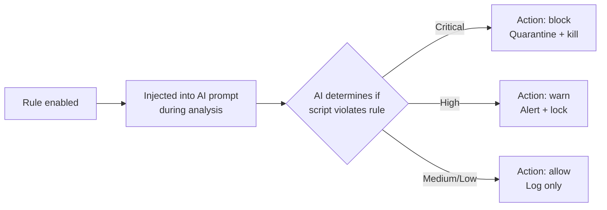

# AgentSec Engine™ — Policy & Rules Configuration Guide

> AgentSec Engine™ is the unified security engine. Expand it in the sidebar to access four sub-pages: **Current Policy**, **Rule Lab**, **AI Model**, **Marketplace**.

---

## What is AgentSec Engine™?

AgentSec Engine™ is the core of AgentSec's security detection, with two layers of defense:
- **Rules Engine**: High-confidence regex fast-path rules — hit = immediate block
- **AI Analysis**: LLM deep analysis of script intent, risk grading per OWASP standards

Includes a built-in default policy based on **OWASP Citizen Developer Top 10** security risks (10 rule groups, 21 rules).

---

## Opening Policy Configuration

In the sidebar, expand **"AgentSec Engine™"**, then click **"Current Policy"**.

---

## Engine Sub-Pages

AgentSec Engine™ contains four sub-pages:

| Sub-Page | Description |
|----------|-------------|
| **Current Policy** | View and adjust currently active security rules (described here) |
| **Rule Lab** | Technical view — rule details, edit JSON source |
| **AI Model** | View current LLM model config (managed by server in login mode) |
| **Marketplace** | Browse and install AgentSec official preset policies |

---

## Policy Page Layout

```
┌─────────────────────────────────────────────┐
│  [Current Policy]  [Marketplace]          │  ← Tab toggle
├─────────────────────────────────────────────┤
│  🛡 Protection: Recommended                  │
│  Critical/High enabled · Medium disabled     │
│  [Strict] [Recommended] [Relaxed]  [Advanced]│
├─────────────────────────────────────────────┤
│  ▼ Blind Trust (CD-SEC-01)                  │
│    2 rules · All enabled                     │
│    ├─ ⚡Block   Unapproved external calls     │
│    └─ ⚡Warn    Unsigned third-party imports  │
│  ▼ Account Impersonation (CD-SEC-02)         │
│  ...                                        │
└─────────────────────────────────────────────┘
```

---

## Simple Mode vs Advanced Mode

### Simple Mode (default)

- Plain-language descriptions, no technical jargon
- Each rule labeled with "Auto-block" or "Warn only"
- One-click presets (Strict / Recommended / Relaxed)

### Advanced Mode

- Technical names, OWASP IDs, severity/action tags
- Per-rule toggle switches
- Direct JSON source editing

---

## Three Preset Protection Levels

| Level | Enabled Rules | Best For |
|-------|--------------|----------|
| **Strict** | All 21 rules | Production, high-security requirements |
| **Recommended** (default) | 15 rules (critical + high) | Most situations |
| **Relaxed** | 6 rules (critical only) | Dev/debug environments, low-risk scenarios |

---

## Save and Reset

### Save Changes

Click **"Save Rules"** to persist your changes. **In login mode**, policies are managed by the server and synced to the client automatically. Changes take effect immediately — the next analysis uses the new rules.

### Reset to Default

Click **"Restore Default Rules"** → confirm → rules revert to the built-in default (Recommended level).

---

## Marketplace

The Marketplace provides AgentSec-maintained preset policies. One-click install replaces your current rules.

Each policy card shows:

| Info | Description |
|------|-------------|
| Policy Name | e.g. "OWASP Citizen Developer Top 10" |
| Category Tags | `General` / `Finance` / `Government` etc. |
| Rule Count | How many rules it contains |
| Installed Badge | Green checkmark if currently active |

### Apply a Policy

1. Click the policy card's **"Apply"** button
2. Confirm replacing current rules
3. Policy auto-downloads and writes to local config
4. Auto-switches back to "Current Policy" tab showing new rules

---

## How Policy Rules Work

Each rule has these attributes:

| Attribute | Description | Values |
|-----------|-------------|--------|
| severity | Risk severity | `critical` / `high` / `medium` / `low` |
| action | Action on hit | `block` (quarantine) / `warn` (alert) |



> ⚠️ Disabling a rule group means the AI **no longer checks** that category. Use caution. Disabling critical+block level rules triggers a confirmation dialog.

---

## FAQ

**Q: Do I need to restart monitoring after changing policy?**
A: No. Changes take effect immediately.

**Q: How often is the Marketplace updated?**
A: Maintained by AgentSec platform admins. Click the "Marketplace" tab to auto-fetch the latest catalog.

**Q: Can onpremise users edit policies?**
A: In onpremise mode, policies are managed centrally by the server admin. The client is read-only.
