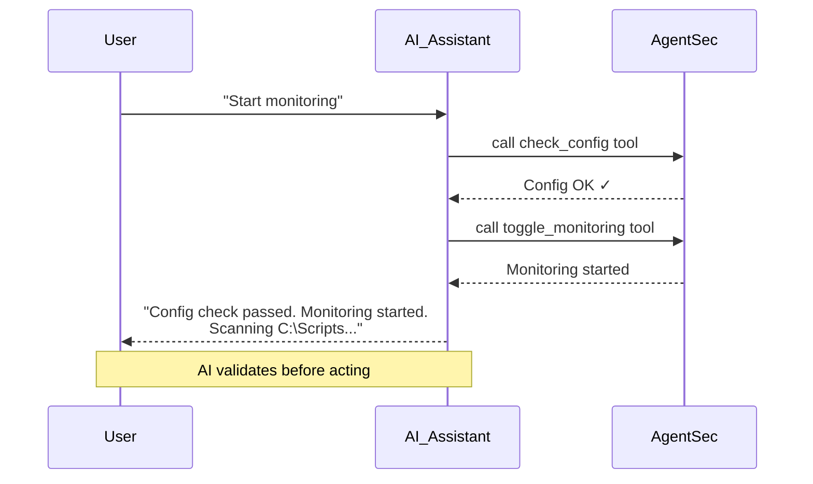

# AI Security Assistant Guide

> AgentSec includes a built-in AI Security Assistant (Copilot). Ask it questions in natural language — it answers based on current monitoring state, analysis results, and configuration, and can even execute operations for you.

---

## Opening the AI Assistant

**Three ways:**

| Method | Action |
|--------|--------|
| Click FAB | Click the blue "AI Assistant" floating button at bottom-right |
| Shortcut | Press `Ctrl+K` (Windows) or `Cmd+K` (macOS) |
| Press again | Close the panel |

---

## Assistant Panel Layout

```
┌──────────────────────────┐
│ AI Assistant          ✕ ⛶│  ← Title bar (fullscreen toggle)
│ ──────────────────────── │
│ 📍 Current: Threat List  │  ← Context indicator
│     [Ask AI about this →]│
│ ──────────────────────── │
│                          │
│   🤖 Hi! I'm AgentSec    │
│   AI Assistant...        │
│                          │
│   ┌──────────────────┐   │
│   │ Summarize status  │   │  ← Suggested questions
│   │ Highest risk?      │   │
│   │ How to reduce?     │   │
│   │ Current policy?    │   │
│   └──────────────────┘   │
│                          │
│ ──────────────────────── │
│ [📊 Checking config...]  │  ← Tool progress (when needed)
│ ──────────────────────── │
│ ┌────────────────────────┤
│ │ Type your question...  │  ← Input box
│ │                        │
│ │ Model name  Enter ↑    │
│ └────────────────────────┤
└──────────────────────────┘
```

### Three Display Modes

| Mode | Effect |
|------|--------|
| Closed | FAB at bottom-right, panel hidden |
| Docked | Panel on right, 1/3 width, main content auto-shrinks |
| Fullscreen | Panel expanded to max width |

---

## What Can the AI Assistant Do?

### 1. Answer Security Questions

Ask in natural language:

| You can ask | Example |
|-------------|---------|
| Security overview | "Summarize the current security status of all scripts" |
| Risk analysis | "Which scripts have the highest risk? Why?" |
| Fix advice | "How do I reduce the security risk of Main.xaml?" |
| Rule explanation | "What is AgentSec's current security policy?" |
| Config check | "Check if my current configuration is correct" |
| Status query | "Which scripts are being analyzed right now?" |

**Context-aware**: The AI knows what page you're on and what's selected. For example, selecting `Main.xaml` in Threat Center shows a context chip "Interpret Main.xaml's analysis results".

### 2. Auto-Execute Operations

The AI assistant can execute 7 built-in tools:

| Capability | Trigger |
|-----------|---------|
| Check config | "Check my config" → AI validates directories, LLM, server connectivity |
| Set watch directory | "Change my watch directory" → AI opens folder picker |
| Start/Stop monitoring | "Start monitoring" → AI checks config first, then starts |
| View monitoring status | "What's the monitoring status?" → AI returns current state |
| View policy | "What are the current security rules?" → AI lists enabled rules |
| Query analysis progress | "How's the analysis going?" → AI returns in-progress scripts |
| Export logs | "Export my logs" → AI opens save dialog |

**AI checks config before acting**. For example, if you say "Start monitoring", it calls the check_config tool first to verify everything is ready, and tells you what needs fixing if not.



### 3. Quick Action Buttons

AI replies may include suggested action buttons:

```
[Summarize status]  [View high-risk details]  [How to fix]
```

Click any button to auto-send that question — no typing needed.

---

## Conversation Tips

### ✅ Good Questions

- "What security issues does Main.xaml have? Explain each one"
- "Compare the risk levels of Process.py and Main.xaml"
- "How do I fix the hardcoded password issue? Give concrete steps"

### ❌ Less Effective

- "Security" (too vague)
- "Write code for me" (out of scope)
- "What's the weather?" (unrelated to RPA security)

### 💡 Tips

- The AI automatically replies in your current UI language
- Conversation history keeps the last 10 rounds (preserved when closing panel, not preserved across app restarts)
- Click "Clear Conversation" to wipe all history and start fresh

---

## Model Info Display

The input box bottom-left shows a **model badge** with the current AI model:

- **Signed-in mode**: `AgentSec / gpt-4o` (server relay, no config needed)
- **Local mode**: `OpenAI / gpt-4o-mini` or `Ollama / qwen3.6:latest` (per your settings)

Click the badge to jump to **AgentSec Engine™ → AI Model** page.

---

## FAQ

**Q: Does the AI assistant need internet?**
A: Depends on your mode. Signed-in mode requires internet (relayed via AgentSec server). Local mode with Ollama works offline.

**Q: How much quota does it consume?**
A: In signed-in mode, each conversation draws from the organization's AI quota (visible in sidebar). Local mode has no quota limit (depends on your own API account).

**Q: Are conversations recorded?**
A: Conversation history is stored in the local database (`chat_logs` table) — not uploaded to the server. Exported logs include conversation records.

**Q: What if the org's AI quota runs out?**
A: Contact your org admin to top up via the AgentSec console. When exhausted, both AI Assistant and AI analysis pause.

**Q: Why can't the AI answer certain questions?**
A: AgentSec's AI Assistant is positioned as an RPA security expert. It keeps answers scoped to security analysis, script risks, and remediation. Unrelated questions may be declined.
