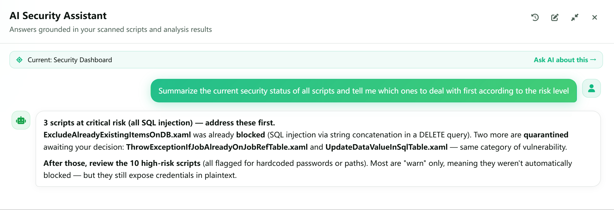
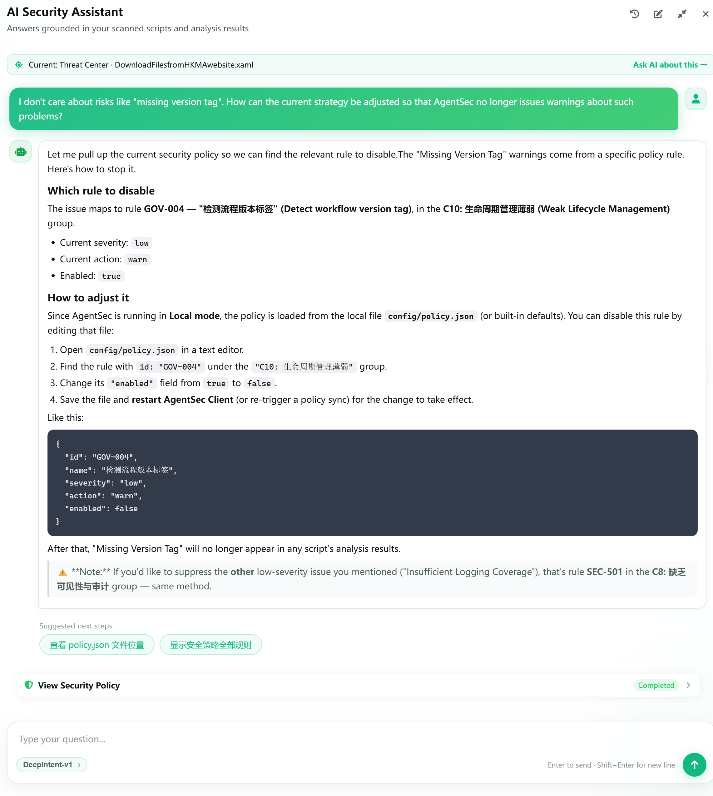

# AI Security Assistant: Use Cases

> This chapter uses several common tasks to show how the AI Assistant can support everyday RPA script security work.

---

## Before You Begin

To make the answers more relevant to your situation, first:

1. Select monitoring directories and start monitoring;
2. Wait for at least one script to finish analysis;
3. When needed, select the relevant script from the Dashboard or Threat Center before opening the AI Assistant.

The AI Assistant answers questions using the current page, selected script, and analysis results as context. Treat its suggestions as supporting information for security investigation. Before performing an action that affects files or monitoring status, confirm that the expected result is correct.

---

## Use Case 1: Quickly Understand Current Risks

**When to use it**: You have just opened AgentSec and want to determine whether any issues need immediate attention today.

**Try asking:**

> Summarize the security status of all current scripts and tell me what I should address first, grouped by risk level.

The AI Assistant summarizes the analyzed scripts, risk levels, and main issue types, then highlights high-risk scripts that should be reviewed first.

> 

**Follow-up examples:**

- Which script has the highest risk, and why?
- Which issues should be fixed today?

---

## Use Case 2: Explain a Script's Analysis Result

**When to use it**: You found a risky script in the Threat Center but do not understand what one of the findings means.

1. Open the target script's details in the Threat Center;
2. Select the script or click **“Ask AI About This”**;
3. Click a suggested question above the chat box, or enter a question manually, such as:

> Please explain the analysis result for `Main.xaml`.

Using the script's analysis result, the AI Assistant explains the reason for the risk in easier-to-understand language.

> 

**Continue with:**

> List the steps for fixing this script in priority order, and explain what I need to verify at each step.

---

## Use Case 3: Get Actionable Remediation Guidance

**When to use it**: You already understand the issue type and want specific remediation instructions.

**Example question:**

> Based on this script's analysis result, guide me step by step through fixing the issue in UiPath.

The AI Assistant provides specific remediation instructions based on the analysis result.

> 

After making the changes, save the script and wait for AgentSec to analyze it again to confirm that the security issue has been resolved successfully.

---

## Use Case 4: Review, Understand, and Adjust the Current Policy

**When to use it**: You want to understand which security policies are enabled, why a certain type of risk triggers a warning, or how to adjust the policy to match an acceptable risk level.

**Example question:**

> Which rules in the current policy warn about this type of risk? Explain their purpose in plain language and describe the possible impact of changing them.

For example, if a particular risk is not relevant to you and you want to stop receiving warnings about it, continue with:

> I am not concerned about the “missing version tag” risk. How can I adjust the current policy so AgentSec no longer warns about this issue?

The AI Assistant first explains the relevant rules and the security impact of changing them, then provides detailed instructions for making the adjustment. After updating the policy, reanalyze the relevant scripts to confirm that the warning has stopped as expected, while accounting for the resulting reduction in detection coverage.

> 

---

## Use Case 5: Perform Operations Automatically

**When to use it**: You want the AI Assistant to help perform actions within the application, including checking configuration, setting monitoring directories, starting or stopping monitoring, viewing monitoring status, checking analysis progress, and exporting logs.

For example, to start monitoring, enter:

> Start monitoring for me.

The AI Assistant first checks the monitoring directories, AI model, and relevant connection settings. After confirming that the configuration is valid, it starts monitoring and reports the current status or scan progress.

> 

For more operations that can be performed automatically and their descriptions, see [08 — AI Security Assistant](08-ai-assistant.md#2-auto-execute-operations).

---

## Tips for Asking Better Questions

- **Identify the subject**: Use a script name, risk level, or issue type, such as “Explain the blocking risk for `Process.py`.”
- **State your goal**: Say whether you want to understand the cause, find a remediation method, or check runtime status.
- **Ask step by step**: Ask the AI to summarize first, then follow up about one script or one issue in greater depth.

For details about how to open the AI Assistant, use its panel, and access all its capabilities, see [08 — AI Security Assistant](08-ai-assistant.md).
