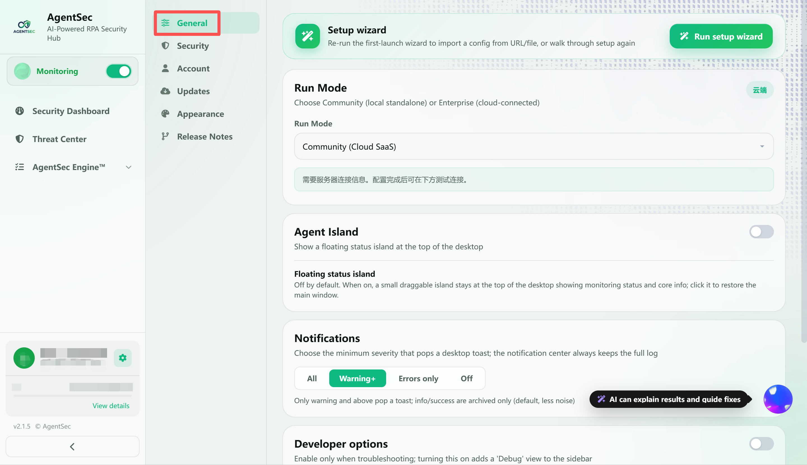
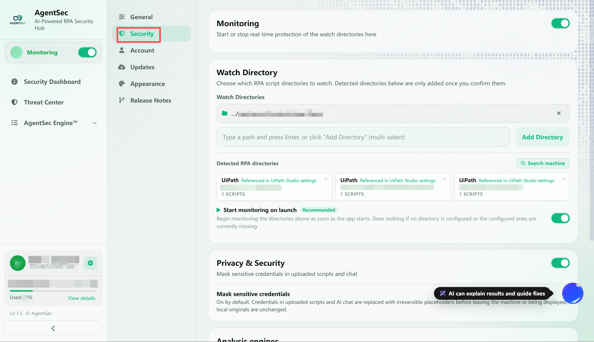
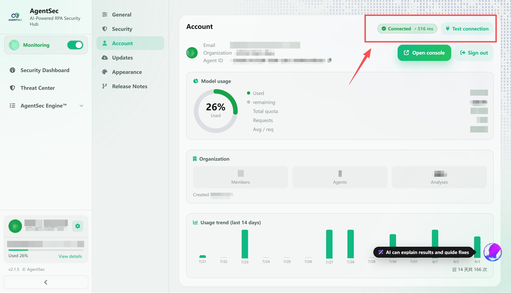
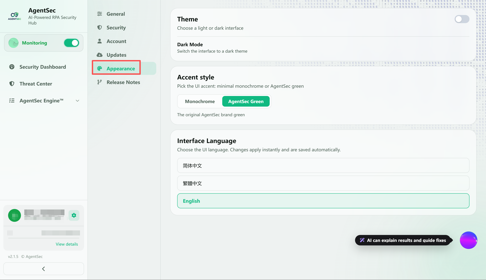
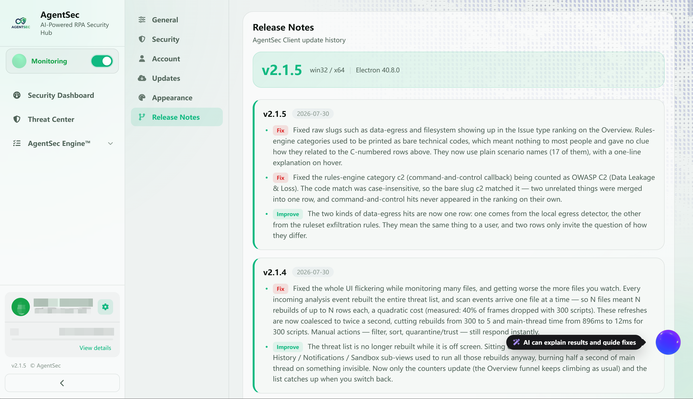

# Settings and Account Guide

> The Settings page is used to manage all AgentSec configuration, including General, Security Configuration, Account, AI model, automatic updates, and more.

---

## Open Settings

Click **⚙ Settings** (the gear icon) in the left navigation bar, or click the gear button at the bottom of the sidebar.

> 

---

## Settings Page Layout

The Settings page uses a **left-side category navigation and right-side content** layout. Use the left side to switch between General, Security Configuration, Account, Updates, Appearance, and Version; the right side shows the settings for the selected category.

### ⚡ Auto-Save

AgentSec supports auto-save. Changes are written to the config file within 1-2 seconds. The bottom save bar shows status:

| Status          | Message                          |
| --------------- | -------------------------------- |
| No changes      | “One save button for all config” |
| Unsaved changes | “Unsaved changes”                |
| Saving          | “Saving...”                      |
| Saved           | “Saved”                          |
| Error           | “Save error: ...”                |

> 💡 Automatic saving applies to most changes. To save manually, click **“Save Settings”** at the bottom.

---

## I. General

> 

### Setup Wizard

Click **“Setup Wizard”** to run the initial setup wizard again. This is useful when you want to reconfigure the operating mode or monitoring directories.

### Operating Mode

| Mode | Description |
| --- | --- |
| Local (Offline) | Does not connect to a server; AI analysis is performed entirely on the local machine |
| Community (Cloud SaaS) | Connects to the AgentSec cloud service; AI analysis is handled in the cloud |

> 

After you switch modes, the corresponding messages and configuration options appear below.

### Developer Options

- **Show Debug View**: Adds a **“Debug”** entry to the sidebar, where you can view the real-time analysis log stream
- Enable this option only when troubleshooting

### Danger Zone

The **“Reset All Data”** button:

- Clears configuration, Agent ID, analysis history, chat history, and the allowlist
- Automatically exits the application after deletion is complete
- Makes the application behave like a first-time installation when reopened

> ⚠️ This operation cannot be undone!

---

## II. Security Configuration

> 

### Monitoring Switch

Use the switch at the top of the page to start or stop real-time protection for the monitoring directories. When monitoring is off, AgentSec no longer analyzes new or modified RPA scripts in those directories in real time. Turn it on again to resume monitoring.

### Monitoring Directories

AgentSec supports **monitoring multiple directories simultaneously**. Add the RPA script directories you want to protect in any of the following ways:

- Enter a path in the input box and press Enter
- Click **“Add Directory”** to open the directory selector; you can select multiple directories at once
- Click **“Search This Computer”** to detect script directories for common RPA tools

Directories found by the search appear under **“Detected RPA Directories”**, together with the tool name, path, and number of scripts. Detected directories are not added to monitoring automatically; they take effect only after you confirm them.

#### Start Monitoring at Launch

When enabled, AgentSec automatically monitors configured directories that currently exist when it starts, so you do not need to start monitoring manually each time. Monitoring does not start automatically if no monitoring directory is configured or if the configured directories no longer exist.

### Privacy and Security

#### Mask Sensitive Credentials

Enabled by default. When you upload scripts or use AI Q&A, credentials are replaced with irreversible placeholders before leaving the local machine or appearing in the interface. This prevents sensitive information such as API keys and passwords from being displayed or transmitted directly. The original local script is not modified.

### Analysis Engine

#### Rules Engine (DSL Ruleset)

The rules engine is **always enabled** and performs deterministic rule matching. Analysis completes locally within milliseconds and does not depend on a network connection or large model. When a rule matches, AgentSec provides a risk conclusion and recommended disposition according to that rule.

Rules can be updated in two ways:

- **Update Rules from Console**: Connect to the Console to retrieve the latest rules
- **Import Rule Update Package (Offline)**: For intranet environments or systems that cannot connect to the Console; an administrator exports a signed rule package for import here

#### AI Assessment (Optional)

AI assessment interprets script intent and helps identify risks not yet covered by rules. When disabled, script contents do not leave the local machine for AI assessment, and analysis conclusions are provided by the rules engine only.

---

## III. Account

> 

### Sign-In Status

#### Signed In

The following information is displayed:

| Field | Description |
| --- | --- |
| Avatar | An identifier generated automatically from the email address |
| Email | Email address used to sign in |
| Organization | The AgentSec organization (tenant) you belong to |
| Agent ID | Unique identifier for the current machine |
| Model Usage | Organization's AI quota usage |

Click **“Sign Out”** to disconnect from the server.

#### Not Signed In

- A **“Connect to Console (Sign In)”** button is displayed

### Connection Test

Click **“Test Connection”** to verify that the server is reachable and the sign-in credentials are valid.

> 

---

## IV. Updates

> 

### Automatically Check for Updates

- **Switch**: Enable or disable automatic update checks at startup and at regular intervals
- **Default**: Enabled; checks every 6 hours

### Current Version Information

| Information | Description |
| --- | --- |
| Current version | The AgentSec version you are currently using |
| Latest version | Latest version available on GitHub Releases |
| Last checked | Time of the most recent update check |

### Check for Updates Manually

Click **“Check for Updates Now”** to query the latest version immediately.

When a new version is detected:

- The Settings page displays the new version details and release notes
- An update banner appears at the top of the Dashboard
- Click **“Download and Install”** to download and install automatically on Windows, or open the DMG on macOS

---

## V. Appearance

> 

### Theme

- **Dark Mode**: Use the switch to enable or disable it
- By default, AgentSec follows the system preference (`prefers-color-scheme`)

### Interface Language

Three languages are supported:

- Simplified Chinese (default)
- Traditional Chinese
- English

The entire interface updates immediately after you switch languages. The AI Assistant also automatically switches its response language.

---

## VI. Version Notes

> 

Displays the version history (Changelog) from v1.0.0 to the current version in reverse chronological order.

Each update entry is labeled by type:

- `feat` (green) — New feature
- `fix` (red) — Bug fix
- `improve` (green) — Improvement and optimization
- `ui` (yellow) — Interface adjustment
