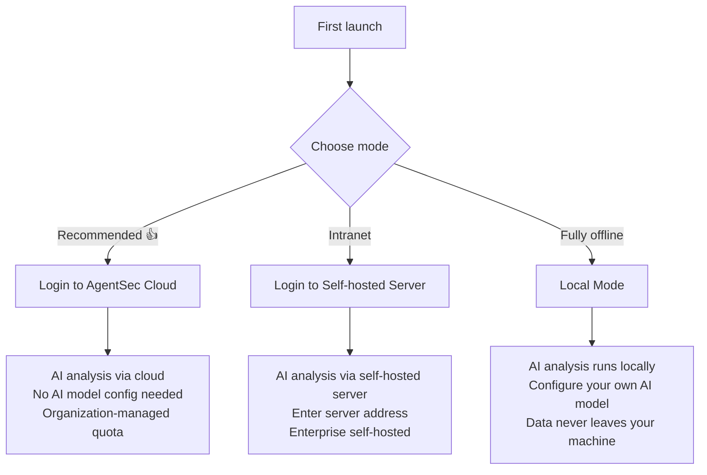
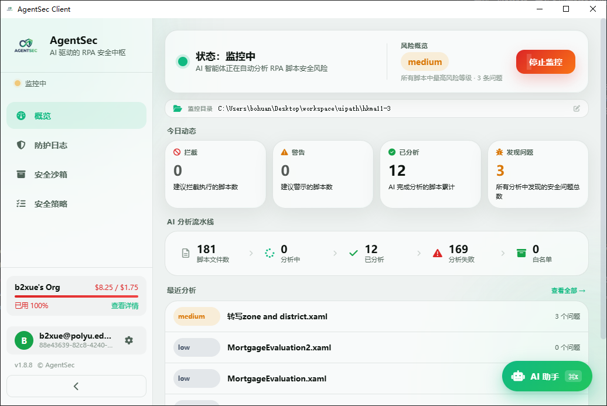

# AgentSec Desktop — User Manual

Welcome to AgentSec Desktop! This manual will help you quickly get started and fully understand how to use AgentSec to protect your RPA scripts.

To follow the Quick Start and First Security Analysis hands-on, download the companion [UiPath sample package](https://github.com/PolyUxAISecurity/AgentSec-UserDoc/raw/main/Demo/agentsec-uipath-demo.zip).

---

## What is AgentSec?

AgentSec is an **AI-powered RPA script security monitoring tool**. It can:

- 🔍 **Auto-scan**: Real-time monitoring of RPA scripts (UiPath, Python, PowerShell, etc.) on your computer
- 🛡️ **Intelligent Analysis**: AI-powered detection of security risks (data exfiltration, hardcoded credentials, malicious commands, etc.)
- 🚫 **Proactive Blocking**: Auto-quarantine high-risk scripts to protect your data
- 💬 **AI Assistant**: Built-in security assistant — ask security questions and get remediation advice

**In short**: Install AgentSec on your RPA workstation, and it acts like an always-on security inspector — monitoring all scripts and automatically handling risks.

---

## 📖 Recommended Reading Order

| # | Chapter | Content | Time |
|---|---------|---------|------|
| 01 | [Quick Start (Hands-on)](01-quickstart.md) | Install → Configure → First scan → Understand results | 10 min |
| 02 | [Dashboard (Overview)](02-dashboard.md) | What each number on the main screen means | 5 min |
| 03 | [First Security Analysis](03-first-analysis.md) | Full case study: three scripts from discovery to remediation | 10 min |
| 04 | [Monitoring & Directory Setup](04-monitoring.md) | Watch directories, three-stage checks, large directory optimization | 5 min |
| 05 | [Threat Center](05-security-log.md) | Threat list, history, notifications, security sandbox | 10 min |
| 06 | [AgentSec Engine™](07-security-policy.md) | Security policy, rules lab, AI model, policy marketplace | 10 min |
| 07 | [AI Security Assistant](08-ai-assistant.md) | Chat with AI, let it help you operate | 5 min |
| 08 | [AI Assistant Use Cases](09-ai-assistant-use-cases.md) | Use examples to investigate risks, remediate issues, and check configuration | 5 min |
| 09 | [Settings Details](10-settings.md) | General, account, updates, appearance, version | As needed |
| 10 | [Key Concepts](11-concepts.md) | Terminology: What is quarantine? What is risk level? | As needed |
| 11 | [FAQ](12-faq.md) | Common issues and solutions | As needed |

> 💡 **New user path**: 01 → 02 → 03 — three chapters and you're fully onboard. The rest is reference.

---

## App Navigation

AgentSec Desktop uses a single-page application design:

| Location | Entry Point |
|----------|-------------|
| **Security Dashboard** | Sidebar "Security Dashboard" — Dashboard summary, risk overview, analysis pipeline |
| **Threat Center** | Sidebar "Threat Center" — Threat list, History, Notifications, Security Sandbox (4 Tabs) |
| **AgentSec Engine™** | Sidebar "AgentSec Engine™" — Current policy, Rule lab, AI model, Marketplace |
| **AI Assistant** | Bottom-right floating button (or `Ctrl+K` / `Cmd+K`) |
| **Settings** | Sidebar bottom gear icon — General, Account, Updates, Appearance, Version |

---

## Three Operating Modes

AgentSec supports three running modes — choose what fits your environment:

| Mode | Use Case | Requirements |
|------|----------|-------------|
| **Login to AgentSec** (Recommended) | Most users | An AgentSec account (sign up via browser) |
| **Self-Hosted** | Enterprise with own AgentSec server | Company server address + account |
| **Local Mode** | Fully offline, data cannot leave the machine | Your own OpenAI / Ollama AI endpoint |

> 💡 **Not sure?** Choose "Login to AgentSec" — it's the simplest option.

---

## Quick Interface Overview

---

## Supported Script Types

| Extension | Script Type | Common Source |
|-----------|-------------|---------------|
| `.xaml` `.xmal` | UiPath Workflow | UiPath Studio |
| `.py` | Python Script | Python automation |
| `.robot` | Robot Framework | Test automation |
| `.bpmn` | BPMN Process | Process modeling tools |
| `.ps1` | PowerShell Script | Windows system administration |
| `.vb` | VBScript | Legacy Windows automation |

---

## Need Help?

- 📖 Browse the detailed manual via the left sidebar
- 💬 Use the built-in AI Security Assistant (press `Ctrl+K` or `Cmd+K`)
- ❓ Check the [FAQ](12-faq.md)

---

> 📄 Document version: v2.0.6 | Last updated: July 2026
